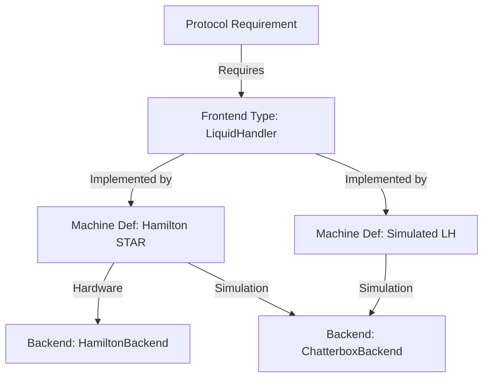

# Research Report: Frontend and Backend Type Architecture

## Overview

This report documents the architectural relationship between **Frontend Types** and **Backend Types** for machines and resources in the Praxis codebase, specifically within the Browser-Mode (SQLite-driven) context. It identifies critical "leaks" where technical backend details are exposed to the user and provides a refactoring roadmap for v0.1-Alpha.

## Architectural Distinction

The Praxis architecture follows a three-tier hierarchy to decouple protocol requirements from physical hardware and simulation drivers.

| Tier | Component | Example | Responsibility |
|:--- |:--- |:--- |:--- |
| **Tier 1** | **Frontend Type** | `LiquidHandler`, `PlateReader` | The abstract category required by Protocols. Defined in `machine_frontend_definitions`. |
| **Tier 2** | **Machine Definition** | `Hamilton STAR`, `Opentrons OT-2` | The user-selectable "Template" or "Model". It bridges the Frontend to specific capabilities. Defined in `machine_definitions`. |
| **Tier 3** | **Backend Driver** | `HamiltonBackend`, `ChatterboxBackend` | The technical implementation that communicates with hardware or simulation buffers. Defined in `machine_backend_definitions`. |

### Data Model Diagram (Logical)

---

## Current State Analysis

### 1. Data Source Overlap

In `praxis/web-client/src/assets/browser-data/plr-definitions.ts`, the `PLR_MACHINE_DEFINITIONS` array is overloaded. It contains:

- **Simulated Frontends**: (e.g., `Simulated Liquid Handler`) which act as generic templates for simulation.
- **Specific Hardware Models**: (e.g., `STAR`) which effectively act as backends but are presented as definitions.

### 2. Implementation "Leaks"

Several places in the UI incorrectly expose Tier 3 (Backend) details directly to the user:

#### A. Technical FQNs in Simulation Config

In `src/app/features/run-protocol/components/simulation-config-dialog/`, the user is presented with a dropdown of "Simulation Backends". These are populated directly from `available_simulation_backends` in `machine_definitions`, which currently contains raw Python FQNs:

- `pylabrobot.liquid_handling.backends.ChatterboxBackend`
- `pylabrobot.liquid_handling.backends.LiquidHandlerChatterboxBackend`

**Leak**: Users should see "Chatterbox" or "Visual Simulator", not Python module paths.

#### B. Mixed Machine Definitions in Asset Wizard

The `AssetWizard` filters machine definitions using `plr_category === 'Machine'`. Since both specific hardware models and generic simulated frontends share this category, the search results are a mix of technical implementations and user-friendly templates.

#### C. Database Table Overloading

The `machine_definitions` table in SQLite is being used as a catch-all for anything that is "selectable", bypassing the stricter `machine_frontend_definitions` vs `machine_backend_definitions` separation in some lookup logic.

---

## Recommended Refactoring Approach

### Phase 1: Clean Up User Exposure (High Priority)

1. **Friendly Names for Backends**: Add a `display_name` field to simulation backends or create a mapping utility in the UI to transform FQNs.
2. **Metadata-Driven UI**: Modify `SimulationConfigDialogComponent` to fetch human-readable labels from `machine_backend_definitions` instead of using raw strings from the machine definition.

### Phase 2: Structural Decoupling

1. **Strict Table Roles**:
    - `machine_frontend_definitions`: ONLY base categories (LiquidHandler, PlateReader).
    - `machine_definitions`: User-facing models (Hamilton STAR, Simulated LH).
    - `machine_backend_definitions`: Technical drivers (Hardware & Simulators).
2. **Discriminator Refinement**: Transition from the overloaded `plr_category` to a more specific `definition_type` (e.g., `TEMPLATE`, `HARDWARE_MODEL`, `VIRTUAL`).

### Phase 3: Protocol Compatibility Logic

Refactor `ExecutionService.getCompatibility()` to:

1. Identify the **Frontend Type** required by the protocol.
2. List all **Machine Definitions** compatible with that Frontend.
3. If an asset is a "Simulated Frontend", trigger the `SimulationConfigDialog` to bind a compatible **Backend**.

## Priority-Ordered Fix List

1. [ ] Map FQNs to friendly names in `simulation-config-dialog.component.ts`.
2. [ ] Update `plr-definitions.ts` to include `compatible_backends` metadata for all machine definitions.
3. [ ] Filter `AssetWizard` search results based on a "User Facing" flag instead of `plr_category === 'Machine'`.
4. [ ] Standardize `machine_category` (Frontend) vs `machine_type` (Definition) naming in `asset.models.ts`.
