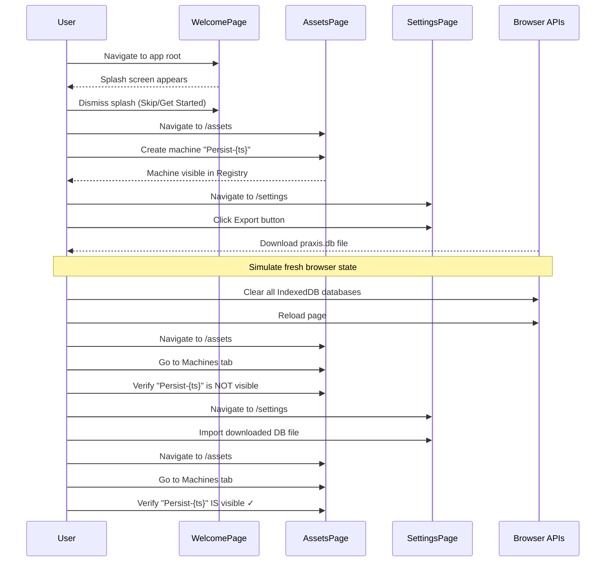

# SDET Static Analysis: 04-browser-persistence.spec.ts

**Target File:** [04-browser-persistence.spec.ts](file:///Users/mar/Projects/praxis/praxis/web-client/e2e/specs/04-browser-persistence.spec.ts)  
**Review Date:** 2026-01-30  
**Analyst:** Senior SDET & Angular Specialist

---

## 1. Test Scope & Coverage

### What is Tested
This test verifies the **browser-mode database persistence layer** through a complete export/import cycle:

| Element | Verification |
|---------|-------------|
| **Machine Creation** | Creates a uniquely-named machine asset (`Persist-{timestamp}`) via the Asset Wizard |
| **Database Export** | Triggers the Settings page export function and captures the downloaded `.db` file |
| **IndexedDB Reset** | Programmatically clears all IndexedDB databases to simulate a "fresh browser" state |
| **Data Import** | Re-imports the exported database file via the Settings page |
| **Data Restoration** | Confirms the originally created asset is visible again after import |

**UI Elements Exercised:**
- Welcome page splash screen dismissal
- Assets page navigation (Registry tab, Machines tab)
- Asset creation wizard (multi-step stepper)
- Settings page export/import controls

### Assertions (Success Criteria)
1. **Export Success**: `expect(downloadPath).toBeTruthy()` — the download path is non-null
2. **Asset Not Visible Post-Clear**: `assetsPage.verifyAssetNotVisible(uniqueName)` — after IndexedDB wipe, asset should be gone
3. **Asset Visible Post-Import**: `assetsPage.verifyAssetVisible(uniqueName)` — after import, asset should be restored

**Key Limitation:** Assertions focus on UI visibility, not database structural integrity.

---

## 2. Code Review & Best Practices (Static Analysis)

### Critique the Code

| Issue | Severity | Location | Details |
|-------|----------|----------|---------|
| **Direct `page.evaluate` for IndexedDB manipulation** | 🔴 High | Lines 42-45 | Uses low-level browser API `indexedDB.databases()` which is not supported in all browsers (Firefox lacks it). This makes the test non-portable. |
| **Race condition after IndexedDB clear** | 🔴 High | Lines 46-51 | `page.reload()` is called immediately after deleting databases, but Angular's `SqliteService` may still hold stale state. No explicit wait for service re-initialization. |
| **Hardcoded `page.waitForTimeout(500)`** in `verifyAssetVisible` | 🟡 Medium | Assets POM Line 319 | Relies on arbitrary wait for search debounce instead of observing Angular state signals. |
| **No worker-db fixture integration** | 🔴 High | Lines 1-13 | Uses vanilla `@playwright/test` import instead of `worker-db.fixture`, breaking parallel test isolation. |
| **Missing `testInfo` in Page Objects** | 🟡 Medium | Lines 10-12, 16-17 | `WelcomePage`, `AssetsPage`, `SettingsPage` are instantiated without `testInfo`, so `BasePage.goto()` cannot apply worker-indexed DB isolation. |
| **Direct `.click()` on `machinesTab`** | 🟡 Medium | Lines 50, 59 | Bypasses `navigateToMachines()` method which includes proper `toHaveAttribute` assertion for tab selection. |
| **Unused imports** | 🟢 Low | Lines 5-6 | `fs` and `path` are imported but never used. |

### Modern Standards (2026) Evaluation

| Criterion | Status | Notes |
|-----------|--------|-------|
| **User-Facing Locators** | ✅ Good | POMs use `getByRole`, `getByTestId`, and regex-based name matching |
| **Test Isolation** | ❌ Broken | Does not use `worker-db.fixture`; IndexedDB manipulation is destructive to all parallel workers sharing the Origin |
| **Page Object Model (POM)** | ⚠️ Partial | Uses POMs but bypasses methods (e.g., `machinesTab.click()` instead of `navigateToMachines()`) |
| **Async Angular Handling** | ❌ Missing | No wait for `SqliteService.isReady$` after reload; relies on race-prone reload timing |
| **Fixture Pattern** | ❌ Missing | Should use Playwright fixtures for setup/teardown of test data |

---

## 3. Test Value & Classification

### Scenario Relevance
**Critical User Journey (Happy Path)** ✅

This tests a **core offline-first capability**: users can export their entire workspace, clear browser storage, and restore from backup. This is essential for:
- Data portability between devices
- Disaster recovery
- Sharing setups between team members

**Real-World Validity:** Yes — users in lab environments absolutely need to back up and restore their configurations.

### Classification
**Mixed Classification:**
- **True E2E (70%):** Exercises real Angular components, real SQLite-in-browser, real file download/upload via browser APIs
- **Synthetic Manipulation (30%):** The `page.evaluate()` IndexedDB deletion is not user-accessible and creates an artificially clean state

**Verdict:** This is a **True E2E Test with a synthetic reset step**. The synthetic step is necessary because no UI exists for "Clear All Data" (the `clearDataButton` fallback in `SettingsPage.resetState()` is incomplete).

---

## 4. User Flow & Intent Reconstruction

### Reverse-Engineered Workflow



### Contextual Fit
This test validates the **data persistence layer** of the Praxis browser-mode architecture:
- **Upstream Dependency:** Relies on asset creation (tested in `02-asset-management.spec.ts`)
- **Downstream Consumer:** All offline-capable features (protocol execution, instrument control) depend on reliable DB storage
- **Architectural Role:** Validates `SqliteService` ↔ OPFS ↔ Export/Import pipeline

---

## 5. Gap Analysis (Scientific & State Logic)

### Missing Critical Paths

| Gap | Impact | Recommendation |
|-----|--------|----------------|
| **No schema version validation** | 🔴 High | After import, should verify `SELECT * FROM migrations` or equivalent to confirm schema integrity |
| **No multi-entity test** | 🟡 Medium | Creates only 1 machine; should also create resources, protocols, and verify relational integrity post-import |
| **No file format validation** | 🟡 Medium | Exported file is accepted blindly; no verification of SQLite magic bytes or expected table structure |
| **No OPFS toggle test** | 🟡 Medium | `SettingsPage.toggleOpfs()` exists but is never exercised — persistence behavior differs between IndexedDB fallback and OPFS |
| **No error case: corrupt import** | 🔴 High | What happens if the user imports a malformed file? Should show error toast, not crash |
| **No cross-session persistence test** | 🟡 Medium | Test reuses same browser context; doesn't verify data survives actual browser restart |

### Domain Specifics

| Aspect | Current Coverage | Assessment |
|--------|-----------------|------------|
| **Data Integrity** | ❌ Weak | Only checks UI visibility; does not query `window.sqliteService.db.exec()` to verify actual rows/columns |
| **Simulation vs. Reality** | ⚠️ Partial | Uses real SQLite-in-WASM, but IndexedDB clear is synthetic (no user-facing equivalent) |
| **Serialization** | ❌ Not Tested | Export file format is not validated; import success is inferred from UI state only |
| **Error Handling** | ❌ Not Tested | No negative cases: corrupt file, wrong file type, disk full, permission denied |

### Specific Code-Level Concerns

1. **IndexedDB Database Enumeration (Line 43):**
   ```typescript
   const dbs = await window.indexedDB.databases();
   ```
   - `indexedDB.databases()` is a **non-standard API** (WebKit/Chromium only)
   - Firefox will throw; this test cannot run in cross-browser CI

2. **Missing SqliteService Ready Wait (Line 49):**
   ```typescript
   await page.reload();
   await assetsPage.goto();
   ```
   - After reload, the `SqliteService` must re-initialize OPFS/IndexedDB
   - `assetsPage.goto()` does contain a wait, but it's not using `testInfo`, so worker isolation is broken
   - Race condition: navigation may complete before DB is truly ready

3. **Tab Navigation Anti-Pattern (Lines 50, 59):**
   ```typescript
   await assetsPage.machinesTab.click();
   ```
   - Should use `await assetsPage.navigateToMachines();` which includes proper ARIA assertions

---

## Summary Scorecard

| Category | Score | Notes |
|----------|-------|-------|
| **Test Scope** | 6/10 | Tests essential export/import flow, but single asset only |
| **Best Practices** | 4/10 | No fixture usage, uses non-standard APIs, bypasses POM methods |
| **Test Value** | 7/10 | High-value scenario (data portability), but lacks error coverage |
| **Isolation** | 2/10 | Destructive IndexedDB clear affects all parallel workers; no worker-db fixture |
| **Domain Coverage** | 3/10 | No schema validation, no multi-entity, no serialization verification |

**Overall**: **4.4/10**

---

## Key Recommendations

1. **Adopt `worker-db.fixture`**: Replace `@playwright/test` import with fixture for parallel safety
2. **Use `SettingsPage.resetState()`**: Leverage the existing POM method instead of raw `page.evaluate`
3. **Add deep state verification**: Query `window.sqliteService.db.exec('SELECT COUNT(*) FROM assets')` pre/post import
4. **Add negative test case**: Import a corrupt `.db` file and verify graceful error handling
5. **Remove unused imports**: Clean up `fs` and `path`
6. **Use POM navigation methods**: Replace `machinesTab.click()` with `navigateToMachines()`
