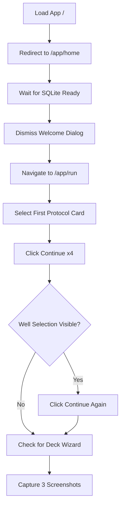

# SDET Static Analysis: deck-setup.spec.ts

**Target File:** [deck-setup.spec.ts](file:///Users/mar/Projects/praxis/praxis/web-client/e2e/specs/deck-setup.spec.ts)  
**Review Date:** 2026-01-30  
**Analyst:** Senior SDET & Angular Specialist

---

## 1. Test Scope & Coverage

### What is Tested
This test file verifies the navigation flow to the **Deck Setup Wizard** within the Run Protocol workflow. Specifically, it tests:
- Application initialization and SQLite service readiness
- Welcome dialog dismissal (Browser Mode)
- Navigation through the Run Protocol wizard steps (Protocol → Parameters → Machine → Assets → Wells → Deck)
- Visibility of the `app-deck-setup-wizard` component
- Screenshot capture of the deck wizard at various states (empty deck, config dialog, deck with placements)

### Assertions (Success Criteria)
| Assertion | Line | Purpose |
|-----------|------|---------|
| `expect(page.locator('.sidebar-rail')).toBeVisible()` | 27 | Shell layout loaded |
| `expect(welcomeDialog).not.toBeVisible()` | 33 | Dialog dismissed successfully |
| `expect(protocolCard).toBeVisible()` | 48 | Protocol cards rendered |
| `expect(page.locator('app-deck-setup-wizard')).toBeVisible()` | 74, 79, 86 | Deck wizard component reached |

**Critical Gap:** The test has **no functional assertions** about the deck setup wizard's behavior. It only verifies navigation and visibility, then captures screenshots. This makes it more of a **reconnaissance test** than a functional E2E test.

---

## 2. Code Review & Best Practices (Static Analysis)

### Critique the Code

#### Critical Issues (Severity: High)

| Issue | Line(s) | Problem | Impact |
|-------|---------|---------|--------|
| **Excessive `waitForTimeout` calls** | 59, 64, 69, 87 | Uses 4 hardcoded waits (500ms + 2000ms) | Flaky tests, wasted time in CI |
| **No worker-db isolation** | 1-97 | Does not use `worker-db.fixture.ts` | Parallel execution will cause race conditions |
| **Fragile navigation pattern** | 51-70 | Clicks "Continue" repeatedly without waiting for step transitions | Will break on slow Angular change detection |
| **Silent failure handling** | 73-83 | Uses try/catch with console.log instead of proper assertions | Test passes when it should fail |
| **No Page Object Model** | Entire file | Inline locators instead of using existing `WizardPage` | Code duplication, maintenance burden |

#### Moderate Issues (Severity: Medium)

| Issue | Line(s) | Problem |
|-------|---------|---------|
| **CSS class selector for layout** | 27 | `.sidebar-rail` is implementation detail |
| **Component selectors for navigation** | 47-48, 58-68 | `app-protocol-card`, `app-deck-setup-wizard` are Angular implementation details |
| **Blind continue clicking** | 55-70 | No verification that each step transitioned before clicking next |
| **Commented-out assertions** | 58, 63, 68 | Dead code indicating incomplete test design |

### Modern Standards (2026) Evaluation

| Category | Score | Finding |
|----------|-------|---------|
| **User-Facing Locators** | 3/10 | Only `getByRole('dialog')` and `getByRole('button')` used. Component selectors (`app-*`) and CSS classes (`.sidebar-rail`) dominate. |
| **Test Isolation** | 2/10 | `afterEach` only presses Escape. No DB reset, no state cleanup, no worker isolation. |
| **Page Object Model (POM)** | 1/10 | Does not use existing `WizardPage` or any POM. Duplicates logic that exists in mature POMs. |
| **Async Angular Handling** | 3/10 | Uses `waitForFunction` for SQLite but relies on timeouts for stepper transitions. Does not wait for Angular animations or step change events. |

---

## 3. Test Value & Classification

### Scenario Relevance
This test covers a **critical user journey**: navigating to the Deck Setup Wizard before executing a protocol. Users must complete deck setup to properly configure labware placement on the machine deck.

**However**, the test only verifies *navigation* to the wizard, not any actual *setup functionality*. The wizard has 3 steps (Carrier Placement → Resource Placement → Verification) plus a complex `WizardStateService` — none of which are tested.

### Classification
**Screenshot Reconnaissance Test** (Not a true E2E test)

Justification:
- No interactions within the deck wizard itself
- No verification of carrier/resource placement
- No testing of the `onConfirm()` → serialization path
- Primary output is screenshots, not functional assertions
- Uses silent failure patterns that mask broken functionality

---

## 4. User Flow & Intent Reconstruction

### Reverse-Engineered Workflow

### Contextual Fit
The **Deck Setup Wizard** (`DeckSetupWizardComponent`) is one of 5-6 steps in the Run Protocol flow:

1. **Protocol Selection** → Select which automation script to run
2. **Parameters** → Configure runtime arguments
3. **Machine Selection** → Choose target instrument (simulation or real)
4. **Asset Configuration** → Assign labware to protocol requirements
5. **Wells Selection** (optional) → Pick specific wells for liquid handling
6. **Deck Setup** → Physical placement guidance for carriers and labware
7. **Review & Launch** → Start execution

This test attempts to verify navigation *through* steps 1-5 to reach step 6. The related `02-deck-view.spec.ts` (in `interactions/`) tests post-execution deck visualization, not the pre-execution wizard.

---

## 5. Gap Analysis (Scientific & State Logic)

### Missing Critical Paths

| Missing Path | Severity | Why It Matters |
|--------------|----------|----------------|
| **Carrier placement step** | Critical | The wizard requires users to confirm carriers are placed on the deck (physical action verification) |
| **Resource placement step** | Critical | Labware must be assigned to carrier slots — this drives the `assetMap` sent to execution |
| **Verification step** | Critical | Final confirmation before protocol can proceed |
| **`onConfirm()` serialization** | Critical | The wizard produces an `assetMap` that must be correctly structured for Pyodide/PLR |
| **`onSkip()` behavior** | High | Skip Setup is a valid path that should emit `setupSkipped` event |
| **WizardStateService mutations** | High | State transitions (`carrier-placement` → `resource-placement` → `verification`) are not tested |

### Domain Specifics

#### Data Integrity
**Score: 1/10**
- **What's tested:** SQLite service `isReady$` observable check
- **What's missing:** No verification that protocol definition was loaded, no check that deck resources exist, no validation of carrier/slot requirements from the protocol

#### Simulation vs. Reality
**Score: 0/10**
- The test does not ensure simulation mode is active
- No check for `modeService.isBrowserMode()` (which exists in `WizardPage.getFormState()`)
- Could fail differently in machine-connected mode

#### Serialization
**Score: 0/10**
- The wizard's purpose is to produce a valid `assetMap` via `this.wizardState.getAssetMap()`
- This map is passed to `dialogRef.close(result)` and used by the protocol execution engine
- **Zero verification** that the map is correctly structured or non-empty

#### Error Handling
**Score: 0/10**
- No tests for: invalid protocol (no deck requirements), missing deck resource, wizard cancel, stepper validation errors
- The silent `try/catch` at lines 73-83 actively hides errors

---

## Summary Scorecard

| Category | Score | Notes |
|----------|-------|-------|
| **Test Scope** | 3/10 | Navigation-only; doesn't test wizard functionality |
| **Best Practices** | 2/10 | Multiple `waitForTimeout`, no POM, no isolation |
| **Test Value** | 2/10 | Screenshot recon, not functional validation |
| **Isolation** | 2/10 | No worker-db, shared state, Escape-only cleanup |
| **Domain Coverage** | 1/10 | Zero serialization, zero state verification |

**Overall**: **2.0/10**

---

## Recommendations Summary

1. **Immediate:** Replace `waitForTimeout` with `WizardPage` step-aware waits
2. **Critical:** Add `worker-db.fixture` for parallel execution safety
3. **High Priority:** Add actual deck wizard interactions (carrier/resource placement)
4. **High Priority:** Verify `WizardStateService` state after each step
5. **Essential:** Add assertion for `assetMap` structure on confirmation
6. **Stretch:** Add negative test for skip behavior
