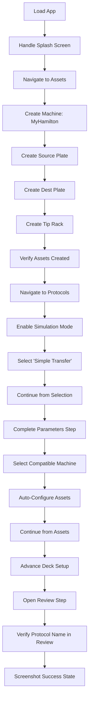

# SDET Static Analysis: functional-asset-selection.spec.ts

**Target File:** [functional-asset-selection.spec.ts](file:///Users/mar/Projects/praxis/praxis/web-client/e2e/specs/functional-asset-selection.spec.ts)  
**Review Date:** 2026-01-30  
**Analyst:** Senior SDET & Angular Specialist

---

## 1. Test Scope & Coverage

### What is Tested
This test verifies the **complete happy-path workflow** for preparing a protocol run in simulation mode by:
1. **Asset Creation via UI**: Creates a machine (Hamilton LiquidHandler) and three resources (Source Plate, Dest Plate, Tip Rack) with timestamped unique names.
2. **Protocol Selection**: Navigates to the protocol page, ensures simulation mode is active, and selects the "Simple Transfer" protocol.
3. **Wizard Progression**: Steps through the entire protocol configuration wizard:
   - Parameter step (default values accepted)
   - Machine selection step (picks first compatible machine)
   - Asset selection step (auto-configures or manually assigns assets)
   - Deck setup step (advanced/skipped)
   - Review step (validation of summary content)
4. **Review Step Validation**: Confirms the review step is reached and displays the expected protocol name.

### Assertions (Success Criteria)
| Assertion | Location | Purpose |
|-----------|----------|---------|
| `expect(assetsStep).toBeVisible()` | L67 | Verify asset selection wizard step loads |
| `expect(continueButton).toBeEnabled()` | L74 | Confirm assets are configured successfully |
| `expect(reviewContent).toBeVisible()` | L85 | Confirm review step rendered |
| `expect(protocolNameEl).toBeVisible()` | L89 | Verify protocol name element exists |
| `expect(protocolNameEl).toContainText('Simple Transfer')` | L96 | **Core assertion**: Correct protocol in review |
| Custom error (L91-95) | L94 | Runtime validation with screenshot on empty protocol name |

---

## 2. Code Review & Best Practices (Static Analysis)

### Critique the Code

| Issue | Severity | Line(s) | Details |
|-------|----------|---------|---------|
| **Missing Worker Isolation** | 🔴 High | L12-20 | `WelcomePage` is constructed without `testInfo`, so it doesn't use the worker-indexed DB pattern. This causes race conditions in parallel execution when assets are created. |
| **500ms hardcoded wait in POM** | 🟡 Medium | assets.page.ts:319 | `verifyAssetVisible()` has `await this.page.waitForTimeout(500)` for search debounce—should use `waitForResponse` or state-based assertion. |
| **100ms/150ms waits in POM** | 🟡 Medium | assets.page.ts:50,60,76 | Multiple small `waitForTimeout` calls for "animation settling"—brittle and adds latency. |
| **`force: true` clicks** | 🟡 Medium | assets.page.ts:47,133,142,158 | Indicates potential overlay/animation issues being worked around rather than solved. |
| **console.log in test code** | 🟢 Low | L37-49,65,98 | Debug logging should be conditional or use test reporter patterns. |
| **Implicit `testInfo` missing** | 🔴 High | L28 | Long timeout (5 min) set inline—should use fixture configuration for consistency. |

### Modern Standards (2026) Evaluation

| Standard | Rating | Evidence |
|----------|--------|----------|
| **User-Facing Locators** | ✅ Good | Uses `getByRole`, `getByTestId`, `getByText` throughout (L66, 73, 84, 88). XPath-free. |
| **Test Isolation** | ⚠️ Partial | `afterEach` dismisses dialogs (L22-25), but no cleanup of created assets. Test leaves data in DB. |
| **Page Object Model (POM)** | ✅ Excellent | Leverages `AssetsPage`, `ProtocolPage`, `WizardPage` effectively. Abstractions are well-defined. |
| **Async Angular Handling** | ⚠️ Mixed | Uses `waitFor({ state: 'visible' })` and `expect().toBeEnabled()`, but some areas still use `waitForTimeout()` (inherited from POMs). |
| **Worker DB Isolation** | ❌ Not Used | Does not pass `testInfo` to `BasePage`, so all parallel workers share the same DB. |
| **Fixture-Based Setup** | ❌ Missing | Uses raw `test` instead of project fixtures (e.g., `worker-db.fixture`). |

---

## 3. Test Value & Classification

### Scenario Relevance
**Critical User Journey (Happy Path)**: This test covers the **primary workflow** a lab scientist would follow:
1. Set up their lab equipment (machines + resources)
2. Select a standard protocol
3. Configure assets and proceed to review

This is exactly what a real user would do when preparing to run a liquid handling experiment.

### Classification
| Type | Verdict |
|------|---------|
| **True E2E Test** | ✅ Yes |
| **Interactive Unit Test** | ❌ No |

**Rationale**: The test exercises the full Angular application including:
- SQLite persistence (via browser mode)
- Multiple component interactions (asset wizard, protocol wizard)
- Real service layer (no mocks detected in test code)
- UI state synchronization across pages

The only simulation is the execution environment (`ensureSimulationMode()`), which is appropriate for CI.

---

## 4. User Flow & Intent Reconstruction

### Reverse-Engineered Workflow

### Contextual Fit
This test validates the **Pre-Execution Configuration Pipeline**:
- **Upstream Dependency**: Requires the asset registry (machines, resources) to function.
- **Downstream Consumer**: Feeds into protocol execution (the "Run" button visible in review).
- **Integration Points**:
  - Asset Wizard → SQLite persistence → Protocol Wizard asset picker
  - Protocol library indexing → Wizard parameter extraction
  - Machine compatibility matrix → Asset selection logic

---

## 5. Gap Analysis (Scientific & State Logic)

### Missing Critical Paths

| Gap | Severity | Description |
|-----|----------|-------------|
| **Asset Persistence Verification** | 🔴 High | Creates assets but only checks UI visibility. Does not verify SQLite contains correct entries. |
| **No Cleanup** | 🔴 High | Created assets remain in DB, causing contamination in subsequent tests. |
| **Machine Compatibility Logic** | 🟡 Medium | Trusts `selectFirstCompatibleMachine()` without verifying the selected machine is actually compatible with "Simple Transfer". |
| **Asset Count Validation** | 🟡 Medium | Does not verify that exactly 3 resources were created before proceeding. |
| **Parallel Execution Safety** | 🔴 High | Missing worker-indexed DB isolation prevents reliable parallel test runs. |

### Domain Specifics

| Domain Area | Coverage | Gap Analysis |
|-------------|----------|--------------|
| **Data Integrity** | ⚠️ Partial | Assets are created via UI but no deep verification. Could check `await page.evaluate(() => window.sqliteService.query('SELECT * FROM resources'))` to confirm DB state. |
| **Simulation vs. Reality** | ✅ Good | `ensureSimulationMode()` explicitly sets simulation mode. Machine selection prefers `Simulation/Chatterbox` backends. |
| **Serialization** | ❌ Not Tested | Does not verify that asset allocations are correctly serialized to the review step's internal state. The test only checks the protocol name display. |
| **Error Handling** | ❌ Not Tested | No negative scenarios (e.g., duplicate asset name, invalid configuration, missing required assets). |

---

## Summary Scorecard

| Category | Score | Notes |
|----------|-------|-------|
| **Test Scope** | 7/10 | Covers full wizard flow but misses persistence validation |
| **Best Practices** | 5/10 | Good POM usage, but missing worker isolation and has hardcoded waits in POMs |
| **Test Value** | 8/10 | Critical happy path with real user workflow |
| **Isolation** | 3/10 | No cleanup, no worker-indexed DB, leaves state behind |
| **Domain Coverage** | 4/10 | Asset creation checked superficially; no deep state verification |

**Overall**: **5.4/10**

---

## Recommendations Summary

1. **P0 - Critical**: Adopt `worker-db.fixture` pattern for parallel execution safety.
2. **P0 - Critical**: Add `afterEach` cleanup to delete created assets.
3. **P1 - High**: Replace `waitForTimeout()` calls in POMs with state-based waits.
4. **P1 - High**: Add SQLite deep verification for asset creation (query DB directly).
5. **P2 - Medium**: Verify machine compatibility explicitly in test.
6. **P2 - Medium**: Add negative test cases (duplicate asset, missing required field).
7. **P3 - Low**: Conditionalze or remove console.log statements.
