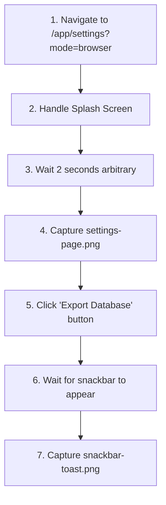

# SDET Static Analysis: low-priority-capture.spec.ts

**Target File:** [low-priority-capture.spec.ts](file:///Users/mar/Projects/praxis/praxis/web-client/e2e/specs/low-priority-capture.spec.ts)  
**Review Date:** 2026-01-30  
**Analyst:** Senior SDET & Angular Specialist

---

## 1. Test Scope & Coverage

### What is Tested
This test file captures visual documentation (screenshots) of two UI elements:
1. **Settings Page** - The application's settings interface at `/app/settings`
2. **Snackbar Toast** - Material Design snackbar notification triggered by clicking "Export Database"

**Functionality Verified:**
- Settings page renders and is navigable
- Export Database button is present and clickable
- Snackbar notification appears after export action

**State Changes Covered:**
- None explicitly verified; this is purely visual capture, not functional validation

### Assertions (Success Criteria)
| Assertion | Type | Purpose |
|-----------|------|---------|
| `expect(exportButton).toBeVisible()` | Visibility | Confirms Export Database button renders |
| `expect(snackbar).toBeVisible()` | Visibility | Confirms snackbar appears after export action |

**Notable Gap:** No assertions on:
- Screenshot file creation success
- Export action completion (download initiates)
- Snackbar content/message correctness
- Settings page content/configuration rendering

---

## 2. Code Review & Best Practices (Static Analysis)

### Critique the Code

| Issue | Severity | Line(s) | Description |
|-------|----------|---------|-------------|
| **Hardcoded `waitForTimeout(2000)`** | 🔴 High | 29 | Arbitrary 2-second wait is brittle; fails on slow CI, wastes time on fast machines |
| **No Worker Isolation** | 🔴 High | 1, 14 | Uses base `@playwright/test` instead of `worker-db.fixture`; breaks parallel execution |
| **CSS Class Selector for Snackbar** | 🟡 Medium | 42 | `.mat-mdc-snack-bar-container` is implementation detail; Material version upgrades will break |
| **No Cleanup** | 🟡 Medium | - | Screenshots persist between runs; no `afterEach` cleanup |
| **Filesystem Side Effects** | 🟡 Medium | 6-11 | `beforeAll` creates directories but test doesn't verify or clean them |
| **Console Logging for Status** | 🟢 Low | 33, 47 | `console.log` used instead of proper test hooks for screenshot verification |

### Modern Standards (2026) Evaluation

#### User-Facing Locators
| Element | Current | Recommendation |
|---------|---------|----------------|
| Export Button | ✅ `getByRole('button', { name: 'Export Database' })` | Excellent - semantic |
| Snackbar | ❌ `.mat-mdc-snack-bar-container` CSS class | Use `getByRole('alert')` or `getByText()` |

**Score: Mixed** - Button locator is excellent; snackbar locator is fragile.

#### Test Isolation
- ❌ **No `afterEach` Cleanup**: Screenshots accumulate, potential disk exhaustion
- ❌ **No Database Isolation**: Missing `worker-db.fixture` integration
- ❌ **Shared State**: Export action affects application state (initiates download) without cleanup

**Score: Poor** - Test is not suitable for parallel execution.

#### Page Object Model (POM)
- ⚠️ **Partial Usage**: `WelcomePage` imported but `SettingsPage` exists and is NOT used
- ❌ **Inline Logic**: Export button locator and snackbar locator defined inline instead of in `SettingsPage`
- ❌ **No Screenshot Helper**: No abstraction for screenshot capture logic

**Score: Poor** - Existing POMs are underutilized.

#### Async Angular Handling
- ❌ **Arbitrary Wait**: `waitForTimeout(2000)` instead of waiting for Angular render stability
- ⚠️ **No `networkidle`**: Export action may trigger network activity not awaited
- ❌ **No Signal-Based Waiting**: Should wait for Angular change detection cycle

**Score: Poor** - Uses timeout anti-pattern.

---

## 3. Test Value & Classification

### Scenario Relevance
| Aspect | Assessment |
|--------|------------|
| **User Journey Type** | Peripheral - screenshot documentation rather than workflow validation |
| **Critical Path** | ❌ No - Export Database is not a core user workflow |
| **Realistic Scenario** | ⚠️ Partial - Users do visit Settings, but test doesn't validate actual settings functionality |
| **Business Value** | 🟡 Low - Visual documentation utility only |

This is a **utility/documentation test**, not a functional regression test. It captures screenshots for manual reference but doesn't validate:
- Settings actually work
- Export produces valid database file
- Snackbar message is correct

### Classification

**Classification: Visual Documentation Utility (not True E2E)**

| Criterion | E2E Test | This Test |
|-----------|----------|-----------|
| Full stack integration | ✅ | ⚠️ Partial (touches real UI) |
| Validates business logic | ✅ | ❌ |
| Verifies state changes | ✅ | ❌ |
| Covers error scenarios | ✅ | ❌ |
| Suitable for regression | ✅ | ❌ |

**Verdict:** This is effectively a **screenshot capture script** running in Playwright's test harness, not a behavioral regression test.

---

## 4. User Flow & Intent Reconstruction

### Reverse-Engineered Workflow



**Step-by-Step:**
1. Navigate to Settings page with browser mode
2. Dismiss onboarding splash if present
3. Hard wait 2 seconds for page to "settle"
4. Screenshot the settings interface
5. Click "Export Database" button
6. Wait for Material snackbar to appear (up to 10s)
7. Screenshot the snackbar notification

### Contextual Fit

**Settings Page Role:**
- Central configuration hub for the Praxis application
- Contains database export/import functionality
- Toggles for OPFS backend selection
- Data management (clear data)

**Where This Fits:**
```
Application Ecosystem
├── Onboarding (01-onboarding)
├── Asset Management (02-asset-management)
├── Protocol Execution (03-protocol-execution)
├── Settings/Configuration  ◄── THIS TEST (partial)
│   ├── Export Database
│   ├── Import Database
│   ├── OPFS Toggle
│   └── Clear Data
└── Browser Persistence (04-browser-persistence)
```

**Gap:** The `SettingsPage` POM has methods for `exportDatabase()`, `importDatabase()`, `toggleOpfs()`, and `resetState()` - none of which are exercised by this test.

---

## 5. Gap Analysis (Scientific & State Logic)

### Missing Critical Paths

| Gap | Severity | Description |
|-----|----------|-------------|
| **Export Validation** | 🔴 Critical | Export button clicked but download never verified (SettingsPage.exportDatabase returns download path) |
| **Import Flow** | 🔴 Critical | No coverage of database import functionality |
| **OPFS Toggle** | 🟡 High | Settings page's core OPFS switching is untested |
| **Settings Persistence** | 🟡 High | Settings changes not verified to persist across page loads |
| **Snackbar Message** | 🟡 Medium | Snackbar visibility checked but message content ignored |

### Domain Specifics

#### Data Integrity
- ❌ **Not Validated**: Export button clicked but:
  - No verification the download initiates
  - No validation of exported file content
  - No check that `praxis.db` is correctly serialized
  
**Recommendation:** Use `SettingsPage.exportDatabase()` which returns the download path, then verify file exists and has valid SQLite header.

#### Simulation vs. Reality
- ⚠️ **Ambiguous Mode**: Uses `mode=browser` but doesn't verify:
  - OPFS is correctly initialized
  - SQLite service is ready
  - No `waitForSqliteReady()` call despite fixture availability

**Recommendation:** Integrate `worker-db.fixture` with `gotoWithWorkerDb()` for proper environment setup.

#### Serialization
- ❌ **Not Tested**: Export action presumably serializes the database but:
  - No verification of serialization format
  - No validation that exported DB can be re-imported
  - Round-trip integrity not tested

**Recommendation:** Add import-after-export validation to verify serialization correctness.

#### Error Handling
- ❌ **No Negative Cases**: 
  - What if export fails mid-write?
  - What if database is corrupted?
  - What if OPFS is unavailable?
  - What snackbar appears on error?

**Recommendation:** Add at least one negative test case (e.g., export with empty database).

---

## Summary Scorecard

| Category | Score | Notes |
|----------|-------|-------|
| **Test Scope** | 2/10 | Only captures screenshots; no functional validation |
| **Best Practices** | 3/10 | Hardcoded waits, no worker isolation, CSS selectors |
| **Test Value** | 2/10 | Utility script, not regression test |
| **Isolation** | 2/10 | No cleanup, shared state, not parallel-safe |
| **Domain Coverage** | 1/10 | Ignores export validation, import, OPFS, persistence |

**Overall**: **2.0/10**

---

## Recommendations Priority

1. **Convert to True E2E Test**: Transform screenshot capture into functional Settings validation
2. **Integrate `worker-db.fixture`**: Enable parallel execution
3. **Use `SettingsPage` POM**: Leverage existing methods for export/import
4. **Replace Hardcoded Wait**: Use Angular stability detection or action completion
5. **Add Domain Assertions**: Verify export file validity, import round-trip
6. **Add Error Cases**: Test failure scenarios

---

## Related Files

| File | Relationship |
|------|--------------|
| `e2e/page-objects/settings.page.ts` | **Should be used** - has export/import methods |
| `e2e/page-objects/welcome.page.ts` | Used for splash handling |
| `e2e/fixtures/worker-db.fixture.ts` | **Should be used** - provides isolation |
| `e2e/specs/browser-export.spec.ts` | Related - covers export in more detail |
