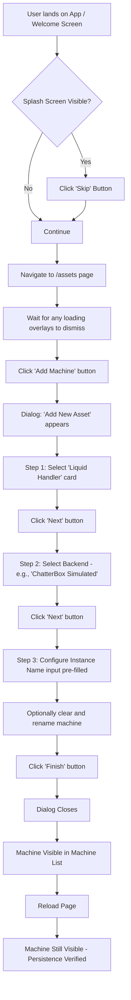

# SDET Static Analysis: machine-frontend-backend.spec.ts

**Target File:** [machine-frontend-backend.spec.ts](file:///Users/mar/Projects/praxis/praxis/web-client/e2e/specs/machine-frontend-backend.spec.ts)  
**Review Date:** 2026-01-30  
**Analyst:** Senior SDET & Angular Specialist

---

## 1. Test Scope & Coverage

### What is Tested

This test file verifies the **3-step Machine Creation Wizard**, a critical UI workflow for adding new lab automation hardware to the Praxis system. The workflow involves:

1. **Frontend Selection (Step 1):** Selecting the machine *type* (e.g., `LiquidHandler`, `PlateReader`) from database-driven `MachineFrontendDefinition` records displayed as selection cards.
2. **Backend Selection (Step 2):** Selecting the *driver* implementation (e.g., `HamiltonSTARBackend`, `ChatterBoxBackend`) compatible with the chosen frontend, including verification of a "Simulated" badge/chip.
3. **Configuration (Step 3):** Inputting the instance name, verifying pre-population from the backend name, and clicking "Finish."
4. **Full Workflow:** Completing all three steps to create a named machine, verifying persistence across page reloads.
5. **Navigation:** Forward/backward navigation using Next/Back buttons and clickable step indicators.
6. **Alternative Entry Point:** Testing the same wizard flow when accessed from the Playground's "Add Asset" inventory dialog.

**UI Elements Verified:**
- Selection cards (`button.selection-card`)
- Dialog container (`role="dialog"`)
- Step headings (`Choose Machine Type`, `Configure Machine`)
- Instance Name input (`getByLabel('Instance Name')`)
- Action buttons (Next, Finish, Cancel, Back)
- Simulated chip/badge (`.simulated-chip` or span text)
- Stepper indicators (`.stepper`)

**State Changes Covered:**
- Dialog open/close
- Multi-step wizard progression
- Form data pre-population
- Machine record creation in SQLite database
- Persistence verification post-reload

### Assertions (Success Criteria)

| Test Category | Key Assertions |
|:---|:---|
| **Step 1 Display** | `dialog` is visible; contains `Add New Asset` text; `Liquid Handler` card visible; at least 1 frontend card exists. |
| **Step 2 Navigation** | Backend cards load for selected frontend; count `> 0`; "Simulated" badge/chip visible. |
| **Step 3 Configuration** | `Configure Machine` heading visible; `Instance Name` input visible and pre-populated (length > 0). |
| **Full Flow** | Dialog closes after `Finish`; created machine name visible in list post-creation AND post-reload. |
| **Navigation** | `Choose Machine Type` or `Configure Machine` headings become visible after back navigation; step indicators clickable. |

---

## 2. Code Review & Best Practices (Static Analysis)

### Critique the Code

| Issue | Severity | Line(s) | Description |
|:---|:---|:---|:---|
| **Hardcoded CSS Selectors** | 🟠 Medium | 45, 51, 69, 72, 96, 120, 128, 154, 165, 196, 234, etc. | Heavy reliance on `button.selection-card:visible`, `button.selection-card.definition-card:visible`, `.simulated-chip`, `.stepper`. These are implementation details subject to change during refactoring. |
| **Arbitrary Timeouts** | 🟠 Medium | 50, 100, 150, 350, etc. | `waitForTimeout(100)` and similar are not present *directly* but many assertions use magic `10000`, `15000`, `5000` timeouts without a justification comment. A constants file or configuration object would improve clarity. |
| **Inconsistent Back Button Selector** | 🟠 Medium | 379, 418 | `page.getByRole('button').filter({ has: page.locator('mat-icon:has-text("arrow_back")') })` is fragile and implementation-specific. The button lacks an accessible name or `data-testid`. |
| **Stepper Indicator Selector** | 🔴 High | 454 | `page.locator('.stepper').locator('div').filter({ hasText: /Machine Type/i })` is extremely brittle and relies on `div` hierarchy within a custom `.stepper` class. |
| **Missing Test IDs** | 🟠 Medium | N/A | The `AssetsPage` POM demonstrates `getByTestId('wizard-next-button')`, but the spec file frequently bypasses the POM's robust methods and interacts directly with CSS-based locators (e.g., `page.getByRole('button', { name: /Next/i })`). |
| **Console Logging in Tests** | 🟢 Low | 21-26, 77, 133, 245 | Debug console logging (`console.log`) is acceptable for development but should be wrapped in a `DEBUG` flag or removed for CI runs to reduce noise. |
| **Duplicate Setup Logic** | 🟠 Medium | Most tests | Many tests repeat the same 4-5 lines to get to Step 2 or Step 3, violating DRY. This should be extracted into POM helper methods or a shared setup fixture. |
| **Potential flakiness on Card Visibility** | 🟠 Medium | 279-283 | The `if (await simulatedBackend.isVisible({ timeout: 2000 }))` pattern with a fallback is a code smell. It indicates the test doesn't have a deterministic expectation of the data state. |
| **Alternative Entry Point Divergence** | 🟠 Medium | 466-501 | Line 468 uses `'/app/playground?mode=browser&resetdb=1'` inline, bypassing `BasePage` conventions for URL construction and DB isolation. This test will likely fail in parallel due to DB contention. |

### Modern Standards (2026) Evaluation

| Criterion | Score | Notes |
|:---|:---|:---|
| **User-Facing Locators** | 5/10 | Good use of `getByRole` for buttons and dialogs, but many instances fall back to CSS classes (`button.selection-card`). The wizard cards lack ARIA roles or `data-testid` attributes. **Recommendation:** Add `role="option"` or `data-testid="definition-card-{id}"` to selection cards. |
| **Test Isolation** | 4/10 | `beforeEach` navigates via `WelcomePage` but does **not** pass `testInfo` for worker-indexed DB. Tests create machines with `Date.now()` names (good for unique naming) but do **not** clean up created records in `afterEach`. This leads to database pollution across test runs and potential strict mode violations if names appear in background tables. **Recommendation:** Implement `afterEach` teardown using `deleteMachine()` from POM. |
| **Page Object Model (POM)** | 5/10 | `AssetsPage` and `WelcomePage` are used, and `AssetsPage` has sophisticated methods (`createMachine`, `waitForStepTransition`). However, the spec **bypasses** these helpers entirely and re-implements step navigation logic inline. This defeats the purpose of the POM abstraction. **Recommendation:** The spec should only call `assetsPage.createMachine()` for happy-path flows. |
| **Async Angular Handling** | 6/10 | Uses `waitForOverlay()` from POM and `waitFor({ state: 'visible' })` for cards. However, it misses the robust `waitForStepTransition` pattern that accounts for Material animation timing. Direct `getByRole('button', { name: /Next/i }).click()` calls don't include the POM's `{ force: true }` safeguard. |

---

## 3. Test Value & Classification

### Scenario Relevance

| Aspect | Assessment |
|:---|:---|
| **User Journey Type** | **Happy Path (Critical)**: The Machine Creation Wizard is a primary onboarding experience. Users cannot control lab hardware without adding machines. This is a **P0** feature. |
| **Realism** | **High**: The flow mirrors exactly what a new user or lab technologist would perform: Open wizard → Select machine type → Select driver → Name and configure → Finish. |
| **Edge Case Coverage** | **Low to None**: No tests for invalid inputs (e.g., empty name, duplicate name, special characters), error states (e.g., database write failure), or keyboard-only navigation (accessibility). |

### Classification

| Attribute | Value | Justification |
|:---|:---|:---|
| **Test Type** | **True E2E Test** | Verifies full-stack: UI rendering, SQLite database persistence (via `resetdb=1` and reload verification), and multi-step wizard state management. No API mocking is performed. |
| **Integration Level** | High | Multiple components involved: Asset Wizard, Dialog, Stepper, Selection Cards, SQLite Service. |
| **Dependency on Seed Data** | Moderate | Relies on `MachineFrontendDefinition` and `MachineBackendDefinition` records being present in the seeded `praxis.db`. Tests use `.first()` or filter for `LiquidHandler` assuming it exists. |

---

## 4. User Flow & Intent Reconstruction

### Reverse-Engineered Workflow

Based on the code, the intended user workflow is:

**Alternative Path (Last Test Block):**
1. Navigate directly to `/app/playground?mode=browser&resetdb=1`.
2. Dismiss onboarding Skip dialog.
3. Open "Inventory Dialog" via an `aria-label="Open Inventory Dialog"` button.
4. Switch to "Browse & Add" tab.
5. Select "Machine" type option.
6. Verify the same Frontend selection cards appear.

### Contextual Fit

This component is the **primary entry point for hardware configuration** in the Praxis lab automation ecosystem. It bridges:

- **Frontend Definitions:** Abstract machine capabilities (what actions a "Liquid Handler" can perform).
- **Backend Definitions:** Concrete driver implementations (how to talk to a Hamilton STAR vs. a simulated ChatterBox).
- **Instance Registry:** The user-created, named instance that ties a frontend capability set to a backend driver for actual protocol execution.

Without this wizard, users cannot:
- Add hardware to their workcell.
- Run protocols that require machine control.
- Set up simulation environments for testing.

---

## 5. Gap Analysis (Scientific & State Logic)

### Missing Critical Paths

| Gap | Impact | Recommendation |
|:---|:---|:---|
| **Validation Logic** | 🔴 High | No test verifies validation errors (empty name, duplicate name). The "Finish" button enablement logic is untested for edge cases. |
| **Error Handling** | 🔴 High | No test simulates a database write failure (e.g., via `page.route` to intercept and fail an internal SQLite call or by corrupting state). The user-facing error message display is unverified. |
| **Cancel Mid-Flow** | 🟠 Medium | Tests click "Cancel" to close the dialog but don't verify that no machine was created, nor do they verify state cleanup (e.g., Angular form state reset if re-opened). |
| **Backend Filtering Correctness** | 🟠 Medium | Step 2 asserts that >0 backends appear for "Liquid Handler", but doesn't verify that *incompatible* backends are hidden. For example, a PlateReader backend should NOT appear when LiquidHandler is selected. |
| **Accessibility** | 🔴 High | No tests for keyboard-only navigation (Tab, Enter, ArrowKeys), screen reader announcements, or focus management during step transitions. |

### Domain Specifics

#### Data Integrity
- ❌ **Weak:** Tests verify that `Liquid Handler` card is visible (i.e., the database query returns results), but do NOT verify the *content* of the card (e.g., frontend description, icon correctness).
- ❌ **Missing:** No verification that the created machine has the correct `frontend_id`, `backend_id`, or configuration properties in the database. Only the *name* is checked in the UI.

#### Simulation vs. Reality
- ✅ **Partially Covered:** Tests explicitly filter for `Simulated|ChatterBox` backends in the full workflow, indicating awareness that these are safe test drivers.
- ❌ **Missing:** No test instantiates a *real* hardware backend and verifies connection status UI or failure handling (which would obviously require mocking or a lab hardware simulator at the protocol level).

#### Serialization
- ❌ **Not Covered:** The tests do NOT verify that the machine configuration object (including any advanced settings exposed in Step 3) is correctly serialized and stored. The pre-population check (line 243-244) only verifies the name *value* was pre-filled, not that it matched the backend's default name property.

#### Error Handling
- ❌ **Not Covered:**
  - Invalid database schema (corrupted `praxis.db`).
  - Python/Pyodide syntax error during backend instantiation (if drivers use Pyodide).
  - Timeout during driver connection check.
  - User entering a name that already exists.

---

## Summary Scorecard

| Category | Score | Notes |
|----------|-------|-------|
| **Test Scope** | 7/10 | Covers the happy path comprehensively, including persistence. Navigation is tested. |
| **Best Practices** | 4/10 | Heavy CSS reliance, POM underutilization, no cleanup, hardcoded timeouts. |
| **Test Value** | 8/10 | Tests a P0 critical journey. High realism. |
| **Isolation** | 3/10 | No worker-indexed DB, no `afterEach` cleanup, inline URL bypassing BasePage. |
| **Domain Coverage** | 3/10 | No validation, error handling, data integrity checks, or accessibility. |

**Overall: 5.0/10**

---

## Prioritized Recommendations

1. **[CRITICAL] Add Test Isolation:** Pass `testInfo` to `AssetsPage` constructor and use the worker-indexed DB pattern from `base.page.ts`. Add `afterEach` cleanup for created machines.

2. **[HIGH] Utilize POM Methods:** Refactor tests to use `assetsPage.createMachine()` for the full workflow. Extract step-by-step navigation into helper methods within the POM.

3. **[HIGH] Add Data-TestIDs to Angular Component:** The wizard's selection cards need `data-testid="frontend-card-{name}"` and `data-testid="backend-card-{id}"` attributes to replace CSS selectors.

4. **[MEDIUM] Add Negative Test Cases:** Test empty name submission, duplicate name, and cancel button behavior.

5. **[MEDIUM] Add Accessibility Tests:** Verify keyboard navigation and focus management.

6. **[LOW] Centralize Timeout Constants:** Create a `test-constants.ts` with named timeout values (e.g., `WIZARD_STEP_TIMEOUT`, `DIALOG_ANIMATION_SETTLE`).
