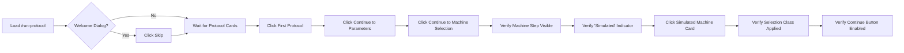

# SDET Static Analysis: run-protocol-machine-selection.spec.ts

**Target File:** [run-protocol-machine-selection.spec.ts](file:///Users/mar/Projects/praxis/praxis/web-client/e2e/specs/run-protocol-machine-selection.spec.ts)  
**Review Date:** 2026-01-30  
**Analyst:** Senior SDET & Angular Specialist

---

## 1. Test Scope & Coverage

### What is Tested
This test verifies the **machine selection step** within the run-protocol wizard flow. Specifically:

| Aspect | Details |
|--------|---------|
| **Navigation** | Navigating to `/run-protocol` with browser mode query parameter |
| **Splash Handling** | Conditionally dismissing the welcome dialog for first-time users |
| **Protocol Selection** | Clicking the first protocol card to advance the stepper |
| **Stepper Progression** | Advancing through Step 1 (Protocol) → Step 2 (Parameters) → Step 3 (Machine Selection) |
| **Machine Step Visibility** | Verifying the machine selection step container appears (`[data-tour-id="run-step-machine"]`) |
| **Simulated Indicator** | Confirming "Simulated" text is visible for browser-mode machines |
| **Machine Selection** | Clicking a simulated machine card and verifying selection feedback |
| **Button State** | Verifying the "Continue" button becomes enabled after selection |

### Assertions (Success Criteria)

| Assertion | Line | Type |
|-----------|------|------|
| Protocol card visible | 30 | `toBeVisible` (15s timeout) |
| Continue button (to params) visible | 35 | `toBeVisible` |
| Continue button (to machine) visible | 40 | `toBeVisible` |
| Machine step container visible | 45 | `toBeVisible` |
| "Select Execution Machine" text visible | 46 | `toBeVisible` |
| "Simulated" indicator visible | 51 | `toBeVisible` |
| Machine card has selection class | 59 | `toHaveClass(/border-primary/)` |
| Continue button enabled | 63 | `toBeEnabled` |

---

## 2. Code Review & Best Practices (Static Analysis)

### Critique the Code

| Issue | Severity | Location | Description |
|-------|----------|----------|-------------|
| **No Worker DB Isolation** | 🔴 Critical | Lines 1-13 | Test uses raw `@playwright/test` import instead of `worker-db.fixture`, causing OPFS race conditions in parallel execution |
| **Manual localStorage Manipulation** | 🟠 Medium | Lines 7-12 | Directly manipulating localStorage in `beforeEach` is fragile; URL params (`mode=browser`) + fixture should handle isolation |
| **`networkidle` Wait Strategy** | 🟠 Medium | Line 18 | `waitUntil: 'networkidle'` is deprecated/flaky for SPAs with WebSockets; prefer `domcontentloaded` + explicit state waits |
| **Conditional Splash Handling** | 🟡 Minor | Lines 22-25 | `isVisible` with catch fallback is acceptable but could be encapsulated in a POM helper |
| **Component Selector Dependency** | 🟠 Medium | Lines 29, 44, 55 | Uses `app-protocol-card`, `[data-tour-id]`, `app-machine-card` - component selectors couple tests to implementation |
| **`.last()` Button Selection** | 🟠 Medium | Lines 34, 39 | Using `.last()` on Continue buttons is fragile if UI structure changes |
| **CSS Class Assertion** | 🟠 Medium | Line 59 | Asserting `border-primary` class couples test to Tailwind implementation detail |
| **No Test Cleanup** | 🟡 Minor | N/A | No `afterEach` to reset state, relying solely on `beforeEach` localStorage clear |

### Modern Standards (2026) Evaluation

| Criterion | Status | Assessment |
|-----------|--------|------------|
| **User-Facing Locators** | 🟢 Partial | Uses `getByRole('button', { name: /Continue/i })` and `getByText` appropriately; however, also relies on component selectors (`app-protocol-card`) |
| **Test Isolation** | 🔴 Fail | Does not use worker-indexed database fixture; parallel execution will cause OPFS conflicts |
| **Page Object Model** | 🔴 Fail | No POM usage; all logic inline despite existing `ProtocolPage` and `WizardPage` POMs that handle this exact flow |
| **Async Angular Handling** | 🟠 Partial | Uses `waitUntil: 'networkidle'` instead of waiting for SQLite service readiness or Angular signals |

---

## 3. Test Value & Classification

### Scenario Relevance
- **Critical User Journey**: ✅ Yes - Machine selection is a mandatory step in protocol execution workflow
- **Happy Path**: ✅ Yes - Tests the primary success path (select protocol → advance → select machine)
- **Realistic Scenario**: ✅ Yes - Mirrors what a user would do when running a protocol in browser/simulation mode

### Classification

| Classification | Verdict |
|----------------|---------|
| **True E2E Test** | 🟢 Yes |
| **Mocking Level** | Minimal (browser mode uses simulated machines, not external mocks) |
| **Integration Points** | Protocol service, machine store, Angular Material stepper, run-protocol wizard |

This is a **True E2E Test** - it navigates through multiple wizard steps with real Angular components and services. The "simulation" is the application's native browser-mode behavior, not test-injected mocks.

---

## 4. User Flow & Intent Reconstruction

### Reverse-Engineered Workflow



**Step-by-Step:**
1. User navigates to run-protocol page in browser mode
2. If first-time user, dismisses welcome dialog
3. Selects the first available protocol card
4. Clicks Continue to advance to Parameters step
5. Clicks Continue to advance to Machine Selection step
6. Views available machines (all simulated in browser mode)
7. Clicks a simulated machine to select it
8. UI shows selection feedback (border highlight)
9. Continue button activates, allowing progression

### Contextual Fit

| Context | Role |
|---------|------|
| **Application Flow** | Middle of run-protocol wizard (Step 3 of 5) |
| **Dependencies** | Requires protocols pre-loaded, machine list available |
| **Successor Steps** | Deck setup (Step 4) → Review (Step 5) → Execute |
| **Related Components** | `MachineSelectionComponent`, `MachineCardComponent`, `ProtocolPage`, `WizardPage` |

---

## 5. Gap Analysis (Scientific & State Logic)

### Missing Critical Paths

| Gap | Risk | Description |
|-----|------|-------------|
| **Incompatible Machine Handling** | 🔴 High | No test for clicking an incompatible machine (should not select, should show warning) |
| **Stepper Back Navigation** | 🟠 Medium | No test for navigating back to previous steps and returning |
| **Empty Machine List** | 🟠 Medium | No test for scenario where no machines are available |
| **Physical vs Simulated Mode** | 🔴 High | No coverage of physical mode behavior (should block simulated machines) |
| **Machine Compatibility Indicators** | 🟡 Medium | No verification of compatibility badges/tooltips on machine cards |

### Domain Specifics

| Domain Area | Status | Assessment |
|-------------|--------|------------|
| **Data Integrity** | 🔴 Not Tested | No verification that selected machine ID is persisted to run state |
| **Simulation vs. Reality** | 🟡 Shallow | Tests for "Simulated" text but doesn't verify `backend_type` or `connection_info` fields |
| **Serialization** | 🔴 Not Tested | No verification that machine selection is correctly serialized when advancing |
| **Error Handling** | 🔴 Not Tested | No coverage of: machine fetch failures, network errors, invalid machine state |

### Specific Gaps by Component

```typescript
// MachineSelectionComponent (line 57-66) has compatibility logic:
if (item.compatibility.is_compatible) {
  if (this.isPhysicalMode() && this.isSimulated(item.machine)) {
    return; // Blocks selection - NOT TESTED
  }
}
```

**Untested Paths in `MachineSelectionComponent`:**
1. `is_compatible === false` → selection blocked (line 57)
2. `isPhysicalMode() && isSimulated()` → selection blocked (line 62-64)
3. Empty `machines()` array → shows empty state (line 35-40)

---

## Summary Scorecard

| Category | Score | Notes |
|----------|-------|-------|
| **Test Scope** | 6/10 | Covers happy path stepper progression but misses machine-specific edge cases |
| **Best Practices** | 3/10 | No POM, no worker isolation, relies on implementation CSS classes |
| **Test Value** | 7/10 | Validates critical user journey (machine selection step) |
| **Isolation** | 2/10 | No worker-indexed DB; parallel execution will fail |
| **Domain Coverage** | 3/10 | Shallow validation - no data integrity, no error states, no mode switching |

**Overall**: **4.2/10**

---

## Recommendations Priority Matrix

| Priority | Action | Effort |
|----------|--------|--------|
| 🔴 P0 | Migrate to `worker-db.fixture` for parallel safety | Low |
| 🔴 P0 | Use existing `ProtocolPage`/`WizardPage` POMs | Medium |
| 🟠 P1 | Replace `networkidle` with SQLite readiness wait | Low |
| 🟠 P1 | Add incompatible machine selection test | Medium |
| 🟠 P1 | Add physical mode vs simulated mode test | Medium |
| 🟡 P2 | Verify machine ID persisted to run state | Medium |
| 🟡 P2 | Add empty machine list scenario | Low |
