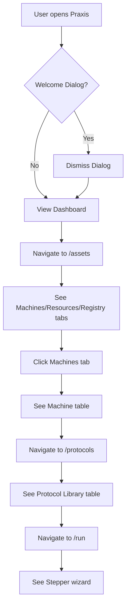

# SDET Static Analysis: smoke.spec.ts

**Target File:** [smoke.spec.ts](file:///Users/mar/Projects/praxis/praxis/web-client/e2e/specs/smoke.spec.ts)  
**Review Date:** 2026-01-30  
**Analyst:** Senior SDET & Angular Specialist

---

## 1. Test Scope & Coverage

### What is Tested
This smoke test validates the **fundamental application bootstrap and navigation skeleton**:

1. **Dashboard Loading** (`should load the dashboard`)
   - Page title contains "Praxis"
   - App shell renders (`app-unified-shell` or `app-main-layout`)
   - Navigation rail (`.sidebar-rail` or `.nav-rail`) is visible

2. **Assets View** (`should navigate to Assets and display tables`)
   - `/assets` route is accessible
   - `app-assets` component renders
   - Material Tab Group with "Machines", "Resources", "Registry" tabs
   - Machine List table is visible after tab click

3. **Protocols View** (`should navigate to Protocols and display library`)
   - `/protocols` route is accessible
   - `app-protocol-library` component with "Protocol Library" heading
   - Protocol table is visible

4. **Run Protocol Wizard** (`should navigate to Run Protocol wizard`)
   - `/run` route is accessible
   - `mat-stepper` with "Select Protocol" and "Configure Parameters" steps visible

### Assertions (Success Criteria)
| Test | Key Assertions |
|------|----------------|
| Dashboard | `toHaveTitle(/Praxis/)`, shell component visible, sidebar visible |
| Assets | `app-assets` visible, tab labels contain machine/resource/registry text, table visible |
| Protocols | `app-protocol-library` with heading visible, table visible |
| Run Protocol | `mat-stepper` visible, step headers with correct labels |

**Screenshot Artifacts:** All 4 tests capture screenshots to `/tmp/e2e-smoke/` for visual verification.

---

## 2. Code Review & Best Practices (Static Analysis)

### Critique the Code

#### ⚠️ Brittleness Issues

| Line | Issue | Severity | Description |
|------|-------|----------|-------------|
| 12 | `waitForLoadState('networkidle')` | Medium | Deprecated and unreliable in SPAs with continuous background activity |
| 13 | Multiple selector fallback: `app-unified-shell, app-main-layout` | Low | Indicates architectural uncertainty; should use stable selector |
| 14 | CSS class selector `.sidebar-rail, .nav-rail` | Medium | Implementation detail; fragile to styling changes |
| 21, 31, 46+49 | 30000ms timeout overrides | High | Excessive timeouts mask flakiness; should use state-based waits |
| 25-27 | `.mat-mdc-tab-labels` text content assertions | Medium | Relies on Angular Material internal DOM structure |
| 52-53 | `.mat-step-header` filter pattern | Medium | Material internal class; brittle to library updates |

#### ✅ Positive Patterns
- Uses `getByRole('tab')` on line 30 — excellent user-facing locator
- Fixture handles DB isolation, auth bypass, and onboarding dismissal
- Screenshot capture for debugging

### Modern Standards (2026) Evaluation

#### User-Facing Locators
| Score | 4/10 |
|-------|------|
**Analysis:** Mixed usage. Only line 30 uses `getByRole`. All other locators are CSS-based component selectors (`app-*`) or Material internal classes (`.mat-mdc-*`, `.mat-step-header`).

**Recommendation:** Migrate to:
```typescript
// Instead of: page.locator('.mat-mdc-tab-labels').toContainText('Machines')
await expect(page.getByRole('tab', { name: /Machines/i })).toBeVisible();
```

#### Test Isolation
| Score | 8/10 |
|-------|------|
**Analysis:** `app.fixture.ts` provides worker-indexed DB isolation (`praxis-worker-{index}`), resets DB on each test, and handles dialog dismissal. No explicit afterEach cleanup in spec, but fixture handles state via `resetdb=1`.

**Gap:** Tests do not verify DB state post-action; relies on reset for next test.

#### Page Object Model (POM)
| Score | 2/10 |
|-------|------|
**Analysis:** POMs exist (`base.page.ts`, `app.page.ts`) but are **not used**. All locator logic is inline in the spec. The existing POMs are rudimentary (only `header`, `sidebar`, `content` getters).

**Impact:** Duplicate locator definitions across tests; high maintenance burden.

#### Async Angular Handling
| Score | 5/10 |
|-------|------|
**Analysis:** 
- ✅ `waitForDbReady()` in fixture waits for SQLite service via `isReady$` signal
- ⚠️ `waitForLoadState('networkidle')` is unreliable for Angular change detection
- ❌ No explicit zone.js stabilization or `waitForAngular()` equivalent

**Recommendation:** Use Angular-aware wait patterns:
```typescript
await page.waitForFunction(() => (window as any).ng?.getComponent);
```

---

## 3. Test Value & Classification

### Scenario Relevance
| Classification | Happy Path — Critical Smoke |
|----------------|----------------------------|

**Justification:** These tests verify the **absolute minimum viable product**:
1. App boots without crash
2. Core navigation routes resolve
3. Primary components render

This is a **Tier 1 Critical Path** that should block any deployment if failing.

### Classification
| Type | True E2E Test (Light Integration) |
|------|-----------------------------------|

**Analysis:**
- ✅ Tests real Angular rendering, routing, and Material components
- ✅ Uses real SQLite service via OPFS
- ⚠️ Auth is bypassed via fixture (localStorage fake token)
- ⚠️ No backend API calls verified (pure browser-side)

**Verdict:** This is a **True E2E** at the browser layer, but mocks authentication. It tests the complete frontend stack but not backend integration.

---

## 4. User Flow & Intent Reconstruction

### Reverse-Engineered Workflow



**Step-by-Step:**
1. User lands on the application root (`/`)
2. Application initializes SQLite worker, loads DB
3. Welcome dialog potentially appears → user dismisses
4. Dashboard/shell with navigation rail is visible
5. User navigates to "Assets" → sees tabbed interface
6. User navigates to "Protocols" → sees library with protocol list
7. User navigates to "Run" → sees multi-step wizard for execution

### Contextual Fit

This smoke test validates the **application skeleton** — the static framework upon which all domain functionality is built. It answers:

- Does the Angular app compile and hydrate?
- Do Material components render?
- Does routing work?
- Is the SQLite OPFS layer operational?

It does **not** validate:
- Data persistence across sessions
- Protocol execution (Pyodide)
- Machine communication (backend/simulation)
- Complex state transitions

---

## 5. Gap Analysis (Scientific & State Logic)

### Missing Critical Paths

| Gap | Severity | Description |
|-----|----------|-------------|
| **No data verification** | High | Tests check UI visibility but not that tables contain actual data |
| **No empty state handling** | Medium | What does Assets page show when no machines exist? |
| **No error UI verification** | Medium | What happens if SQLite fails to initialize? |
| **No navigation deeplink test** | Low | Tests only root-based navigation; no `?asset=123` style links |
| **No responsive/viewport tests** | Low | All tests use default viewport |

### Domain Specifics

#### Data Integrity
| Score | 2/10 |
|-------|------|
**Analysis:** Tests confirm tables are *visible* but never verify:
- Row count > 0
- Specific data content matches expected seed data
- SQLite query correctness

**Gap:** A table could render empty and tests would pass.

#### Simulation vs. Reality
| Score | N/A |
|-------|-----|
**Analysis:** Smoke tests intentionally avoid simulation complexity. The fixture uses `mode=browser` which runs fully in-browser with real SQLite. No machine simulation is tested.

#### Serialization
| Score | N/A |
|-------|-----|
**Analysis:** No protocol execution or Pyodide invocation occurs in smoke tests. Argument serialization is out of scope.

#### Error Handling
| Score | 1/10 |
|-------|------|
**Analysis:** Zero error scenarios tested:
- ❌ Invalid route handling
- ❌ SQLite initialization timeout
- ❌ Missing seed data
- ❌ Network failure simulation

---

## Summary Scorecard

| Category | Score | Notes |
|----------|-------|-------|
| **Test Scope** | 6/10 | Covers core navigation; lacks data verification |
| **Best Practices** | 4/10 | Mixed locators; excessive timeouts; no POM usage |
| **Test Value** | 7/10 | High value as smoke gate; correctly prioritized |
| **Isolation** | 8/10 | Fixture provides excellent worker isolation |
| **Domain Coverage** | 2/10 | Pure UI visibility; no state/data validation |

**Overall**: **5.4/10**

**Key Improvement Vectors:**
1. Replace CSS selectors with `getByRole`/`getByLabel`
2. Add data presence assertions (row counts, cell content)
3. Migrate inline locators to POMs
4. Remove `waitForLoadState('networkidle')` anti-pattern
5. Add at least one error scenario (e.g., invalid route → 404 handling)
