# SDET Static Analysis: user-journeys.spec.ts

**Target File:** [user-journeys.spec.ts](file:///Users/mar/Projects/praxis/praxis/web-client/e2e/specs/user-journeys.spec.ts)  
**Review Date:** 2026-01-30  
**Analyst:** Senior SDET & Angular Specialist

---

## 1. Test Scope & Coverage

### What is Tested

| Test Case | Functionality Verified |
|-----------|------------------------|
| **Asset Management: View and Create Machine** | Navigates to `/assets?type=machine`, dismisses welcome dialogs, opens the Asset Wizard via `[data-tour-id="add-asset-btn"]`, steps through a 6-step Material Stepper wizard (Category → Frontend → Backend → Config → Review → Create), verifies wizard closure. |
| **Protocol Workflow: Select and Run** | Navigates to `/protocols`, locates "Simple Transfer" in a table, clicks a Play button, navigates through a 4-step wizard (Protocol Selection → Parameters → Deck Config → Review), and clicks "Start Execution". |

### Key Assertions (Success Criteria)

| Test | Critical Assertions | Locator Strategy |
|------|---------------------|------------------|
| Asset Creation | `expect(wizard).toBeHidden()` after Create button click | `app-asset-wizard` component |
| Asset Creation | `expect(page.getByTestId('category-card-LiquidHandler')).toBeVisible()` | `data-testid` ✓ |
| Protocol Workflow | `expect(page.locator('table')).toContainText('Simple Transfer')` | Broad `table` locator |
| Protocol Workflow | `expect(page.getByText('Ready to Run')).toBeVisible()` | Text content ✓ |
| Protocol Workflow | `expect(page.getByText('Parameters Configured: Yes')).toBeVisible()` | Text content ✓ |

> [!NOTE]
> Neither test verifies **persistent state changes** (e.g., that the created machine actually appears in the asset list, or that the protocol run was logged anywhere). They test *UI flow completion*, not *data integrity*.

---

## 2. Code Review & Best Practices (Static Analysis)

### Brittle Logic Identified

| Line | Issue | Severity | Recommendation |
|------|-------|----------|----------------|
| **L15-17** | `page.waitForLoadState('networkidle')` with `.catch()` swallows errors silently | 🟡 Medium | Remove entirely or replace with `await expect(locator).toBeVisible()` per Web-First principles |
| **L42-45** | `expect(page.locator('.cdk-overlay-backdrop')).not.toBeVisible()` wrapped in try/catch that logs but continues | 🟡 Medium | This is a race condition workaround. Better: use CDK-aware dismissal or `waitForOverlay()` from `BasePage` |
| **L51, L133** | `await addBtn.click({ force: true })` | 🔴 High | Force clicks bypass actionability checks—this hides real overlay timing issues |
| **L68, L118** | `await page.waitForTimeout(500)` and `waitForTimeout(1000)` | 🔴 High | Hardcoded sleeps are flaky. Replace with state-driven waits |
| **L64, L79, L87, L103** | Generic `:visible` and `.first()` chaining | 🟡 Medium | Order-dependent; DOM changes will break these |
| **L134** | `row.locator('button:has(mat-icon:text("play_arrow"))')` | 🟡 Medium | Pseudo-selector `:has()` and `:text()` are brittle; prefer `getByRole('button', { name: ... })` |
| **L141-145** | `expect(async () => { ... }).toPass()` polling pattern | 🟢 OK | Actually good for eventual consistency |
| **L166** | Complex CSS selector with `:not([style*="visibility: hidden"])` | 🔴 High | Fragile implementation-detail selector; breaks with style changes |
| **L181** | `page.locator('button').filter({ hasText: 'Next' }).locator('visible=true')` | 🟡 Medium | Mixing pseudo-locators; `locator('visible=true')` is non-standard syntax |

### Modern Standards (2026) Evaluation

| Criteria | Status | Evidence |
|----------|--------|----------|
| **User-Facing Locators** | 🟡 Partial | Uses `getByRole`, `getByTestId`, `getByLabel` in some places, but falls back to CSS classes (`.sidebar-rail`, `.cdk-overlay-backdrop`, `.mat-step-content`) frequently |
| **Test Isolation** | 🔴 Poor | No `afterEach` cleanup; wizard creation test doesn't delete the machine, polluting state for subsequent runs |
| **Page Object Model (POM)** | 🔴 Unused | `WizardPage` and `AssetsPage` exist but are **completely bypassed**—this spec writes raw Playwright code inline |
| **Fixtures** | 🔴 Unused | `base.page.ts` has worker-indexed DB isolation, but this test doesn't use it (`goto('/?mode=browser')` lacks `dbName`) |
| **Async Angular Handling** | 🟡 Partial | Uses `networkidle` (discouraged) instead of waiting for `SqliteService.isReady$` as documented in best practices |

> [!CAUTION]
> **Critical Gap**: This test navigates via `page.goto('/?mode=browser')` directly, bypassing `BasePage.goto()` which handles SQLite readiness and worker isolation. This causes OPFS contention in parallel runs.

---

## 3. Test Value & Classification

### Scenario Relevance

| Test | User Journey Type | Business Criticality |
|------|-------------------|---------------------|
| **Asset Management** | ✅ Happy Path | **High** — Creating machines is a core onboarding step |
| **Protocol Workflow** | ✅ Happy Path | **High** — Running protocols is the primary app function |

Both tests simulate realistic user scenarios that a lab technician would perform. These are **essential coverage** for regression testing.

### Classification

| Aspect | Verdict |
|--------|---------|
| **True E2E Test?** | 🟡 Partial |
| **Backend Integration** | ❌ None — hardcoded `mode=browser` uses in-memory SQLite |
| **Python/Pyodide Execution** | ❌ Not tested — "Start Execution" is clicked but no verification of what happens next |
| **Network Mocking** | ❌ None (no `page.route()` calls) |

**Verdict**: These are **Interactive UI Flow Tests**, not True E2E Tests. They verify that the UI *stepper* completes, but don't verify that:
- Assets are persisted to the database
- Protocol execution actually runs Python code
- Serialization to the Pyodide worker is correct

---

## 4. User Flow & Intent Reconstruction

### Reverse-Engineered Workflow

```mermaid
flowchart TD
    subgraph "Test 1: Asset Management"
        A1[Navigate to /assets?type=machine] --> A2[Dismiss Welcome Dialog]
        A2 --> A3[Click Add Asset Button]
        A3 --> A4[Select 'LiquidHandler' Category]
        A4 --> A5[Select First Frontend Card]
        A5 --> A6[Select First Backend Card]
        A6 --> A7[Fill Name = 'New Robot']
        A7 --> A8[Click Create]
        A8 --> A9{Wizard Closes?}
        A9 -->|Yes| A10[Pass ✓]
    end

    subgraph "Test 2: Protocol Workflow"
        B1[Navigate to /protocols] --> B2[Find 'Simple Transfer' in Table]
        B2 --> B3[Click Play Button on Row]
        B3 --> B4[Fill Parameter Input]
        B4 --> B5[Skip Deck Config]
        B5 --> B6[Verify 'Ready to Run' Review]
        B6 --> B7[Click Start Execution]
        B7 --> B8[Pass ✓ No verification after]
    end
```



### Contextual Fit

The `user-journeys.spec.ts` tests represent the **two primary use cases** of the Praxis lab automation platform:

1. **Asset Management** – Setting up the lab workcell (machines, resources)
2. **Protocol Execution** – Running automated liquid handling protocols

These are "critical path" tests that should be run on every PR. However, they currently only verify UI navigation, not the underlying state machine or execution engine.

---

## 5. Gap Analysis (Scientific & State Logic)

### Missing Critical Paths

| Gap | Impact | Recommendation |
|-----|--------|----------------|
| **Database Persistence** | High | After asset creation, query SQLite via `page.evaluate()` or navigate back to verify the machine appears in the list |
| **Protocol Execution Outcome** | Critical | The test clicks "Start Execution" but doesn't verify navigation to `/run/live` or that the execution log renders |
| **Error States** | High | No negative tests (invalid category, empty name, missing required fields) |
| **Wizard Validation** | Medium | Tests don't verify that "Next" is *disabled* until requirements are met |

### Domain-Specific Validation Gaps

| Domain Area | Tested? | Details |
|-------------|---------|---------|
| **Data Integrity (praxis.db)** | ❌ No | Test doesn't confirm the asset was actually written to SQLite — only that the wizard closed |
| **Simulation Environment** | ❌ No | The test uses `mode=browser` but doesn't verify that a simulated machine instance was created |
| **Serialization to Pyodide** | ❌ No | Protocol parameters are filled in UI, but no verification that they're serialized correctly for Python |
| **Error Handling** | ❌ No | No tests for: invalid DB upload, Python syntax errors, machine connection failures |
| **Multi-Worker Isolation** | ❌ No | This spec bypasses `BasePage.goto()` which handles `dbName` isolation — will fail in parallel runs |

> [!IMPORTANT]
> **Blocking Issue for Parallelism**: This test uses raw `page.goto('/?mode=browser')` without the `dbName=praxis-worker-{index}` parameter. When tests run in parallel, all workers contend for the same OPFS database lock, causing initialization timeouts.

### Recommended Additions

1. **Post-Creation Verification**:
   ```typescript
   // After wizard closes, verify asset exists in DB
   await page.goto('/assets?type=machine');
   await expect(page.getByText('New Robot')).toBeVisible();
   ```

2. **Execution Outcome Verification**:
   ```typescript
   // After Start Execution, verify we reached the live view
   await page.waitForURL('**/run/live');
   await expect(page.getByTestId('execution-status')).toContainText('Running');
   ```

3. **Use Page Objects**:
   ```typescript
   // Replace inline code with POM
   const assetsPage = new AssetsPage(page);
   await assetsPage.createMachine('New Robot', 'LiquidHandler');
   await assetsPage.verifyAssetVisible('New Robot');
   ```

4. **Worker Isolation**:
   ```typescript
   // In beforeEach, use fixture or BasePage:
   import { test } from '../fixtures/worker-db.fixture';
   // This automatically adds dbName=praxis-worker-{index}
   ```

---

## Summary Scorecard

| Category | Score | Notes |
|----------|-------|-------|
| **Test Scope** | 🟢 7/10 | Covers two critical user journeys |
| **Best Practices** | 🔴 4/10 | Hardcoded waits, force clicks, no POM usage |
| **Test Value** | 🟡 6/10 | Happy path only, no state verification |
| **Isolation** | 🔴 3/10 | No cleanup, no worker isolation |
| **Domain Coverage** | 🔴 3/10 | UI-only, no DB/Pyodide/error validation |

**Overall**: 🟡 **4.6/10** — Functional smoke tests with significant gaps in reliability and domain coverage.
