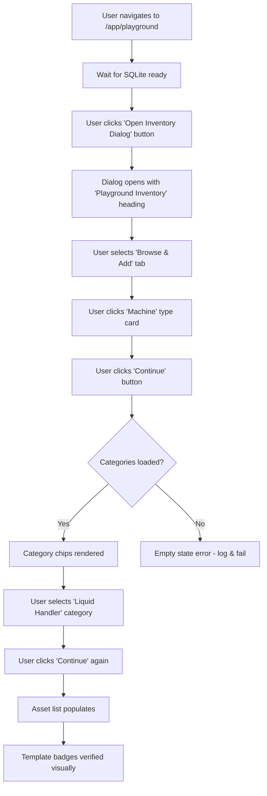

# SDET Static Analysis: verify-inventory.spec.ts

**Target File:** [verify-inventory.spec.ts](file:///Users/mar/Projects/praxis/praxis/web-client/e2e/specs/verify-inventory.spec.ts)  
**Review Date:** 2026-01-30  
**Analyst:** Senior SDET & Angular Specialist

---

## 1. Test Scope & Coverage

### What is Tested
This test file verifies the **Inventory Dialog** functionality specifically through the following workflow:
1. **Navigation**: Navigating to the playground route (`/app/playground`)
2. **Dialog Opening**: Clicking "Open Inventory Dialog" button triggers the dialog
3. **Tab Navigation**: Switching to the "Browse & Add" tab within the dialog
4. **Type Selection**: Selecting "Machine" asset type from type cards
5. **Category Loading**: Verifying that machine categories (e.g., "Liquid Handler") load from the SQLite database
6. **Category Filtering**: Selecting a specific category and advancing through the wizard
7. **Asset List Population**: Verifying that assets matching the selected category are displayed
8. **Template Detection**: Checking for visual differentiation of template assets (`.template-badge`)

### Assertions (Success Criteria)
| Assertion | Description |
|-----------|-------------|
| `expect(dialogTitle).toBeVisible()` | Dialog appears with correct heading |
| `expect(chipList).toBeVisible()` | Category chips are rendered |
| `expect(categories.length).toBeGreaterThan(0)` | At least one category exists |
| `expect(categories.some(c => c.includes('Liquid Handler'))).toBeTruthy()` | Specific expected category is present |
| `expect(continueBtn).toBeEnabled()` | Continue button is actionable |
| `expect(items.length).toBeGreaterThan(0)` | Asset list is not empty |

---

## 2. Code Review & Best Practices (Static Analysis)

### Critique the Code

#### 🔴 Critical Issues
1. **No Worker Isolation (Lines 4-15)**: The test does NOT use the worker-indexed database fixture pattern (`BasePage.goto()` with `testInfo`). This means parallel execution will cause **OPFS contention** and flaky failures.

2. **Missing Page Object Model (Lines 23-114)**: The entire test is implemented as inline procedural code. No `InventoryDialog.page.ts` or `PlaygroundPage.ts` abstraction exists.

3. **Hardcoded `waitForLoadState('networkidle')` (Lines 20, 35)**: This is fragile; Angular apps with long-polling websockets or background sync can cause hangs.

4. **Non-User-Facing Locators Throughout**:
   - Line 36: `.mdc-tab` - Material internal class
   - Line 42: `.type-card` - Implementation-specific CSS
   - Line 56: `.empty-state` - Custom CSS class
   - Line 84: `mat-chip-option` - Angular Material internal selector
   - Line 101: `mat-selection-list` - Angular Material component tag
   - Line 108: `.template-badge` - Custom CSS class

5. **Console Logging as Debugging Strategy (Lines 5-9, 19, 23, etc.)**: While informative, this should be abstracted into a test logger utility or removed in favor of Playwright's built-in trace/report.

6. **Database Query Inside Test (Lines 67-76)**: Directly executing SQL in `page.evaluate()` is a code smell; this logic should be encapsulated in a test utility or fixture.

#### 🟡 Moderate Issues
1. **Magic Timeouts**: Timeout values (5000, 10000, 30000ms) are scattered without clear rationale.

2. **Incomplete Assertions on Empty State**: The empty state handling (lines 59-79) logs an error but still throws the original exception. This could be cleaner with a dedicated helper.

3. **Conditional Test Logic (Lines 95-113)**: The test has branching logic (`if (await lhChip.isVisible())`) which makes it non-deterministic; the test might skip critical verification paths.

### Modern Standards (2026) Evaluation

| Category | Score | Assessment |
|----------|-------|------------|
| **User-Facing Locators** | 2/10 | Heavy reliance on CSS classes (`.mdc-tab`, `.type-card`, `.empty-state`) vs. `getByRole`, `getByLabel`, etc. Only line 24 (`getByRole('button', { name: 'Open Inventory Dialog' })`) follows best practices. |
| **Test Isolation** | 1/10 | No cleanup logic, no worker-indexed DB, no `afterEach`. Parallel execution is unsafe. |
| **Page Object Model (POM)** | 0/10 | Completely absent. All selectors and actions are inline. |
| **Async Angular Handling** | 4/10 | Uses `waitForFunction` for SQLite readiness (good), but also relies on `networkidle` and arbitrary `waitFor` timeouts. Should wait for specific UI signals or state observables. |

---

## 3. Test Value & Classification

### Scenario Relevance
**High Value - Critical User Journey**: This test validates a fundamental user workflow:
1. Users need to browse available assets by type and category
2. The inventory dialog is the primary mechanism for adding assets to a playground/workspace
3. Database-loaded definitions (machine categories) are essential to the lab automation domain

**Real User Scenario**: ✅ Yes, this is a scenario a real user would perform when setting up their workcell or configuring a new protocol.

### Classification

| Aspect | Classification | Rationale |
|--------|---------------|-----------|
| **Type** | **Integration Test** (Not True E2E) | Tests frontend + SQLite integration, but does NOT verify: (1) actual asset instantiation, (2) Pyodide/worker integration, (3) machine communication layer |
| **Mocking Level** | Low | Uses real SQLite data (good), but missing verification that the loaded definitions match expected schema |
| **Stack Coverage** | Partial | Frontend → SQLite only; no backend/protocol engine validation |

---

## 4. User Flow & Intent Reconstruction

### Reverse-Engineered Workflow

### Contextual Fit
This component is central to the **Praxis lab automation platform**:
- **Inventory Dialog** is the gateway for users to configure their virtual workcell
- **Machine Definitions** are loaded from the embedded SQLite database (`praxis.db`)
- The dialog bridges the **static asset catalog** with the **dynamic playground environment**
- Successful completion enables users to add instruments (liquid handlers, readers, etc.) to their simulated or real lab setup

---

## 5. Gap Analysis (Scientific & State Logic)

### Missing Critical Paths

| Gap | Severity | Description |
|-----|----------|-------------|
| **No Add-to-Playground Verification** | 🔴 Critical | Test selects an asset but never verifies it's actually added to the playground |
| **No Definition Schema Validation** | 🟡 Moderate | We trust `categories.length > 0` but don't verify the schema/structure of machine definitions |
| **No Multi-Category Filtering** | 🟡 Moderate | Only tests single category selection; real users might toggle multiple |
| **No Search/Filter Functionality** | 🟡 Moderate | If the dialog has a search box, it's untested |
| **No Pagination/Long List Handling** | 🟢 Low | If there are many assets, scroll/pagination behavior is untested |

### Domain Specifics

#### Data Integrity
| Aspect | Status | Notes |
|--------|--------|-------|
| **praxis.db Loading** | ⚠️ Partial | Tests that SQLite is "ready" via `isReady$` but doesn't verify DB version or expected table structure |
| **Definition Parsing** | ⚠️ Weak | Trusts that "Liquid Handler" string appears, but doesn't verify the underlying definition object properties |
| **Category-Asset Mapping** | ⚠️ Weak | No verification that selected category correctly filters the asset list |

#### Simulation vs. Reality
| Aspect | Status | Notes |
|--------|--------|-------|
| **Environment Mode** | ✅ Detected | Uses `?mode=browser` implicitly via default app behavior |
| **Workcell State** | ❌ Absent | Doesn't verify the playground's internal state after asset selection |

#### Serialization
| Aspect | Status | Notes |
|--------|--------|-------|
| **Protocol Arguments** | N/A | Not applicable to this test (pre-execution phase) |
| **Asset Definition Serialization** | ❌ Absent | Should verify that selected asset definition can be serialized for Pyodide |

#### Error Handling
| Aspect | Status | Notes |
|--------|--------|-------|
| **Empty Database** | ⚠️ Partial | Logs error if empty state, but test fails without meaningful diagnostic |
| **Invalid Definition** | ❌ Absent | No test for malformed machine definitions |
| **Network Failure** | ❌ Absent | No test for what happens if offline mode fails to load definitions |

---

## Summary Scorecard

| Category | Score | Notes |
|----------|-------|-------|
| **Test Scope** | 6/10 | Covers core inventory browsing but stops before asset addition |
| **Best Practices** | 2/10 | No POM, no worker isolation, heavy CSS selector usage |
| **Test Value** | 7/10 | Critical user journey, realistic scenario |
| **Isolation** | 1/10 | Unsafe for parallel execution, no cleanup |
| **Domain Coverage** | 4/10 | Missing serialization, state verification, error paths |

**Overall**: **4.0/10**

---

## Recommendations Summary

1. **Immediate**: Migrate to `worker-db.fixture` for parallel execution safety
2. **High Priority**: Create `InventoryDialog.page.ts` Page Object with user-facing locators
3. **Medium Priority**: Add asset addition verification (complete the workflow)
4. **Medium Priority**: Add error state tests (empty DB, malformed definitions)
5. **Low Priority**: Add definition schema validation assertions
