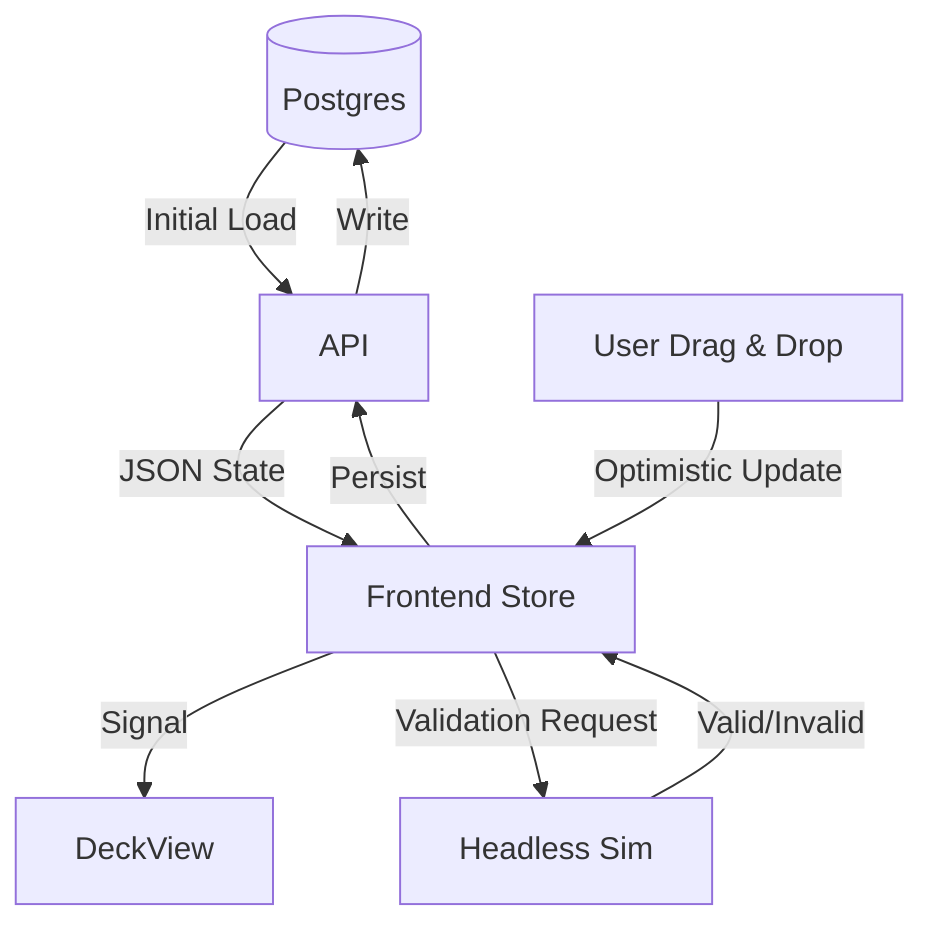

# Deck View UX Design

## Current State Analysis

The current deck visualization is split across multiple components with distinct responsibilities:

| Component | Responsibility | Current Limitations |
|:----------|:---------------|:--------------------|
| **DeckViewComponent** | Visual rendering of deck, resources, and rails/slots. | Drag-and-drop is limited; no active constraint visualization; heavily coupled to `PlrResource` structure. |
| **GuidedSetupComponent** | Mapping inventory items to protocol requirements. | Logic is separate from visual deck placement; validation is list-based, not spatial. |
| **DeckSetupWizard** | Orchestrates setup steps (Carrier -> Resource). | Workflow is linear; limited feedback on *why* a placement is valid/invalid during drag. |

## Design Goals

1. **Empty Deck Start**: Decks should visualize as "empty" (only fixed hardware) by default, rather than assuming a full state.
2. **Database-Driven State**: The "Live" deck state must persist in the database (e.g., `machine_state` table) to be shared across sessions and users, replacing `localStorage`.
3. **Constraint System**: A unified system to validate placements based on machine physics, protocol requirements, and interaction rules.
4. **Spatial Guided Setup**: Merge the concept of "Asset Selection" and "Deck Placement" into a more cohesive spatial workflow.

## Constraint System

### Constraint Sources

1. **Machine Definition**:
    - *Hard Constraints*: Rail spacing, slot dimensions, collision models.
    - *Compatibility*: `compatibleCarrierTypes` for rails (existing but underused).
2. **Protocol Definition**:
    - *Decorators*: `@praxis.deck_constraints(allow_only=[...], forbidden_slots=[...])`.
    - *Inference*: "Source Plate" must be accessible by 8-channel pipette (implies specific rail restriction).
3. **Simulation State**:
    - *Dynamic*: "Cannot place X here because Y is too tall and blocks the arm".

### Constraint Types

| Type | Description | Example | Visual Indicator |
|:-----|:------------|:--------|:-----------------|
| **SlotRestriction** | Resource restricted to specific slots/rails. | "HeaterShaker must be on Rail 3" | Highlight valid slots Green, others faded. |
| **Adjacency** | Resources cannot be adjacent. | "Magnet next to Thermocycler" | Red border between slots. |
| **Collision** | Physical overlap or arm collision. | "TipRack too tall for this position" | Red overlay on drop target. |
| **Dependency** | Requires another resource. | "Plate requires Carrier" | Ghost outline of required carrier. |

### UI Representation

- **Interactive Dragging**:
  - **Valid Target**: Glows Green (`var(--sys-success)`).
  - **Invalid Target**: Glows Red (`var(--sys-error)`) + Tooltip explaining why.
  - **Snap-to-Grid**: Resources "snap" to valid slots for preview before drop.
- **Validation Overlay**:
  - Toggleable "Show Constraints" layer displaying all restricted zones.

## State Management

The Single Source of Truth (SSOT) moves from Frontend/LocalStorage to **Database**.

### Flow

1. **Load**: `GET /api/machines/:id/deck_state` returns current *persisted* layout.
2. **Edit**: User moves resource.
3. **Validate**: Frontend checks basic constraints (dimensions/rails).
4. **Confirm**: If physical interaction is required (guided setup), instructions are shown.
5. **Persist**: `PUT /api/machines/:id/deck_state`.

## Guided Setup Improvements

Transform the current "Wizard" into a **Spatial Assistant**.

1. **Ghost Suggestions**: Instead of a blank deck, show semi-transparent "Ghosts" where resources *should* go based on the protocol.
    - *Action*: User drags actual inventory item onto the Ghost.
    - *Feedback*: Ghost turns solid/real upon successful placement.
2. **Smart Sidebar**:
    - List of "Required Items" waiting to be placed.
    - Clicking an item highlights its target slot on the deck.
3. **Progressive Disclosure**:
    - Step 1: Place Carriers (Ghosts show Rail locations).
    - Step 2: Place Labware (Ghosts show Carrier positions).

## Component Architecture

### Modifications

- **DeckViewComponent**:
  - Add `[constraints]` input.
  - Add `(validateDrop)` output.
  - Implement "Snap-to-Slot" logic.
- **DeckConstraintService** (New):
  - Centralizes validation logic.
  - params: `(resource, targetSlot, currentDeckState) => ValidationResult`.

### Phase Plan

1. **Phase 1: Persistence**
    - Implement `deck_states` table.
    - Update `VisualizerComponent` to load/save from API.
2. **Phase 2: Basic Constraints**
    - Implement `DeckConstraintService`.
    - Add visual feedback for basic rail/slot compatibility.
3. **Phase 3: Advanced Guided Setup**
    - Implement "Ghost" placement workflow.
    - Update `DeckSetupWizard` to use new spatial logic.
