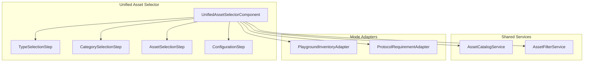

# Unified Asset Selector UX Design

## Executive Summary

This document proposes a unified asset selection architecture that addresses the feedback that "categories in the playground inventory adder are not good for machines or resources" and unifies the `InventoryDialogComponent` (Playground) with the `GuidedSetupComponent` (Protocol Asset Selection).

> [!IMPORTANT]
> The core insight is that **the same selection mechanism** should be used in both contexts, but with **different operational modes** that determine:
>
> - What assets are available (definitions vs instances)
> - What happens after selection (configure simulation vs assign to requirement)

---

## Audit Summary

### Inventory Dialog (Playground)

**Location:** [inventory-dialog.component.ts](file:///Users/mar/Projects/pylabpraxis/praxis/web-client/src/app/features/playground/components/inventory-dialog/inventory-dialog.component.ts)

**Current Implementation:**

- **876 lines** of complex, multi-tabbed dialog
- Three tabs: "Quick Add", "Browse & Add", "Current Items"
- Uses a 4-step stepper: Type → Category → Selection → Specs
- Separates Machines and Resources at the first step
- Categories derived from `machine_category` and resource `plr_definition.plr_category`

**Pain Points Identified:**

1. **Hardcoded 2-category system:** Forces Machine/Resource binary choice first
2. **Category chip selection is awkward:** Manual categories don't map well to PLR taxonomy
3. **No category hierarchy:** Flat list of categories regardless of asset type
4. **Different UX than protocol selection:** Creates cognitive dissonance
5. **Backend configuration is hidden:** Only "Simulated (Default)" option shown

**Key Data Flow:**

```
User selects Type → Categories filter → Select specific asset → Configure (variableName, backend, count) → Add to queue
```

**Output:** Returns `InventoryItem[]` with:

```typescript
interface InventoryItem {
  type: 'machine' | 'resource';
  asset: Machine | Resource;
  category: string;
  variableName: string;
  count?: number;
  backend?: string;
}
```

---

### Protocol Asset Selector (GuidedSetupComponent)

**Location:** [guided-setup.component.ts](file:///Users/mar/Projects/pylabpraxis/praxis/web-client/src/app/features/run-protocol/components/guided-setup/guided-setup.component.ts)

**Current Implementation:**

- **666 lines**
- Displays protocol-defined `AssetRequirement[]`
- Shows inventory items (existing Resources) for each requirement
- Auto-matches based on FQN, class name, type hint, and PLR category
- Uses `PraxisAutocompleteComponent` for selection

**Strengths:**

1. **Requirement-driven:** Clear mapping of what the protocol needs
2. **Auto-fill logic:** Smart matching reduces user friction
3. **Visual feedback:** Shows autofilled, assigned, unassigned states
4. **Constraint-aware:** Uses `required_plr_category` for filtering

**Data Flow:**

```
Protocol.assets requirements → For each, filter compatible inventory → Auto/manual select → Emit assetMap
```

**Output:** Returns `Record<string, Resource>` mapping requirement accession_id to inventory Resource

---

### Supporting Components

#### MachineDialogComponent (768 lines)

**Location:** [machine-dialog.component.ts](file:///Users/mar/Projects/pylabpraxis/praxis/web-client/src/app/features/assets/components/machine-dialog.component.ts)

- Frontend-first selection (Machine Type)
- Backend selection (hardware drivers)
- 3-step wizard: Machine Type → Backend → Configuration
- Uses `FrontendType` grouping with user-friendly labels

#### ResourceDialogComponent (561 lines)

**Location:** [resource-dialog.component.ts](file:///Users/mar/Projects/pylabpraxis/praxis/web-client/src/app/features/assets/components/resource-dialog.component.ts)

- Uses `ResourceUiGroup` for categorization (Carriers, Plates, TipRacks, Containers, Other)
- Rich filtering (vendor, facets like num_items, tip_volume_ul)
- Two-phase: Browse definitions → Configure instance

---

## Problem Analysis

The user feedback identifies these core issues:

| Issue | Root Cause |
|:------|:-----------|
| Categories not good for machines | Machine categories use raw PLR taxonomy instead of user-friendly groupings |
| Categories not good for resources | Same problem - uses `plr_category` directly |
| Components should be united | Two different UX patterns for conceptually similar operations |
| Different logic needed | Playground adds to simulation; Protocol assigns to requirements |

### Key Insight: Shared Selection, Divergent Context

Both use cases fundamentally do the same thing:

1. **Browse available assets** (definitions or instances)
2. **Filter by type/category**
3. **Select specific items**
4. **Configure for usage context**

The difference is:

- **Playground:** Select definitions → configure simulation backend → add to notebook
- **Protocol:** Select inventory instances → assign to requirement → run protocol

---

## Unified Design

### Component Architecture



### UnifiedAssetSelectorComponent

**Core Responsibilities:**

1. Present consistent browsing/selection UI
2. Delegate mode-specific logic to adapters
3. Handle both single and multi-selection
4. Emit standardized selection events

**Component API:**

```typescript
@Component({
  selector: 'app-unified-asset-selector',
  // ...
})
export class UnifiedAssetSelectorComponent {
  // Mode determines behavior
  @Input() mode: 'playground' | 'protocol' = 'playground';
  
  // Protocol mode: what requirements to fulfill
  @Input() requirements?: AssetRequirement[];
  
  // Playground mode: what's already added
  @Input() existingInventory?: InventoryItem[];
  
  // Initial filter (e.g., pre-select Machine type)
  @Input() initialFilter?: AssetFilter;
  
  // Selection events
  @Output() selectionConfirmed = new EventEmitter<UnifiedSelectionResult>();
  @Output() selectionCancelled = new EventEmitter<void>();
}

interface UnifiedSelectionResult {
  mode: 'playground' | 'protocol';
  // Playground mode result
  inventoryItems?: InventoryItem[];
  // Protocol mode result  
  assetMap?: Record<string, Resource>;
}
```

### Unified Category System

Replace the current category systems with a **user-centric hierarchy**:

```typescript
enum AssetSuperCategory {
  LIQUID_HANDLING = 'Liquid Handling',
  SAMPLE_PREP = 'Sample Preparation', 
  THERMAL = 'Thermal Control',
  ANALYSIS = 'Analysis & Detection',
  LABWARE = 'Labware & Consumables',
  AUTOMATION = 'Automation & Transport'
}

interface CategoryNode {
  id: string;
  label: string;
  icon: string;
  superCategory: AssetSuperCategory;
  // Machines that belong here
  machineCategories?: string[];  // maps to machine_category
  // Resources that belong here
  plrCategories?: string[];      // maps to plr_category
}
```

**Example Mapping:**

| User Category | Super Category | PLR Categories | Machine Categories |
|:--------------|:---------------|:---------------|:-------------------|
| Plates | Labware | plate, well_plate, pcr_plate | - |
| Tip Racks | Labware | tip_rack | - |
| Liquid Handlers | Liquid Handling | - | HamiltonSTAR, Opentrons |
| Plate Readers | Analysis | - | PlateReader |
| Heater Shakers | Thermal | - | HeaterShaker |
| Tubes | Labware | tube, tube_rack | - |

### Mode: Protocol Definition (Abstract Types)

When `mode === 'protocol'`:

1. **Requirements-Driven Display**
   - Show each `AssetRequirement` as a card
   - For each, show compatible inventory items
   - Auto-select best matches (current GuidedSetup logic)

2. **Selection UX**
   - Autocomplete search within compatible items
   - Visual indication of match quality (exact FQN, category, compatible)
   - "No compatible items" state with link to add new resources

3. **Output**
   - `assetMap: Record<string, Resource>`

### Mode: Playground Inventory (Concrete Instances)

When `mode === 'playground'`:

1. **Browsing-First Display**
   - Category chips at top (using unified categories)
   - Mixed machine/resource grid based on selection
   - Quick search across all asset types

2. **Selection Flow**
   - Select from catalog (definitions)
   - Configure for simulation:
     - Variable name (Python identifier)
     - Backend selection (for machines)
     - Count (for resources)

3. **Backend Configuration** (New!)
   - Show available simulation backends
   - Allow selecting "SimulatedLiquidHandlerBackend" vs "ChatterboxBackend"
   - Store backend choice with inventory item

4. **Output**
   - `InventoryItem[]` with full configuration

---

## Detailed Wireframes

### Playground Mode - Type Selection

```
┌─────────────────────────────────────────────────────────────┐
│ Add to Playground Inventory                            [X]  │
├─────────────────────────────────────────────────────────────┤
│ ┌─────────────────────────────────────────────────────────┐ │
│ │ 🔍 Search machines and resources...                     │ │
│ └─────────────────────────────────────────────────────────┘ │
│                                                             │
│ Categories:                                                 │
│ ┌──────────┐ ┌──────────┐ ┌──────────┐ ┌──────────┐        │
│ │ 🤖 All   │ │ 💧 Liquid│ │ 🧪 Sample│ │ 🌡️ Thermal│       │
│ │          │ │ Handling │ │   Prep   │ │ Control  │       │
│ └──────────┘ └──────────┘ └──────────┘ └──────────┘        │
│ ┌──────────┐ ┌──────────┐ ┌──────────┐                     │
│ │ 📊 Analy.│ │ 🧫 Labware│ │ 🔄 Autom.│                     │
│ └──────────┘ └──────────┘ └──────────┘                     │
│                                                             │
│ ┌───────────────────┐ ┌───────────────────┐                │
│ │ STAR              │ │ 96-Well Plate     │                │
│ │ Liquid Handler    │ │ Labware           │                │
│ │ 3 backends        │ │ Corning 3599      │                │
│ └───────────────────┘ └───────────────────┘                │
│ ┌───────────────────┐ ┌───────────────────┐                │
│ │ Heater Shaker     │ │ 300µL Tip Rack    │                │
│ │ Thermal Control   │ │ Labware           │                │
│ └───────────────────┘ └───────────────────┘                │
├─────────────────────────────────────────────────────────────┤
│                                      [Cart (2)] [Continue →]│
└─────────────────────────────────────────────────────────────┘
```

### Playground Mode - Configuration Step (Machine)

```
┌─────────────────────────────────────────────────────────────┐
│ ← Configure: Hamilton STAR                             [X]  │
├─────────────────────────────────────────────────────────────┤
│                                                             │
│  ┌─────────────────────────────────────────────────────┐   │
│  │ 💧 Hamilton STAR                                     │   │
│  │ Liquid Handler • Hamilton Robotics                  │   │
│  └─────────────────────────────────────────────────────┘   │
│                                                             │
│  Variable Name *                                            │
│  ┌─────────────────────────────────────────────────────┐   │
│  │ hamilton_star_1                                      │   │
│  └─────────────────────────────────────────────────────┘   │
│  Must be a valid Python identifier                          │
│                                                             │
│  Simulation Backend *                                       │
│  ┌─────────────────────────────────────────────────────┐   │
│  │ ▼ ChatterboxBackend                                  │   │
│  │   ├─ ChatterboxBackend (Verbose logging)             │   │
│  │   ├─ SimulatedBackend (Minimal)                      │   │
│  │   └─ WebSocketBackend (Remote)                       │   │
│  └─────────────────────────────────────────────────────┘   │
│                                                             │
├─────────────────────────────────────────────────────────────┤
│                          [Cancel] [Add to Inventory]        │
└─────────────────────────────────────────────────────────────┘
```

### Protocol Mode - Requirements View

```
┌─────────────────────────────────────────────────────────────┐
│ Asset Selection: Simple Transfer Protocol                   │
├─────────────────────────────────────────────────────────────┤
│                                                             │
│  ┌─────────────────────────────────────────────────────┐   │
│  │ ✨ liquid_handler                          [Auto]    │   │
│  │ LiquidHandler                                        │   │
│  │ ┌─────────────────────────────────────────────┐     │   │
│  │ │ 🔍 Search inventory...                      │     │   │
│  │ │ ✓ Hamilton STAR 1 (accs-123)               │     │   │
│  │ │   Opentrons OT-2 (accs-456)                │     │   │
│  │ └─────────────────────────────────────────────┘     │   │
│  └─────────────────────────────────────────────────────┘   │
│                                                             │
│  ┌─────────────────────────────────────────────────────┐   │
│  │ ⚠️ source_plate                          [Required]  │   │
│  │ Plate                                                │   │
│  │ ┌─────────────────────────────────────────────┐     │   │
│  │ │ 🔍 Search inventory...                      │     │   │
│  │ │ No compatible items                         │     │   │
│  │ │ [+ Add from Catalog]                        │     │   │
│  │ └─────────────────────────────────────────────┘     │   │
│  └─────────────────────────────────────────────────────┘   │
│                                                             │
│  Summary: 1 auto-filled • 1 unassigned                     │
├─────────────────────────────────────────────────────────────┤
│                            [Back] [Confirm Setup]           │
└─────────────────────────────────────────────────────────────┘
```

---

## Implementation Plan

### Phase 1: Foundation (E-03)

Create shared infrastructure for unified asset selection.

#### [NEW] AssetCatalogService

Path: `shared/services/asset-catalog.service.ts`

Responsibilities:

- Unified access to machine definitions, resource definitions, inventory
- Category mapping (PLR → User-friendly)
- Search and filter logic

#### [NEW] UnifiedCategoryConfig

Path: `shared/constants/asset-categories.ts`

Defines the user-friendly category system with mappings to PLR taxonomy.

---

### Phase 2: Type Selection Step (E-04)

#### [NEW] TypeSelectionStepComponent

Path: `shared/components/asset-selector/type-selection-step.component.ts`

Features:

- Unified category chips
- Search across all asset types
- Grid display of matching assets
- Mode-aware filtering (definitions vs instances)

---

### Phase 3: Configuration Step (E-05)

#### [NEW] AssetConfigurationStepComponent

Path: `shared/components/asset-selector/configuration-step.component.ts`

Features:

- Variable name input with validation
- Backend selection dropdown (for machines)
- Count selector (for resources)
- Real-time validation feedback

---

### Phase 4: Integration - Playground (E-06)

#### [MODIFY] InventoryDialogComponent

Path: `features/playground/components/inventory-dialog/inventory-dialog.component.ts`

Changes:

- Replace internal stepper with `UnifiedAssetSelectorComponent`
- Pass `mode="playground"`
- Handle `selectionConfirmed` event

---

### Phase 5: Integration - Protocol (E-07)

#### [MODIFY] GuidedSetupComponent

Path: `features/run-protocol/components/guided-setup/guided-setup.component.ts`

Changes:

- Use shared category/filter services
- Optionally embed mini-selector for "Add from Catalog"
- Preserve current requirement-driven layout

---

## Verification Plan

### Automated Tests

1. **Unit Tests for AssetCatalogService**
   - Category mapping correctness
   - Filter logic for machines and resources
   - Search across asset types

2. **Component Tests**
   - TypeSelectionStep renders categories
   - ConfigurationStep validates inputs
   - Mode switching behavior

### Manual Verification

1. **Playground Flow**
   - Add a machine with specific backend
   - Add resources with count
   - Verify inventory items appear correctly

2. **Protocol Flow**
   - Run protocol with auto-matched assets
   - Manually reassign assets
   - Verify execution uses correct assets

### Browser Tests

```bash
# Playground inventory test
npm run e2e -- --spec=playground-inventory.spec.ts

# Protocol asset selection test  
npm run e2e -- --spec=protocol-assets.spec.ts
```

---

## Migration Strategy

### Backward Compatibility

1. Keep existing components during migration
2. Feature flag: `UNIFIED_ASSET_SELECTOR`
3. Gradual rollout per feature area

### Deprecation Timeline

| Phase | Duration | Action |
|:------|:---------|:-------|
| 1 | Week 1-2 | Build unified components alongside existing |
| 2 | Week 3 | Integrate into Playground with feature flag |
| 3 | Week 4 | Integrate into Protocol flow |
| 4 | Week 5+ | Remove legacy components after validation |

---

## Open Questions

1. **Quick Add behavior:** Should the unified selector preserve the "Quick Add" autocomplete, or is the search sufficient?

2. **Cart/Queue pattern:** Current Playground uses a "Current Items" tab. Should this persist?

3. **Protocol inline mode:** GuidedSetup can work inline (not dialog). Should unified selector support this?

---

## Summary

This design unifies the asset selection experience by:

1. **Shared category system** with user-friendly groupings
2. **Mode-aware behavior** for different contexts
3. **Consistent UI patterns** reducing cognitive load
4. **Enhanced backend selection** for simulation configuration

The phased implementation allows incremental delivery while maintaining backward compatibility.
