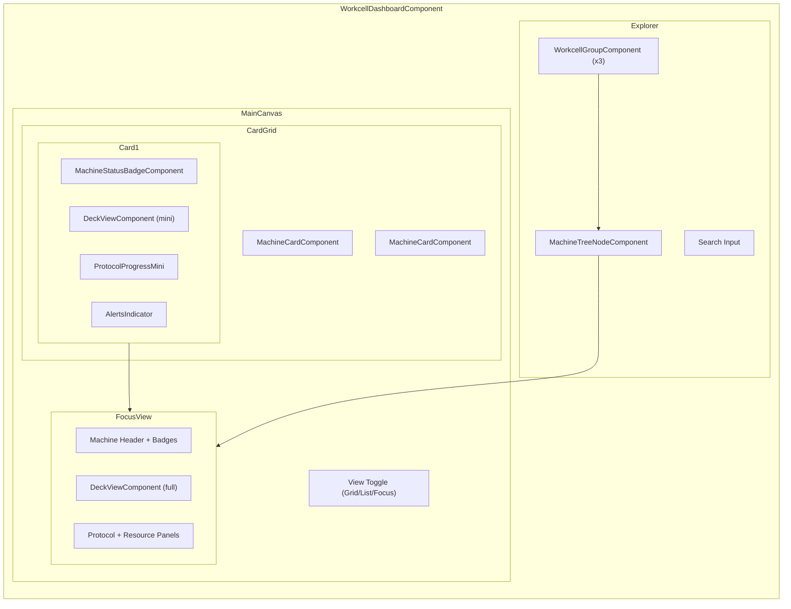
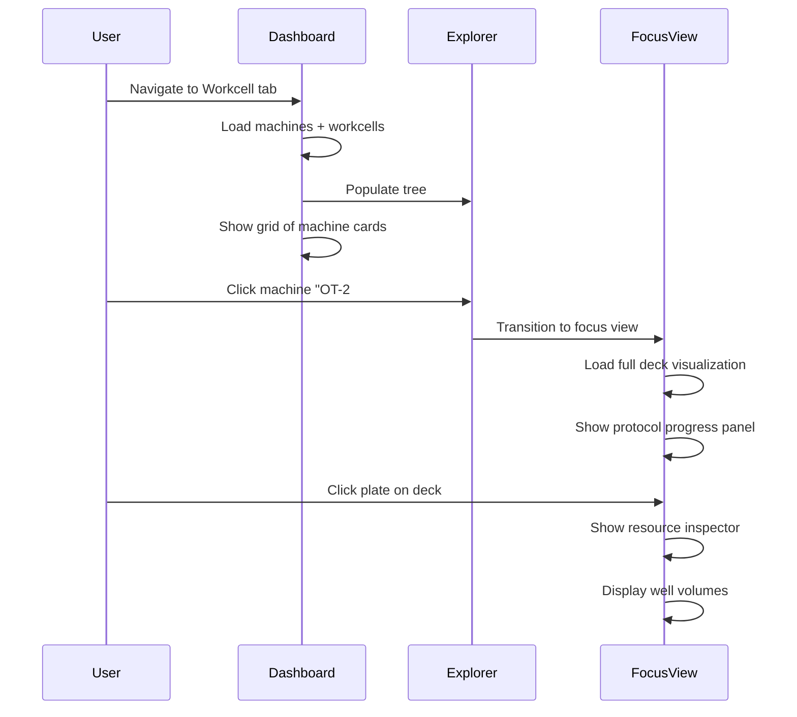
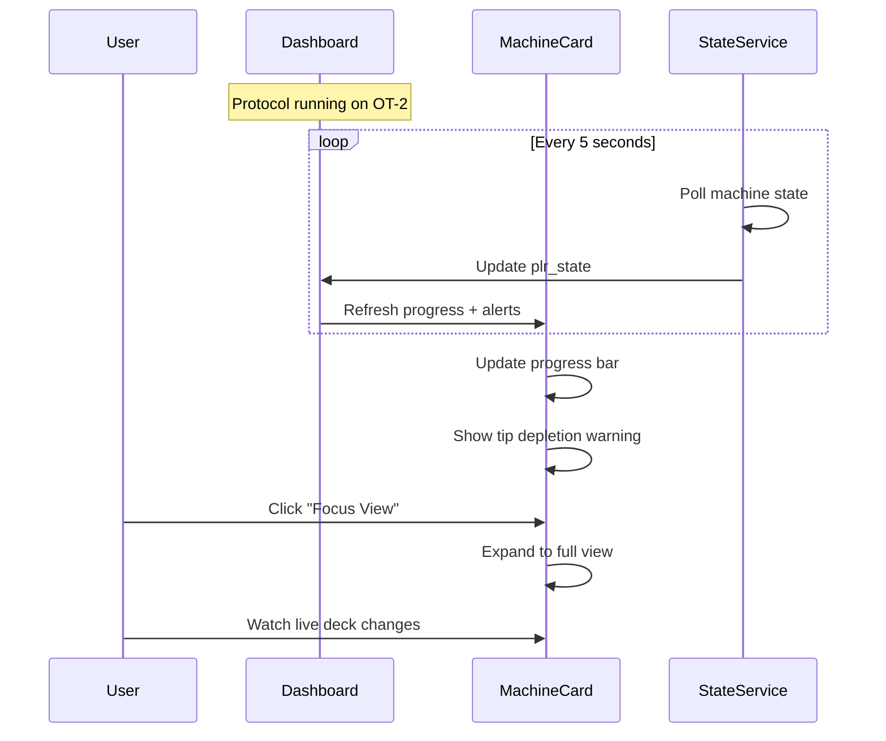
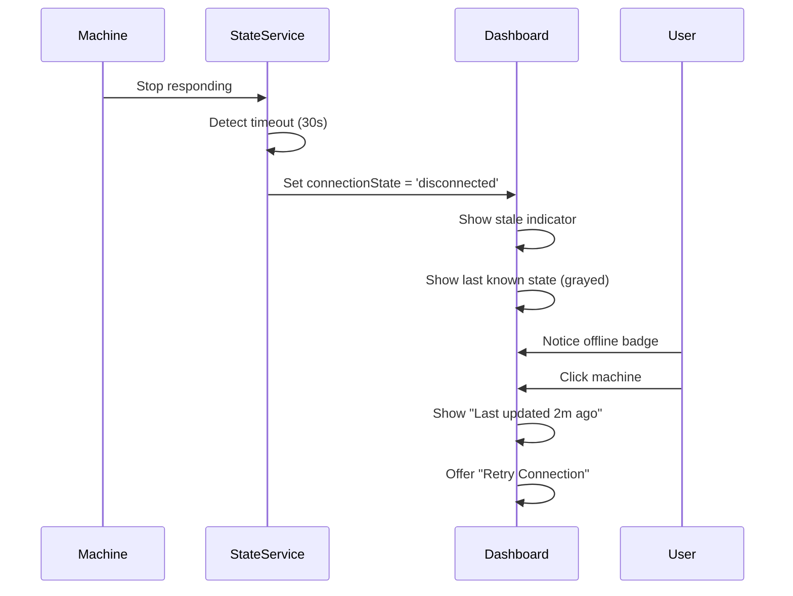

# Workcell UX Redesign

**Document ID:** WCX-001  
**Status:** 📋 Draft - Pending Review  
**Created:** 2026-01-13  
**Author:** Agent  
**Reviewers:** @USER

---

## 1. Problem Statement

### Current State Analysis

The existing "Workcell" view (`VisualizerComponent`) suffers from several UX limitations:

#### 1.1 Navigation Issues

- **Flat list structure**: The sidebar presents machines as a simple flat list with no hierarchy
- **No workcell grouping**: While the backend supports Workcell → Machine relationships, the UI doesn't expose this
- **Limited discoverability**: Users must toggle each machine individually to see its deck
- **No status-at-a-glance**: The only visual indicator is whether a deck is "active" (open)

```
Current Sidebar:
┌─────────────────────┐
│ Workcell            │  ← Static header
├─────────────────────┤
│ ○ Hamilton STAR     │  ← Toggle button only
│ ○ OT-2              │
│ ● Opentrons Flex    │  ← Active state
│ ○ Reservoir Holder  │
└─────────────────────┘
```

#### 1.2 Information Display Issues

- **No status visibility**: Machine status (idle, running, error) not shown
- **No protocol context**: Users can't see what's running on each machine
- **No intervention alerts**: No indication of required user actions
- **Missing health indicators**: Connection state, maintenance due, errors hidden

#### 1.3 Interaction Problems

- **One-dimensional toggle**: Only action is show/hide deck
- **No drill-down**: Can't focus on a single machine's details
- **No resource inspection**: Must hover for tooltips, no permanent details panel
- **Context menu absent**: Right-click actions not available

#### 1.4 Simulation State Issues

- **"No deck state available" fallback**: When `plr_state` is missing, shows useless message
- **Static visualization**: Deck definition shown, but no live state updates
- **No state differentiation**: Can't tell if state is "live" vs "simulated" vs "stale"

### Code Analysis

**visualizer.component.ts** (Lines 1-295):

- Simple `DeckWindow[]` array with `id`, `title`, `data`, `visible`
- Uses `AssetService.getMachines()` with no hierarchy
- Persists visibility state to localStorage but no other preferences
- Template: Basic sidebar list + grid of deck windows

**Key Observations**:

1. No concept of Workcell grouping
2. No machine status mapping
3. No real-time state subscription
4. `plr_state` OR `plr_definition` used, but no state overlay

---

## 2. Proposed Solution

### 2.1 Navigation Redesign: Hierarchical Workcell Explorer

Replace the flat list with a **tree/accordion structure**:

```
Proposed Sidebar:
┌─────────────────────────────────────────┐
│ 🔍 Search machines...                   │
├─────────────────────────────────────────┤
│ ▼ 🏭 Main Workcell          3 machines  │
│   ├─ 🟢 Hamilton STAR       [Idle]      │
│   ├─ 🟡 OT-2 (Left)         [Running]   │
│   └─ 🔴 Plate Handler       [Error]     │
├─────────────────────────────────────────┤
│ ▶ 🏭 QC Station             2 machines  │
├─────────────────────────────────────────┤
│ ─ 📦 Unassigned             1 machine   │
│   └─ ⚪ Optrode Reader      [Offline]   │
└─────────────────────────────────────────┘
```

**Key Changes:**

1. **Workcell grouping**: Machines grouped under their assigned workcell
2. **Expandable sections**: Collapse workcells to reduce visual noise
3. **Status indicators**: Color-coded status dots with labels
4. **Search/filter**: Quick filter for large labs
5. **Unassigned section**: For machines not yet assigned to a workcell

### 2.2 Information Architecture: Machine Cards

Transform list items into **rich machine cards**:

```ascii
┌────────────────────────────────────────────────┐
│  🟡 OT-2 Liquid Handler              [Running] │
│──────────────────────────────────────────────  │
│  Protocol: Sample Prep v2.1                    │
│  Step 4/12 • 34% complete                      │
│  ⏱️ 4m remaining                               │
│────────────────────────────────────────────────│
│  ⚠️ Low tip inventory on Slot 1               │
│────────────────────────────────────────────────│
│  [View Deck]  [Pause]  [•••]                   │
└────────────────────────────────────────────────┘
```

**Information Displayed:**

- Machine name + status badge
- Current protocol (if running) with progress
- Next intervention/alert (if any)
- Quick actions

### 2.3 Layout: Dashboard + Focus Views

**Dashboard View** (default):

```ascii
┌────────────────────┬─────────────────────────────────────────────────────┐
│                    │                                                     │
│    SIDEBAR         │              MAIN CANVAS                            │
│    (Explorer)      │                                                     │
│                    │   ┌─────────────┐    ┌─────────────┐                │
│    [collapsed      │   │ OT-2        │    │ Hamilton    │                │
│     workcells      │   │ [deck view] │    │ [deck view] │                │
│     with machine   │   │             │    │             │                │
│     summary]       │   └─────────────┘    └─────────────┘                │
│                    │                                                     │
│                    │   ┌─────────────┐                                   │
│                    │   │ Plate       │                                   │
│                    │   │ Handler     │                                   │
│                    │   │ [deck view] │                                   │
│                    │   └─────────────┘                                   │
│                    │                                                     │
└────────────────────┴─────────────────────────────────────────────────────┘
```

**Focus View** (single machine selected):

```ascii
┌────────────────────┬─────────────────────────────────────────────────────┐
│                    │  OT-2 Liquid Handler          [🟡 Running] [Sim]    │
│    SIDEBAR         ├────────────────────────────────────────────────────│
│    (Explorer)      │                                                     │
│    [highlighted    │       ┌─────────────────────────────────────┐       │
│     machine]       │       │                                     │       │
│                    │       │          DECK VISUALIZATION         │       │
│                    │       │            (Full Width)             │       │
│                    │       │                                     │       │
│                    │       │  [Plates] [Tip Racks] [Troughs]    │       │
│                    │       │                                     │       │
│                    │       └─────────────────────────────────────┘       │
│                    │                                                     │
│                    │  ┌─────────────────────┐ ┌─────────────────────┐   │
│                    │  │ Protocol Progress   │ │ Resource Panel      │   │
│                    │  │ Step 4/12           │ │ Selected: Plate1    │   │
│                    │  │ ████░░░░ 34%        │ │ Wells: A1-H12 filled│   │
│                    │  └─────────────────────┘ └─────────────────────┘   │
└────────────────────┴─────────────────────────────────────────────────────┘
```

### 2.4 Simulation State Integration

**State Sources (Priority Order):**

1. **Live State** (`plr_state` with recent timestamp): Real-time from backend
2. **Simulated State** (`plr_state` with simulation flag): From simulation engine
3. **Definition State** (`plr_definition`): Static layout, no liquid/tip info
4. **Loading State**: Spinner while fetching
5. **Error State**: Connection lost, show last known with warning

**Visual Differentiation:**

| State Type | Border | Badge | Behavior |
|------------|--------|-------|----------|
| Live | Green glow | 🟢 LIVE | Real-time updates |
| Simulated | Blue glow | 🔵 SIM | Updates during sim run |
| Stale | Gray border | ⚪ OFFLINE | Static, last known |
| Error | Red border | 🔴 ERROR | Flash attention |

**State Mapping (`plr_state` → Visual):**

```typescript
interface PlrStateMapping {
  // Liquid visualization
  wells: {
    [wellId: string]: {
      volume: number;      // → fill height gradient
      liquid_class?: string; // → color mapping
    }
  };

  // Tip visualization
  tip_racks: {
    [rackId: string]: {
      tip_mask: string;    // hex bitmask → individual tip presence
    }
  };

  // Resource positions (future)
  resource_positions: {
    [resourceId: string]: {
      location: { x: number; y: number; z: number };
      carrier?: string;
    }
  };
}
```

---

## 3. UI Mockups

### 3.1 Dashboard View - Wireframe

```ascii
╔══════════════════════════════════════════════════════════════════════════════════════╗
║ WORKCELL DASHBOARD                                                    🔍 ⚙️ 👤       ║
╠════════════════════════╦═════════════════════════════════════════════════════════════╣
║                        ║  ┌─ VIEW: [Grid ▼] [Filter ▼] ──────────────────────────┐  ║
║ WORKCELL EXPLORER      ║  │                                                       │  ║
║ ──────────────────     ║  └───────────────────────────────────────────────────────┘  ║
║                        ║                                                              ║
║ 🔍 Search...           ║  ┌────────────────────────┐  ┌────────────────────────┐     ║
║                        ║  │ 🟢 HAMILTON STAR       │  │ 🟡 OT-2 #1             │     ║
║ ▼ Main Lab (3)         ║  │ ─────────────────────  │  │ ─────────────────────  │     ║
║   └ 🟢 Hamilton STAR   ║  │                        │  │                        │     ║
║   └ 🟡 OT-2 #1         ║  │  ╔════════════════╗   │  │  ╔════════════════╗   │     ║
║   └ 🟢 OT-2 #2         ║  │  ║ ██████ ▓▓▓▓▓▓ ║   │  │  ║ [1] [2] [3]    ║   │     ║
║                        ║  │  ║ ██████ ▓▓▓▓▓▓ ║   │  │  ║ [4] [5] [6]    ║   │     ║
║ ▶ QC (2)               ║  │  ║ ██████ ▓▓▓▓▓▓ ║   │  │  ║ [7] [8] [9]    ║   │     ║
║                        ║  │  ╚════════════════╝   │  │  ╚════════════════╝   │     ║
║ ▶ Storage (1)          ║  │                        │  │                        │     ║
║                        ║  │ ⏱️ Idle               │  │ 📋 Sample Prep 34%     │     ║
║                        ║  │ Last: 2h ago          │  │ ⚠️ Low tips slot 1     │     ║
║ ─ Unassigned (1)       ║  └────────────────────────┘  └────────────────────────┘     ║
║   └ ⚪ Optrode Reader  ║                                                              ║
║                        ║  ┌────────────────────────┐  ┌────────────────────────┐     ║
║                        ║  │ 🟢 OT-2 #2             │  │ ⚪ OPTRODE READER      │     ║
║ ──────────────────     ║  │ ─────────────────────  │  │ ─────────────────────  │     ║
║ [+ Add Machine]        ║  │  ╔════════════════╗   │  │                        │     ║
║ [+ Add Workcell]       ║  │  ║ [1] [2] [3]    ║   │  │  ┌─────────────────┐  │     ║
║                        ║  │  ╚════════════════╝   │  │  │   [OFFLINE]     │  │     ║
║                        ║  │ ⏱️ Idle               │  │  └─────────────────┘  │     ║
║                        ║  └────────────────────────┘  └────────────────────────┘     ║
╚════════════════════════╩═════════════════════════════════════════════════════════════╝
```

### 3.2 Focus View - Wireframe

```ascii
╔══════════════════════════════════════════════════════════════════════════════════════╗
║ WORKCELL DASHBOARD › OT-2 #1                                         🔍 ⚙️ 👤       ║
╠════════════════════════╦═════════════════════════════════════════════════════════════╣
║                        ║  ╭─────────────────────────────────────────────────────────╮ ║
║ WORKCELL EXPLORER      ║  │  OT-2 #1                    🟡 RUNNING  🔵 SIMULATED   │ ║
║ ──────────────────     ║  │  Opentrons Inc. • SN: OT2-2024-001 • Location: Lab A   │ ║
║                        ║  ╰─────────────────────────────────────────────────────────╯ ║
║ 🔍 Search...           ║                                                              ║
║                        ║  ╭─────────────────────────────────────────────────────────╮ ║
║ ▼ Main Lab (3)         ║  │                                                         │ ║
║   └ 🟢 Hamilton STAR   ║  │    ┏━━━━━━━━━━━┓ ┏━━━━━━━━━━━┓ ┏━━━━━━━━━━━┓           │ ║
║   └ 🟡 OT-2 #1  ◀─     ║  │    ┃  1 🧫    ┃ ┃  2 💧    ┃ ┃  3 🗑️    ┃           │ ║
║   └ 🟢 OT-2 #2         ║  │    ┃ Costar96 ┃ ┃ Trough   ┃ ┃  Trash   ┃           │ ║
║                        ║  │    ┗━━━━━━━━━━━┛ ┗━━━━━━━━━━━┛ ┗━━━━━━━━━━━┛           │ ║
║ ▶ QC (2)               ║  │                                                         │ ║
║                        ║  │    ┏━━━━━━━━━━━┓ ┏━━━━━━━━━━━┓ ┏━━━━━━━━━━━┓           │ ║
║ ▶ Storage (1)          ║  │    ┃  4       ┃ ┃  5 📦    ┃ ┃  6 📦    ┃           │ ║
║                        ║  │    ┃  EMPTY   ┃ ┃ TipRack1 ┃ ┃ TipRack2 ┃           │ ║
║ ─ Unassigned (1)       ║  │    ┗━━━━━━━━━━━┛ ┗━━━━━━━━━━━┛ ┗━━━━━━━━━━━┛           │ ║
║   └ ⚪ Optrode Reader  ║  │                                                         │ ║
╠════════════════════════╣  ╰─────────────────────────────────────────────────────────╯ ║
║ DETAILS PANEL          ║                                                              ║
║ ──────────────────     ║  ╭─ PROTOCOL STATUS ──────────╮ ╭─ SELECTED RESOURCE ─────╮ ║
║                        ║  │ 📋 Sample Prep v2.1        │ │ 🧫 Costar96 (Slot 1)   │ ║
║ Selected: Costar96     ║  │ ───────────────────────────│ │ ─────────────────────── │ ║
║ Type: 96-well plate    ║  │ Step 4 of 12               │ │ Type: 96-well plate    │ ║
║ Location: Slot 1       ║  │ "Adding reagent A"         │ │ Wells filled: 48/96    │ ║
║ ───────────────────    ║  │ ████████░░░░░░░ 34%        │ │ Volume: 12-200 µL      │ ║
║ Wells: A1-H6 filled    ║  │ ⏱️ ~4 min remaining        │ │                        │ ║
║ Volume: 12-200 µL      ║  │ ─────────────────────────  │ │ [View Details] [Edit]  │ ║
║ Liquid: Reagent A      ║  │ [Pause] [Stop] [Details]   │ ╰────────────────────────╯ ║
║                        ║  ╰────────────────────────────╯                             ║
╚════════════════════════╩═════════════════════════════════════════════════════════════╝
```

### 3.3 Machine Card Component

```ascii
╭──────────────────────────────────────────────────────────────╮
│ ╭──────╮                                                     │
│ │ 🔧  │  OT-2 Liquid Handler            🟡 RUNNING  🔵 SIM  │
│ ╰──────╯  Opentrons • SN: OT2-001                            │
├──────────────────────────────────────────────────────────────┤
│ ┏━━━━━━━━━━━━━━━━━━━━━━━━━━━━━━━━━━━━━━━━━━━━━━━━━━━━━━━━━┓  │
│ ┃                                                         ┃  │
│ ┃   [1 🧫]  [2 💧]  [3 🗑️]                               ┃  │
│ ┃   [4   ]  [5 📦]  [6 📦]                               ┃  │
│ ┃   [7   ]  [8   ]  [9   ]                               ┃  │
│ ┃   [10  ]  [11  ]  [12  ]                               ┃  │
│ ┃                                                         ┃  │
│ ┗━━━━━━━━━━━━━━━━━━━━━━━━━━━━━━━━━━━━━━━━━━━━━━━━━━━━━━━━━┛  │
├──────────────────────────────────────────────────────────────┤
│ 📋 Sample Prep v2.1 • Step 4/12 • 34%                        │
│ ████████████░░░░░░░░░░░░░░░ ~4 min remaining                 │
├──────────────────────────────────────────────────────────────┤
│ ⚠️ Low tips on Slot 5 (12/96 remaining)                      │
├──────────────────────────────────────────────────────────────┤
│         [Focus View]    [Pause Protocol]    [...]            │
╰──────────────────────────────────────────────────────────────╯
```

---

## 4. Data Requirements

### 4.1 Existing Backend Fields (No Changes Needed)

| Model | Field | Type | Usage |
|-------|-------|------|-------|
| `Machine` | `status` | `MachineStatusEnum` | Status badge color |
| `Machine` | `plr_state` | `JSONB` | Deck state (liquid, tips) |
| `Machine` | `plr_definition` | `JSONB` | Static deck layout |
| `Machine` | `workcell_accession_id` | `UUID` | Hierarchy grouping |
| `Machine` | `current_protocol_run_accession_id` | `UUID` | Protocol display |
| `Machine` | `is_simulation_override` | `bool` | Sim/Physical badge |
| `Machine` | `simulation_backend_name` | `str` | Sim backend info |
| `Workcell` | `name` | `str` | Group headers |
| `Workcell` | `status` | `WorkcellStatusEnum` | Workcell badge |
| `Workcell` | `machines` (relation) | `List[Machine]` | Hierarchy |

### 4.2 Frontend Model Extensions

```typescript
// Extend Machine model
interface MachineWithRuntime extends Machine {
  // Runtime state (not persisted, computed on frontend)
  connectionState: 'connected' | 'disconnected' | 'connecting';
  lastStateUpdate?: Date;
  stateSource: 'live' | 'simulated' | 'cached' | 'definition';

  // Protocol info (joined from ProtocolRun if running)
  currentRun?: {
    id: string;
    protocolName: string;
    currentStep: number;
    totalSteps: number;
    progress: number;
    estimatedRemaining?: number;
  };

  // Alerts (computed from state analysis)
  alerts: MachineAlert[];
}

interface MachineAlert {
  severity: 'info' | 'warning' | 'error';
  message: string;
  resourceId?: string;
  action?: { label: string; callback: () => void };
}

// Extend Workcell for frontend
interface WorkcellGroup {
  workcell: Workcell | null; // null for "Unassigned" group
  machines: MachineWithRuntime[];
  isExpanded: boolean;
}
```

### 4.3 API Considerations

**Existing Endpoints** (sufficient for MVP):

- `GET /api/v1/machines` → Returns all machines with `plr_state`
- `GET /api/v1/workcells` → Returns workcells with machine references

**Future Enhancement** (not required for F-01):

- WebSocket/SSE for real-time state updates
- `GET /api/v1/machines/{id}/state` for targeted polling

---

## 5. Component Architecture

### 5.1 New Components

```
shared/components/
├── workcell/
│   ├── workcell-dashboard/
│   │   ├── workcell-dashboard.component.ts      # Main container
│   │   └── workcell-dashboard.component.scss
│   ├── workcell-explorer/
│   │   ├── workcell-explorer.component.ts       # Sidebar tree
│   │   ├── workcell-group.component.ts          # Collapsible group
│   │   └── machine-tree-node.component.ts       # Machine list item
│   ├── machine-card/
│   │   ├── machine-card.component.ts            # Dashboard card
│   │   ├── machine-card-mini.component.ts       # Compact variant
│   │   └── machine-status-badge.component.ts    # Status indicator
│   ├── machine-focus-view/
│   │   ├── machine-focus-view.component.ts      # Detail view
│   │   ├── protocol-progress-panel.component.ts # Running protocol
│   │   └── resource-inspector-panel.component.ts # Selected resource
│   └── deck-state-indicator/
│       └── deck-state-indicator.component.ts    # Live/Sim/Stale badge
```

### 5.2 Component Hierarchy (Mermaid)



### 5.3 Existing Components to Extend

| Component | Extension Needed |
|-----------|------------------|
| `DeckViewComponent` | Add `stateSource` input for visual differentiation |
| `AssetService` | Add `getWorkcellsWithMachines()` method |
| `AssetStatusChipComponent` | Already supports MachineStatus |
| `ViewControlsComponent` | Can be reused for grid/list toggle |

---

## 6. User Flows

### 6.1 Primary Flow: Check Machine Status



### 6.2 Secondary Flow: Monitor Running Protocol



### 6.3 Error Flow: Handle Disconnection



---

## 7. Design System Compliance

### 7.1 Premium Design Guidelines

| Guideline | Implementation |
|-----------|----------------|
| **Rich Aesthetics** | Dark mode with glassmorphism panels, gradient status badges |
| **Dynamic Design** | Smooth transitions between grid/focus views, animated progress |
| **Micro-animations** | Status pulse on running machines, hover effects on cards |
| **Modern Typography** | Use design system's Inter/Roboto, proper hierarchy |

### 7.2 Theme Tokens

```css
/* Status colors */
--status-running: var(--sys-tertiary);        /* Amber */
--status-idle: var(--sys-secondary);          /* Green */
--status-error: var(--sys-error);             /* Red */
--status-offline: var(--sys-outline);         /* Gray */

/* State source indicators */
--state-live: linear-gradient(135deg, #22c55e, #16a34a);
--state-simulated: linear-gradient(135deg, #3b82f6, #2563eb);
--state-stale: var(--sys-outline-variant);

/* Card styling */
--card-background: var(--sys-surface-container);
--card-border: var(--sys-outline-variant);
--card-hover-shadow: 0 8px 32px rgba(0, 0, 0, 0.12);
```

### 7.3 Responsive Behavior

| Breakpoint | Layout |
|------------|--------|
| Desktop (≥1280px) | Sidebar + 3-4 column grid |
| Tablet (768-1279px) | Collapsible sidebar + 2 column grid |
| Mobile (<768px) | Bottom sheet explorer + single column |

---

## 8. Acceptance Criteria

### 8.1 Functional Requirements

- [ ] Machines displayed in workcell hierarchy (or "Unassigned" group)
- [ ] Machine status visible at-a-glance (color + badge)
- [ ] Click machine → focus view with full deck visualization
- [ ] Simulated deck state renders liquid levels and tip presence
- [ ] Running protocol shows progress on machine card
- [ ] User can toggle between grid and list views
- [ ] Sidebar is searchable/filterable

### 8.2 Non-Functional Requirements

- [ ] Grid view loads within 500ms for ≤20 machines
- [ ] Focus view transition is <300ms
- [ ] State updates reflected within 5s of backend change
- [ ] Works in both light and dark modes
- [ ] WCAG 2.1 AA compliant (status not only indicated by color)

### 8.3 Stretch Goals

- [ ] Real-time state via WebSocket (vs polling)
- [ ] Drag-and-drop machine assignment to workcells
- [ ] Protocol quick-launch from context menu
- [ ] Deck layout editing mode

---

## 9. Risks & Mitigations

| Risk | Likelihood | Impact | Mitigation |
|------|------------|--------|------------|
| Backend `plr_state` structure varies per machine type | Medium | High | Define canonical mapping in `DeckViewComponent`, handle unknown fields gracefully |
| Performance with many machines (>20) | Low | Medium | Virtualize grid, lazy-load deck previews |
| Real-time updates cause jank | Medium | Medium | Throttle UI updates, use `ChangeDetectionStrategy.OnPush` |
| Workcell data not consistently populated | High | Low | Show "Unassigned" group, don't require workcell for display |

---

## 10. Next Steps

1. **USER Review**: Approve this design document
2. **Generate Implementation Prompts**: Break down into F-02, F-03, etc.
3. **Component Implementation**: Start with `WorkcellExplorerComponent`
4. **Integration**: Connect to `DeckViewComponent` with state overlay

---

## Appendix A: Current Code References

| File | Lines | Description |
|------|-------|-------------|
| `visualizer.component.ts` | 1-295 | Current implementation |
| `deck-view.component.ts` | 1-794 | Deck visualization |
| `machine.py` | 1-355 | Backend Machine model |
| `workcell.py` | 1-104 | Backend Workcell model |
| `asset.py` | 1-112 | Asset base with `plr_state` |
| `machine-list.component.ts` | 1-530 | Reference for card patterns |

## Appendix B: Related Prompts

- **F-01**: Simulated Deck States (blocked by this)
- **D-01**: Monitor State & Parameter Display
- **A-01**: Shared View Controls (reusable component)
