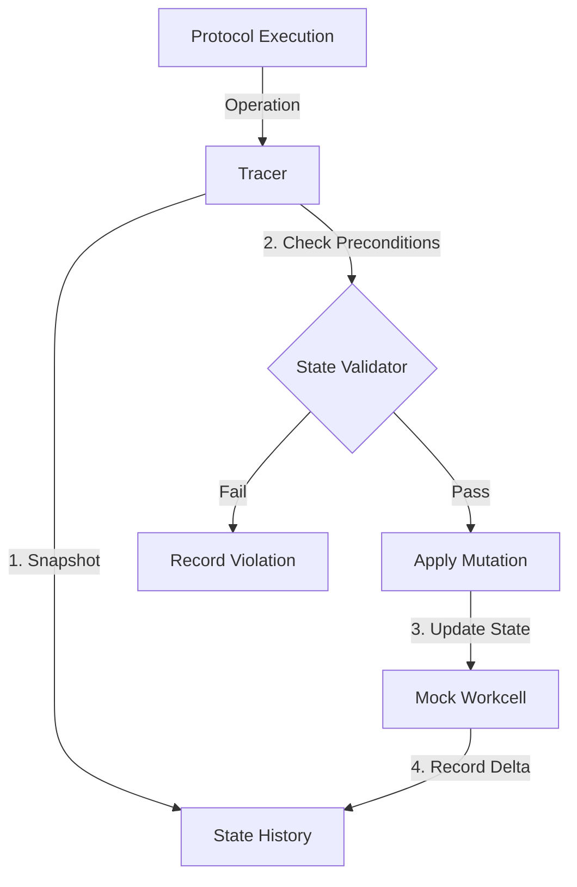

# State Snapshot Tracing

**Status**: ✅ Backend Complete (2026-01-05)
**Implementation**: `praxis/backend/core/simulation/`
**Integration**: `praxis/backend/services/simulation_service.py`
**Tests**: 59 tests passing

## Overview

Implement a generic state snapshot tracing system for protocol execution. This enables predicting failures (e.g., insufficient volume, missing tips) before running on hardware by simulating state changes on a mock workcell.

The system treats the workcell state as a serializable snapshot that is mutated by operations. Preconditions are checked against this state.

## Architecture



## Implementation Status

### Phase 1: Traced Workcell & State Serialization ✅

- [x] Create `SimulationState` class with serializable state
- [x] Implement `BooleanLiquidState`, `SymbolicLiquidState`, `ExactLiquidState`
- [x] Implement state mutation methods (`aspirate`, `dispense`, `transfer`)
- [x] Support PLR-compatible state structure (resources, wells, tips)
- [x] State promotion (boolean → symbolic → exact)

**Files**: `praxis/backend/core/simulation/state_models.py`

### Phase 2: State Validator & Preconditions ✅

- [x] Create `MethodContract` dataclass with preconditions/effects
- [x] Implement 40+ method contracts for LiquidHandler, PlateReader, HeaterShaker, etc.
- [x] Generic precondition system (`requires_tips`, `requires_liquid_in`, `requires_on_deck`)
- [x] State effects tracking (`loads_tips`, `drops_tips`, `aspirates_from`, `dispenses_to`)
- [x] `StateViolation` model with fix suggestions

**Files**:
- `praxis/backend/core/simulation/method_contracts.py`
- `praxis/backend/core/simulation/state_models.py`

### Phase 3: Integration with Tracers ✅

- [x] Create `StatefulTracedMachine` extending `TracedMachine`
- [x] Precondition checking before each operation
- [x] State effect application after each operation
- [x] Violation collection with full context
- [x] `HierarchicalSimulator` pipeline (boolean → symbolic → exact)

**Files**:
- `praxis/backend/core/simulation/stateful_tracers.py`
- `praxis/backend/core/simulation/pipeline.py`

### Phase 4: Failure Mode Detection ✅

- [x] `FailureModeDetector` for enumerating failure states
- [x] Early pruning to reduce state space exploration
- [x] `BoundsAnalyzer` for loop iteration counts
- [x] Comprehensive test suite (49 tests)

**Files**:
- `praxis/backend/core/simulation/failure_detector.py`
- `praxis/backend/core/simulation/bounds_analyzer.py`
- `tests/core/test_simulation.py`

### Phase 5: Integration & Caching ✅

- [x] Create `ProtocolSimulator` facade class
- [x] Create `SimulationService` for running and caching results
- [x] Integrate with `DiscoveryService` (auto-simulation on discovery)
- [x] Database schema: simulation_result_json, inferred_requirements_json, failure_modes_json
- [x] Alembic migration for cache columns
- [x] Pydantic models for API responses
- [x] Cache validation with version and source hash

**Files**:
- `praxis/backend/core/simulation/simulator.py`
- `praxis/backend/services/simulation_service.py`
- `praxis/backend/models/pydantic_internals/protocol.py`
- `alembic/versions/f3a4b5c6d7e8_add_simulation_cache_to_protocol_defs.py`

### Phase 6: Visualization & Reporting (Future)

- [ ] Expose state history to frontend
- [ ] Visual indication of state failures in `ExecutionMonitor`
- [ ] "Time travel" debugging - inspect state at any operation step
- [ ] Surface requirements in deck setup wizard
- [ ] Show failure mode warnings in UI

## Technical Details

### State Models (Implemented)

```python
# Three precision levels
@dataclass
class BooleanLiquidState:
    has_liquid: dict[str, bool]  # "plate.A1" -> True/False
    has_capacity: dict[str, bool]

@dataclass
class SymbolicLiquidState:
    volumes: dict[str, SymbolicVolume]  # "plate.A1" -> "v1"
    constraints: list[str]  # ["v1 > 0", "v1 <= 200"]

@dataclass
class ExactLiquidState:
    volumes: dict[str, float]  # "plate.A1" -> 150.0
```

### Method Contract Example (Implemented)

```python
MethodContract(
    method_name="aspirate",
    receiver_type="liquid_handler",
    requires_tips=True,
    requires_on_deck=("resource",),
    requires_liquid_in="resource",
    aspirates_from="resource",
    aspirate_volume_arg="vol",
)
```

### Usage Example

```python
from praxis.backend.core.simulation import simulate_protocol_sync

async def my_protocol(lh, plate, tips):
    await lh.pick_up_tips(tips)
    await lh.aspirate(plate["A1"], 100)
    await lh.dispense(plate["B1"], 100)
    await lh.drop_tips(tips)

result = simulate_protocol_sync(
    my_protocol,
    parameter_types={
        "lh": "LiquidHandler",
        "plate": "Plate",
        "tips": "TipRack",
    }
)

if result.passed:
    print("Protocol validated!")
else:
    for v in result.violations:
        print(f"Failure: {v['message']}")
        print(f"Fix: {v['suggested_fix']}")
```

## Module Structure

```
praxis/backend/core/simulation/
├── __init__.py              # Module exports
├── method_contracts.py      # PLR method contracts (40+ contracts)
├── state_models.py          # Boolean/Symbolic/Exact state
├── stateful_tracers.py      # State-aware tracers
├── pipeline.py              # HierarchicalSimulator
├── bounds_analyzer.py       # Loop iteration analysis
├── failure_detector.py      # Failure mode enumeration
└── simulator.py             # ProtocolSimulator facade

praxis/backend/services/
└── simulation_service.py    # Service for running/caching simulations

praxis/backend/models/
├── orm/protocol.py          # ORM cache columns
└── pydantic_internals/
    └── protocol.py          # API response models

alembic/versions/
└── f3a4b5c6d7e8_...py       # Migration for cache columns

tests/core/
└── test_simulation.py       # 59 comprehensive tests
```
