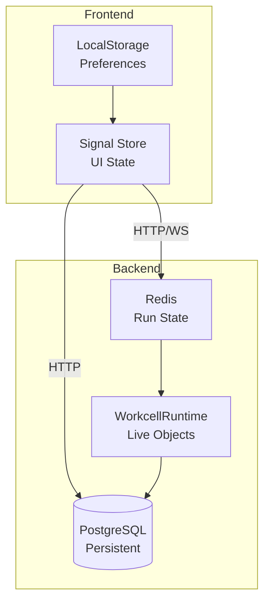

# Agent Prompt: Fix State Management Diagram Theming

Examine `.agents/README.md` for development context.

**Status:** 🟢 Not Started
**Priority:** P2
**Batch:** [260109](./README.md)
**Backlog Reference:** [docs.md](../../backlog/docs.md)

---

## 1. The Task

The state management overview diagram in `docs/architecture/state-management.md` is improperly formatted for theming. The Mermaid diagram colors may be hardcoded or not respecting dark/light mode CSS variables, causing poor visibility in one or both themes.

**User Value:** Developers can read architecture diagrams clearly in both light and dark modes, improving documentation accessibility.

---

## 2. Technical Implementation Strategy

### Architecture

**Component:** Mermaid diagrams rendered in DocsPageComponent

- Source: `docs/architecture/state-management.md`
- Renderer: `ngx-markdown` with mermaid support
- Mermaid options configured in `docs-page.component.ts`

### Current Diagram (lines 7-26 of state-management.md)



### Problem Analysis

Mermaid diagrams use a theme system. The issue is likely:

1. Hardcoded colors in the diagram that don't adapt to dark mode
2. Mermaid theme not configured to use CSS variables
3. Missing CSS overrides for `.mermaid` SVG elements

### Implementation Options

**Option A (Recommended):** Configure Mermaid to use the 'base' theme with CSS variable overrides:

In `docs-page.component.ts`, the `mermaidOptions()` computed property should include:

```typescript
mermaidOptions = computed(() => ({
  theme: 'base',
  themeVariables: {
    primaryColor: 'var(--mat-sys-primary-container)',
    primaryTextColor: 'var(--mat-sys-on-primary-container)',
    primaryBorderColor: 'var(--mat-sys-outline)',
    lineColor: 'var(--mat-sys-outline)',
    secondaryColor: 'var(--mat-sys-secondary-container)',
    tertiaryColor: 'var(--mat-sys-tertiary-container)',
    background: 'var(--mat-sys-surface)',
    mainBkg: 'var(--mat-sys-surface-container)',
    nodeBkg: 'var(--mat-sys-surface-container-high)',
    textColor: 'var(--mat-sys-on-surface)',
  }
}));
```

**Option B:** Add CSS overrides in the component styles for `.mermaid` SVG elements.

**Option C:** Use Mermaid's built-in 'dark' theme when dark mode is active:

```typescript
mermaidOptions = computed(() => ({
  theme: this.isDarkMode() ? 'dark' : 'default'
}));
```

### Data Flow

1. DocsPageComponent loads markdown with mermaid code blocks
2. ngx-markdown detects ``` mermaid blocks
3. Mermaid.js renders SVG using configured theme
4. Theme should respond to system/app dark mode setting

---

## 3. Context & References

**Primary Files to Modify:**

| Path | Description |
|:-----|:------------|
| `praxis/web-client/src/app/features/docs/components/docs-page.component.ts` | Configure mermaidOptions for theming |
| `docs/architecture/state-management.md` | Source diagram (may need directive adjustments) |
| `praxis/web-client/src/assets/docs/architecture/state-management.md` | In-app copy |

**Reference Files (Read-Only):**

| Path | Description |
|:-----|:------------|
| `praxis/web-client/src/styles.scss` | Global CSS variables for theming |
| `docs/architecture/execution-flow.md` | Another diagram to verify fix works |

---

## 4. Constraints & Conventions

- **Commands**: Use `npm run start` in `praxis/web-client` to test
- **Frontend Path**: `praxis/web-client`
- **Styling**: Use existing CSS variables (`--mat-sys-*` or `--theme-*`)
- **Both themes**: Must work in BOTH light and dark modes

---

## 5. Verification Plan

**Definition of Done:**

1. The code compiles without errors:

   ```bash
   cd praxis/web-client && npm run build
   ```

2. Visual verification in LIGHT mode:
   - Navigate to Docs → Architecture → State Management
   - Verify diagram renders with readable colors
   - Text should be dark on light backgrounds
   - Borders and lines should be visible

3. Visual verification in DARK mode:
   - Toggle to dark mode (Settings cog in app)
   - Navigate to same page
   - Verify diagram adapts to dark theme
   - Text should be light on dark backgrounds
   - All elements remain visible

4. Cross-check other diagrams:
   - Docs → Architecture → Execution Flow
   - Docs → Architecture → Overview
   - All should use consistent theming

---

## On Completion

- [ ] Commit changes with message: `docs: fix mermaid diagram theming for dark/light modes`
- [ ] Update backlog item status in [docs.md](../../backlog/docs.md)
- [ ] Mark this prompt complete in batch README, update DEVELOPMENT_MATRIX.md if applicable, and set the status in this prompt document to 🟢 Completed

---

## References

- `.agents/README.md` - Environment overview
- [Mermaid Theming](https://mermaid.js.org/config/theming.html) - Official docs
