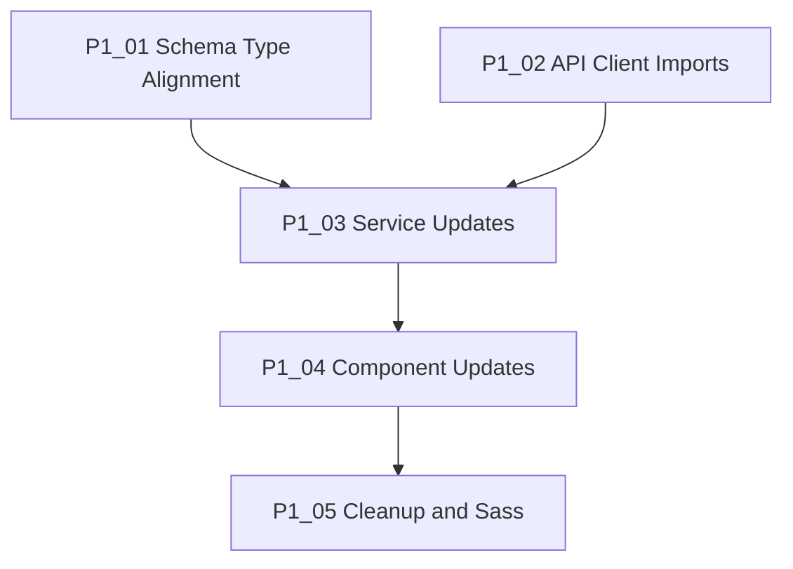

# Prompt Batch: 260113 - Frontend Schema Sync

**Created:** 2026-01-13
**Status:** 🟡 In Progress
**Backlog:** [frontend_schema_sync.md](../../backlog/frontend_schema_sync.md)

---

## Summary

This batch addresses the **29 TypeScript compilation errors** and **17 warnings** in the frontend Angular application following the backend SQLModel migration. The prompts are sequenced to resolve dependencies progressively.

---

## Execution Order

| # | Prompt | Priority | Complexity | Status |
|:--|:-------|:---------|:-----------|:-------|
| 1 | [P1_01_schema_type_alignment.md](./P1_01_schema_type_alignment.md) | P1 | Low | 🟢 Not Started |
| 2 | [P1_02_api_client_imports.md](./P1_02_api_client_imports.md) | P1 | Low | 🟢 Not Started |
| 3 | [P1_03_service_updates.md](./P1_03_service_updates.md) | P1 | Medium | 🟢 Complete |
| 4 | [P1_04_component_updates.md](./P1_04_component_updates.md) | P1 | Medium | 🟢 Not Started |
| 5 | [P1_05_cleanup_and_sass.md](./P1_05_cleanup_and_sass.md) | P1 | Low | 🟢 Not Started |

---

## Dependencies



**Execution Notes:**

- Prompts 1 and 2 can be executed in parallel (no dependencies)
- Prompt 3 depends on both 1 and 2
- Prompt 4 depends on 3
- Prompt 5 can be done last (purely cleanup)

---

## Key Files Overview

### Schema Layer

- `praxis/web-client/src/app/core/db/schema.ts` - Browser SQLite interfaces
- `praxis/web-client/src/app/core/db/repositories.ts` - Type-safe queries

### API Client (Generated)

- `praxis/web-client/src/app/core/api-generated/services/` - API service classes
- `praxis/web-client/src/app/core/api-generated/models/` - Request/response types

### Services (Manual)

- `praxis/web-client/src/app/core/services/playground-runtime.service.ts`
- `praxis/web-client/src/app/core/services/simulation-results.service.ts`
- `praxis/web-client/src/app/features/auth/services/auth.service.ts`

### Components

- `praxis/web-client/src/app/features/data/data-visualization.component.ts`

---

## Verification

After completing all prompts, run:

```bash
cd praxis/web-client
npm run build
```

**Expected Result:**

- 0 errors
- 0 warnings (or minimal)

---

## Completion Checklist

- [ ] All prompts marked complete
- [ ] Update [frontend_schema_sync.md](../../backlog/frontend_schema_sync.md) status
- [ ] Update [DEVELOPMENT_MATRIX.md](../../DEVELOPMENT_MATRIX.md) P1 count
- [ ] Move this batch to archive if all complete
