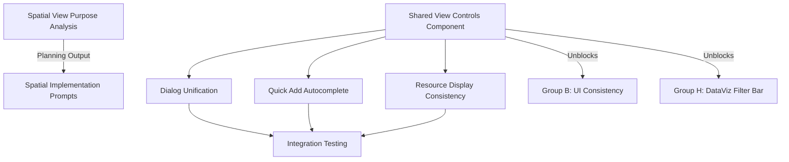

# Group A: View Controls Standardization - Initialization

Examine `.agents/README.md` for development context.

**Status:** 🟢 Not Started
**Priority:** P1-P2
**Batch:** [260114_frontend_feedback](../README.md)
**Type:** 🔵 Planning → Implementation

---

## Overview

This group establishes **shared view control components** that will be reused across **ALL areas with filters/views**:

- Spatial View
- Machines Tab
- Resources Tab
- Registry Tab
- **Data Visualization** (filter bar)
- **Workcell View**
- **Protocol Library/Display**
- Any future tabs with filtering needs

Completing this work will unblock consistency improvements in **Group B** (UI Consistency) and **Group H** (DataViz).

---

## Critical Dependencies

> [!IMPORTANT]
> **Group B depends on Group A.** The multiselect, filter, and chip consistency issues in Group B should adopt patterns established here. Coordinate prompts accordingly.

---

## Items to Address

### 1. Shared View Controls Component (P1) - 🔴 PLANNING TASK

**User Feedback:**

> "we should overall have a consistent set of 'view' controls exposed to the user across menus (this should be a shared component) this should have a groupby and filterby etc. this will be a larger refactor that makes some of the above issues obsolete"

**Scope:**

- **Reconnaissance first**: Audit ALL existing filter/view implementations across the app
- Design a reusable `ViewControlsComponent` architecture
- Define which features to include: group-by, filter-by, view-type toggle (card/list)
- Specify adoption path for: Spatial, Machines, Resources, Registry, DataViz, Workcell, Protocols
- This is a **foundation** component that other groups depend on

**Output:** Planning document with component design and adoption plan, spawns implementation prompts

---

### 2. View Type Toggle - Card/List (P2)

**User Feedback:**

> "I like these card based views. let's have toggle for view type in spatial machines resources and registry."

**Scope:**

- Part of the shared view controls component
- Toggle between card view and list/table view
- Persist user preference (localStorage or user settings)

**Output:** Included in shared component prompt

---

### 3. Spatial View Purpose Clarity (P3) - 🔴 PLANNING TASK

**User Feedback:**

> "it's also unclear what the role of spatial view is and why it's a separate tab. we should assess this carefully"

**Scope:**

- This requires **UX analysis** before implementation
- Questions to answer:
  - What unique value does Spatial View provide?
  - Should it be a view mode within other tabs instead of separate tab?
  - What is the mental model for users?

**Output:** Planning prompt that produces a UX recommendation document, which may spawn additional implementation prompts

---

### 4. Unify Add Asset/Machine Dialog Routes (P2)

**User Feedback:**

> "maybe we should unify add asset add machine dialog routes (select type, then specific one, then additional configuration)"

**Scope:**

- Consolidate add flows into consistent pattern
- Flow: Select Type → Select Specific → Configure
- Apply to both Asset and Machine dialogs

**Output:** Implementation prompt for dialog unification

---

### 5. Quick Add Autocomplete (P2)

**User Feedback:**

> "we should also have a quick add autocomplete for both (in both the + asset and the + machine +resource separate dialogue) for the + asset it should also be on the first (pick machine or resource dialog)"

**Scope:**

- Add autocomplete search to bypass category navigation
- Available in: +Asset dialog, +Machine dialog, +Resource dialog
- Should be on first screen of each dialog

**Output:** Implementation prompt for autocomplete feature

---

### 6. Resource Display Consistency (P2)

**User Feedback:**

> "resource display should be consistent"

**Scope:**

- Audit resource display across all tabs
- Standardize card/list item structure
- Part of shared component adoption

**Output:** Included in shared component adoption prompts

---

## Execution Order

## Prompts to Generate

| #    | Type               | Title                               | Depends On |
| ---- | ------------------ | ----------------------------------- | ---------- |
| A-P1 | 🔵 Planning        | Spatial View UX Analysis            | -          |
| A-01 | 🟢 Implementation  | Shared View Controls Component      | -          |
| A-02 | 🟢 Implementation  | Add Dialog Unification              | A-01       |
| A-03 | 🟢 Implementation  | Quick Add Autocomplete              | A-02       |
| A-04 | 🟢 Implementation  | Adopt Shared Controls Across Tabs   | A-01       |
| A-05 | 🟢 Implementation  | Deprecate FilterChip for Praxis Select/Multiselect | A-01 |

---

## Reconnaissance Needed (WIDER SCOPE)

> [!IMPORTANT]
> Before generating implementation prompts, conduct **comprehensive audit** of ALL filter/view implementations, not just the obvious tabs.

- [ ] Current dialog implementations in `praxis/web-client/src/app/features/*/dialogs/`
- [ ] Existing filter/view components in `praxis/web-client/src/app/shared/`
- [ ] Spatial view implementation and its unique features
- [ ] How view preferences are currently stored
- [ ] **Data Visualization filter bar** (`praxis/web-client/src/app/features/dataviz/`)
- [ ] **Workcell view filters** (`praxis/web-client/src/app/features/workcell/`)
- [ ] **Protocol library filters** (`praxis/web-client/src/app/features/protocols/`)
- [ ] **Any other tabs with filter/view controls**

The purpose is to understand the **full scope** of where shared view controls would be adopted.
