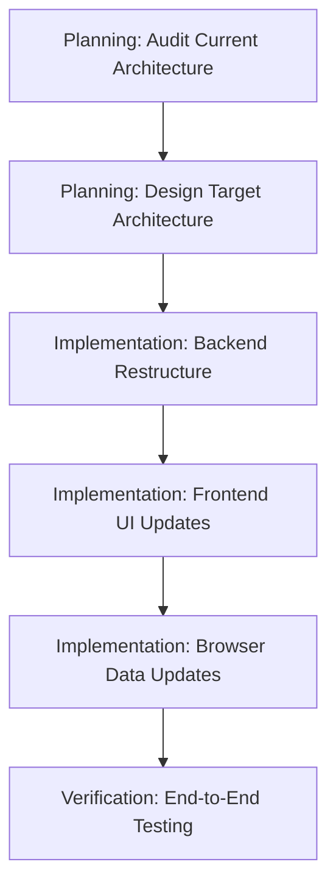

# Group C: Simulation Architecture - Initialization

Examine `.agents/README.md` for development context.

**Status:** 🟢 Not Started
**Priority:** P2
**Batch:** [260114_frontend_feedback](../README.md)
**Type:** 🔵 Planning → Implementation (Architecture Change)

---

## Overview

This group addresses the frontend/backend separation for simulated machines. This is an **architectural improvement** that requires planning before implementation.

---

## Items to Address

### 1. Simulated Frontend/Backend Separation (P2, Hard) - 🔴 PLANNING TASK

**User Feedback:**
> "machines (not great frontend vs backend separation, we should start with only simulated frontends, users can select chatterbox or another simulated backend of their choosing when instantiating simulated machines whether for protocols or in the playground)"

**Current State (from backlog):**

- "Demo" naming still present on simulated frontends
- Unclear what each simulated backend does
- Machine Backend Mismatch: "Add Machine" shows 0 backends but logs show 73 simulated backends loaded
- Excessive simulated frontends per category

---

## Desired Architecture

> [!CAUTION]
> **NOT 1:1 mapping.** The target architecture is:
>
> - **ONE simulated frontend per machine category** in the database/inventory
> - User selects **which simulated backend** to use when instantiating (ChatterboxBackend, etc.)
> - Simulated backends do NOT show up in inventory - they are runtime selections
> - Need to track which simulated backend is used for each machine instance

**Example Flow:**

1. User sees "Simulated Hamilton" frontend in inventory (one per category)
2. When instantiating, user selects backend: ChatterboxBackend, DryRunBackend, etc.
3. System tracks: Machine instance → simulated frontend → selected backend

**This requires architectural changes:**

- Tracking which simulated backend is selected per machine instance
- UI for backend selection during instantiation
- Clear separation: Frontend = what user sees/interacts with, Backend = behavior simulation

**Scope:**
This requires:

1. **Architecture planning** - Document current state, define target state
2. **Backend changes** - Restructure simulated machine definitions
3. **Frontend changes** - Update machine instantiation UI
4. **Data migration** - Update browser mode data

---

## Execution Strategy

This is a **multi-phase task**:

### Phase 1: Planning (This spawns implementation prompts)

- Audit all simulated backend implementations
- Document what each simulated frontend/backend pair does
- Identify which use ChatterboxBackend vs other approaches
- Design the target 1:1 mapping architecture
- Define migration path

### Phase 2: Implementation (Generated from planning output)

- Remove "demo" naming
- Restructure backend registration
- Update instantiation UI
- Update browser mode data

---

## Prompts to Generate

| # | Type | Title | Depends On |
|---|------|-------|------------|
| C-P1 | 🔵 Planning | Simulation Architecture Audit & Design | - |
| C-01+ | 🟢 Implementation | (Generated from C-P1 output) | C-P1 |

---

## Reconnaissance Needed

Before generating planning prompt, investigate:

- [ ] Simulated backend implementations in `praxis/backend/`
- [ ] Machine definition catalog structure
- [ ] Frontend machine instantiation flow
- [ ] Browser mode machine data

---

## Related Backlog

- [simulation.md](../../backlog/simulation.md) - Existing backlog item with more context
