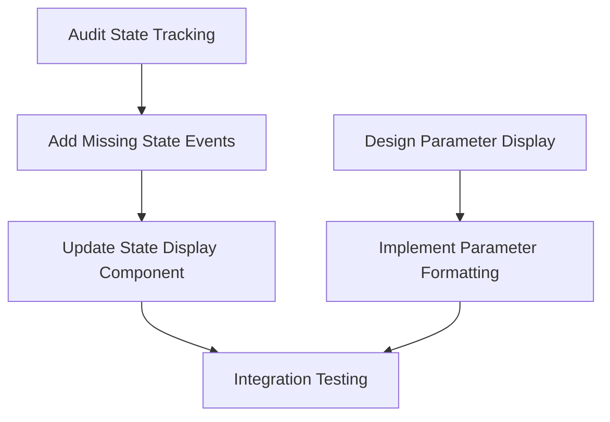

# Group D: State Inspection & Monitor - Initialization

Examine `.agents/README.md` for development context.

**Status:** 🟢 Not Started
**Priority:** P2
**Batch:** [260114_frontend_feedback](../README.md)
**Type:** 🟢 Implementation

---

## Overview

This group improves the protocol execution monitor's state inspection and parameter display capabilities.

---

## Items to Address

### 1. State Inspection Incomplete (P2, Medium)

**User Feedback:**
> "state inspection does not appear to be detecting everything (for example dispense does not show volume leaving tip and going to well)"

**Current State:**

> [!NOTE]
> **State serialization/inspection is already implemented and partially working.** This is a debugging/audit task to understand why certain state changes (e.g., dispense volume transfers) are not being logged.

**Scope:**

- Audit which state changes are currently being captured vs missing
- Diagnose: Is this a PLR issue or our inspection utility?
- Focus on dispense operations (tip → well volume movement)
- Ensure all liquid handling operations show state changes

**Technical Notes:**

> [!TIP]
> PLR state serialization should capture arbitrary state changes. The question is whether PLR is emitting these events or if our inspection utility is not processing them correctly.

- Check PLR state event emission for dispense operations
- Verify our inspection utility is subscribing to all relevant events
- Frontend display needs to show volume deltas
- Consider: before/after state comparison view

---

### 2. Input Parameters Display (P2, Medium)

**User Feedback:**
> "input parameters in monitor does not have a nice display"

**Scope:**

- Improve input parameter rendering in monitor tab
- Better formatting for complex objects
- Consider: collapsible sections, syntax highlighting
- Handle different parameter types appropriately

---

## Execution Strategy

These are related monitor improvements that can be addressed together:

---

## Prompts to Generate

| # | Type | Title | Items Covered |
|---|------|-------|---------------|
| D-01 | 🟢 Implementation | Monitor State & Parameter Display | 1, 2 |

---

## Reconnaissance Needed

Before generating implementation prompt, investigate:

- [ ] Current state inspection implementation in monitor tab
- [ ] How dispense operations are logged/tracked
- [ ] Parameter display components
- [ ] State event types and structure
