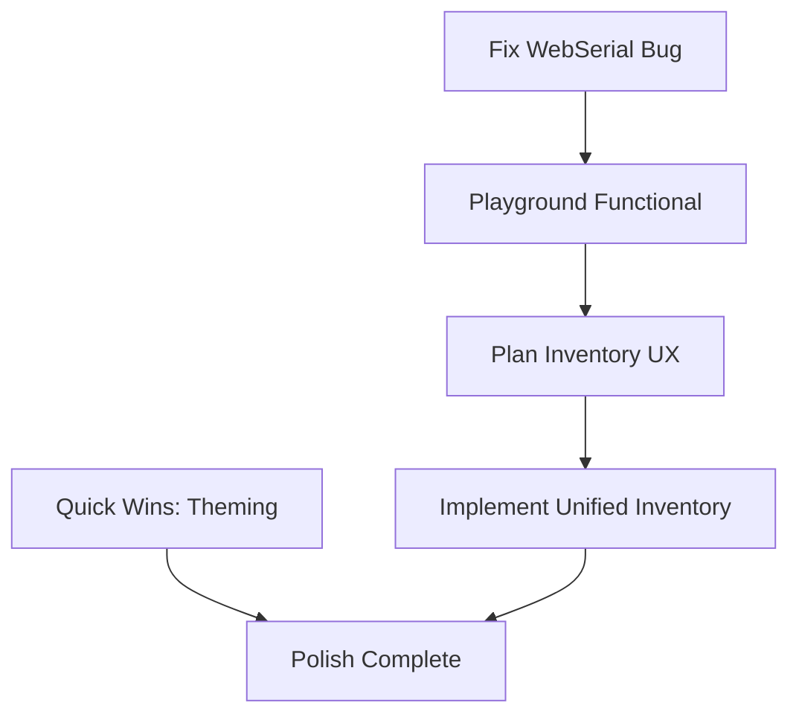

# Group E: Playground Improvements - Initialization

Examine `.agents/README.md` for development context.

**Status:** 🟢 Not Started
**Priority:** P1-P3
**Batch:** [260114_frontend_feedback](../README.md)
**Type:** 🔴 Bug Fix + 🔵 Planning + 🟢 Implementation

---

## Overview

This group addresses playground-specific issues including a P1 bug (WebSerial), inventory management UX, and styling consistency.

---

## Items to Address

### 1. WebSerial NameError (P1, Medium) - 🔴 BUG FIX

**User Feedback:**

```python
NameError: name 'WebSerial' is not defined
Traceback in Cell In[1], line 25: _ser.Serial = WebSerial
```

**Scope:**

- Critical bug preventing playground initialization
- WebSerial class not being imported/defined before use
- Check Pyodide environment initialization order

**Priority:** This blocks playground functionality - fix first!

---

### 2. Inventory Categories Not Good (P2, Medium) - 🔵 PLANNING TASK

**User Feedback:**
> "categories in the playground inventory adder are not good for machines or resources. this component should be united with what we use to select for the protocols, but with different logic. not sure if this is actually the case. we should think carefully and plan out the best ux here."

**Scope:**

- Audit current inventory adder vs protocol asset selector
- Determine if they should share a component
- Define what "different logic" means for each context
- Plan unified component with context-aware behavior

**Output:** Planning prompt that produces UX design, spawns implementation prompts

---

### 3. Stepper Themed CSS (P3, Easy)

**User Feedback:**
> "also make sure we are using themed css and not overrides (the stepper looks off)"

**Scope:**

- Audit stepper component for hardcoded styles
- Replace with theme variables/tokens
- Ensure consistent with application theme

---

### 4. Well Selector Chips Smaller (P3, Easy)

**User Feedback:**
> "well selector is GREAT, feels fluid and natural. let's make the chips in the selected a bit smaller though."

**Scope:**

- Reduce chip size in well selector selected display
- Maintain readability while improving density

---

### 5. Programmatic Well Selection (P4, Medium) - 🔵 TECH DEBT

**User Feedback:**
> "we should also support programmatic selection (but this should be put in technical debt for now, definitely beyond scope of alpha)"

**Scope:**

- Add to technical debt backlog
- Document desired API for programmatic selection
- Defer implementation to post-alpha

---

### 6. Loading Skeleton Theming (P3, Easy)

**User Feedback:**
> "playground loading skeleton is working, but can we make sure it's on theme?"

**Scope:**

- Update skeleton loading colors to use theme tokens
- Match skeleton pulse animation to theme

---

## Execution Strategy

### Priority Order

1. **P1 Bug Fix** - WebSerial error (blocks everything)
2. **Planning** - Inventory categories UX design
3. **Quick Wins** - Stepper CSS, Well chips, Loading skeleton
4. **Post-Planning** - Inventory implementation from planning output



---

## Prompts to Generate

| # | Type | Title | Items Covered |
|---|------|-------|---------------|
| E-01 | 🔴 Bug Fix | WebSerial NameError Fix | 1 |
| E-P1 | 🔵 Planning | Inventory/Asset Selector UX Design | 2 |
| E-02 | 🟢 Implementation | Playground Theming Quick Wins | 3, 4, 6 |
| E-03+ | 🟢 Implementation | (Generated from E-P1 output) | - |

**Tech Debt Item:** Add #5 to TECHNICAL_DEBT.md

---

## Reconnaissance Needed

Before generating prompts, investigate:

- [ ] WebSerial initialization in REPL/Pyodide setup
- [ ] Current inventory adder implementation
- [ ] Protocol asset selector implementation
- [ ] Stepper component and its styles
- [ ] Well selector component location

---

## Related Backlog

- [playground.md](../../backlog/playground.md) - Existing playground issues
