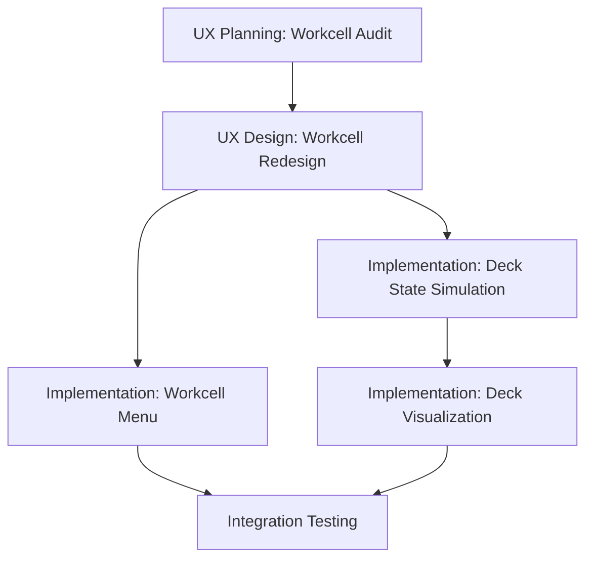

# Group F: Workcell & Deck - Initialization

Examine `.agents/README.md` for development context.

**Status:** 🟢 Not Started
**Priority:** P2
**Batch:** [260114_frontend_feedback](../README.md)
**Type:** 🔵 Planning → Implementation (UX Redesign)

---

## Overview

This group addresses workcell visualization and deck state simulation.

> [!CAUTION]
> **UX PLANNING IS THE VERY FIRST TASK.** Per user: "this will be a task of first planning out what the best UX here would be and going from there." ALL implementation is downstream of the planning output.

---

## Items to Address

### 1. Workcell UX Planning (P2, Hard) - 🔴 FIRST TASK

**User Feedback:**

> "also the workcell column and just generally the workcell menu needs a lot of improvement. this will be a task of first planning out what the best UX here would be and going from there."

**Scope:**

- Full UX audit of workcell interface
- Define what information should be displayed
- Design improved menu/navigation structure
- Consider: machine status, deck visualization, resource tracking

**Output:** UX design document that spawns ALL subsequent implementation prompts

---

### 2. Simulated Deck States (P2, Hard) - ⏳ AFTER PLANNING

**User Feedback:**

> "no deck state available. we should have simulated deck states."

**Current State (from backlog):**

- Workcell view has no deck views for anything
- Dynamic deck mapping system incomplete
- Deck catalog not properly integrated with machine backends

**Scope:**

- Implement simulated deck state tracking
- Display deck state in workcell view
- Show resource positions on deck
- Track state changes during protocol execution

**Note:** Implementation details will be informed by F-P1 planning output.

---

## Execution Strategy

User explicitly stated this needs **planning first**:

### Phase 1: Planning

- Audit current workcell implementation
- Document user workflows and pain points
- Design improved information architecture
- Create wireframes/mockups for new design
- Define deck state data requirements

### Phase 2: Implementation (Generated from planning)

- Implement deck state tracking in simulation
- Build deck visualization components
- Redesign workcell menu structure
- Connect to protocol execution state

---

## Prompts to Generate

| # | Type | Title | Depends On |
|---|------|-------|------------|
| F-P1 | 🔵 Planning | Workcell UX Audit & Redesign | - |
| F-01+ | 🟢 Implementation | (Generated from F-P1 output) | F-P1 |

---

## Reconnaissance Needed

Before generating planning prompt, investigate:

- [ ] Current workcell view implementation
- [ ] Deck visualization pipeline (or lack thereof)
- [ ] Deck catalog structure
- [ ] Machine → deck definition mapping
- [ ] Simulation state tracking

---

## Related Backlog

- [workcell.md](../../backlog/workcell.md) - Detailed context on deck visualization issues
