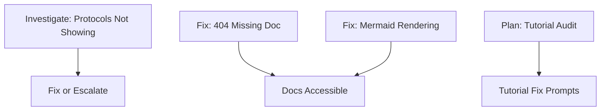

# Group G: Documentation & Rendering - Initialization

Examine `.agents/README.md` for development context.

**Status:** 🟢 Not Started
**Priority:** P1-P2
**Batch:** [260114_frontend_feedback](../README.md)
**Type:** 🟢 Implementation + 🔵 Planning (Tutorial Audit)

---

## Overview

This group addresses documentation issues including P1 blockers (missing docs, broken rendering) and tutorial maintenance.

---

## Items to Address

### 1. No Protocols Showing Up (P1, Medium) - 🔴 INVESTIGATION

**User Feedback:**
> "No protocols showing up"

**Console Error (from Vite):**

```
[vite] http proxy error: /api/v1/protocols/definitions?limit=100
AggregateError [ECONNREFUSED]:
    at internalConnectMultiple (node:net:1139:18)
    at afterConnectMultiple (node:net:1714:7)
```

**Analysis:**

This is an **API proxy error** - in browser mode, the frontend is trying to hit a backend API endpoint (`/api/v1/protocols/definitions`) that doesn't exist because no backend server is running.

**Scope:**

- Diagnose: Is this a browser mode fallback issue?
- In browser mode, protocols should load from local browser data, not API
- May be a routing/service configuration issue after SQLModel refactor
- Check if protocol service correctly detects browser mode

**Note:** This likely requires ensuring browser mode bypasses API calls for protocol data.

---

### 2. 404 on installation-production.md (P1, Easy)

**User Feedback:**
> "Error Code: 404 Message: Http failure response for <http://localhost:4200/assets/docs/getting-started/installation-production.md>: 404 Not Found"

**Scope:**

- Missing documentation file
- Either create the file or fix the reference
- Verify documentation routing

---

### 3. Mermaid/System Diagrams Not Rendering (P2, Medium)

**User Feedback:**
> "system diagrams and mermaid not rendering"

**Existing Backlog:**
> "Trying to expand the system architecture views does not work and instead yields just the text, not the actual visual view."

**Scope:**

- Debug Mermaid library loading
- Fix expand/collapse functionality for diagrams
- Test across different browsers

---

### 4. Tutorial End Reset + Audit (P2, Medium) - 🔵 PLANNING TASK

**User Feedback:**
> "end of tutorial resetting, also auditing tutorial"

**Existing Backlog:**
> "The tutorial needs to be brought up to date."

**Scope:**

- Audit tutorial for accuracy after recent changes
- Fix end-of-tutorial state reset
- Update screenshots if UI changed
- Verify all described features still work

**Output:** Tutorial audit document with specific update tasks, spawns fix prompts

---

## Execution Strategy

### Priority Order

1. **P1 Investigations** - Protocols not showing, 404 error
2. **P2 Fixes** - Mermaid rendering
3. **Planning** - Tutorial audit



---

## Prompts to Generate

| # | Type | Title | Items Covered |
|---|------|-------|---------------|
| G-01 | 🔴 Investigation | Protocols Not Loading Diagnosis | 1 |
| G-02 | 🟢 Implementation | Documentation 404 & Mermaid Fixes | 2, 3 |
| G-P1 | 🔵 Planning | Tutorial Audit | 4 |
| G-03+ | 🟢 Implementation | (Generated from G-P1 output) | - |

---

## Reconnaissance Needed

Before generating prompts, investigate:

- [ ] Protocol loading and display code
- [ ] Documentation file structure in `praxis/web-client/src/assets/docs/`
- [ ] Mermaid integration in docs viewer
- [ ] Tutorial implementation and flow

---

## Related Backlog

- [docs.md](../../backlog/docs.md) - Documentation issues including diagrams and tutorial
