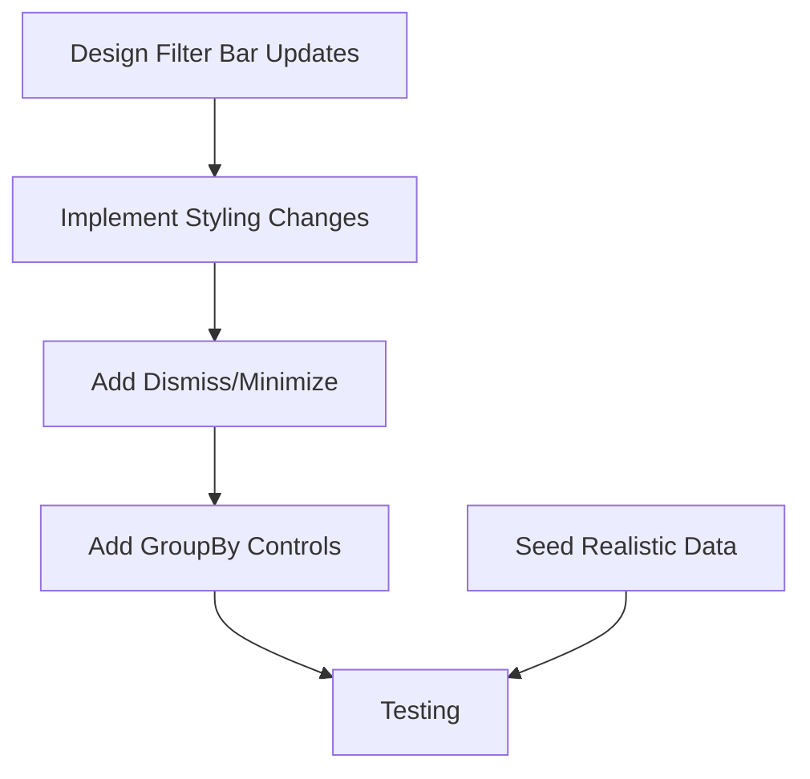

# Group H: Data Visualization - Initialization

Examine `.agents/README.md` for development context.

**Status:** 🟢 Not Started
**Priority:** P2
**Batch:** [260114_frontend_feedback](../README.md)
**Type:** 🟢 Implementation

---

## Overview

This group addresses the data visualization filter bar UI improvements.

---

## Items to Address

### 1. DataViz Filter Bar UI (P2, Medium)

**User Feedback:**
> "the filter bar in data viz again can have some better UI with groupby etc. i also don't like how it trails while partially transparent. we should make it rounded corner and hover above and dismissable or minimizable"

**Scope:**

- Add groupby functionality to filter bar
- Fix trailing/transparency issues
- Add rounded corners
- Make filter bar float/hover above content
- Add dismiss/minimize functionality
- Consider: sticky behavior, collapse state

**Design Considerations:**

- Should integrate with Group A's shared view controls component (if applicable)
- Consistent with filter patterns elsewhere in app

---

### 2. Realistic Simulated Data (P2, Medium)

**User Request:**

> Add more realistic simulated data for data visualization.

**Scope:**

- Seed browser database with realistic sample data from simulated protocol runs
- Include varied well data (volumes, concentrations, etc.)
- Provide meaningful data for users to explore visualization features
- Connect to existing backlog item in [dataviz.md](../../backlog/dataviz.md) "Sample Data Seeding"

---

### 2. Realistic Simulated Data (P2, Medium)

**User Request:**

> Add more realistic simulated data for data visualization.

**Scope:**

- Seed browser database with realistic sample data from simulated protocol runs
- Include varied well data (volumes, concentrations, etc.)
- Provide meaningful data for users to explore visualization features
- Connect to existing backlog item in [dataviz.md](../../backlog/dataviz.md) "Sample Data Seeding"

---

## Execution Strategy

This is a focused UI improvement:

**Dependency Note:** If Group A creates a shared view controls component, this should adopt it rather than creating separate controls.

---

## Prompts to Generate

| # | Type | Title | Depends On |
|---|------|-------|------------|
| H-01 | 🟢 Implementation | DataViz Filter Bar Redesign | Group A (optional) |
| H-02 | 🟢 Implementation | Realistic Simulated Data | H-01 (optional) |

---

## Reconnaissance Needed

Before generating implementation prompt, investigate:

- [ ] Current filter bar implementation in data viz
- [ ] Styling approach (CSS, Tailwind, etc.)
- [ ] Existing groupby implementations elsewhere
- [ ] Filter bar component structure
- [ ] How simulated data is currently seeded in browser DB

---

## Related Backlog

- [dataviz.md](../../backlog/dataviz.md) - Data visualization issues
