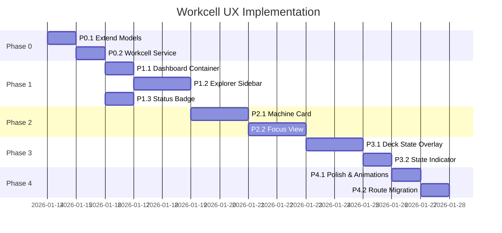

# Workcell UX Redesign - Implementation Plan

**Document ID:** WCX-001-IMPL  
**Parent:** [workcell_ux_redesign.md](./workcell_ux_redesign.md)  
**Created:** 2026-01-13  
**Status:** 📋 Pending Approval

---

## Overview

This document breaks down the Workcell UX Redesign into discrete implementation phases. Each phase corresponds to one or more agent prompts.

---

## Phase 0: Foundation (Pre-requisites)

**Duration:** ~1 day  
**Dependencies:** None

### P0.1: Extend Frontend Models

**Prompt:** `F-02_workcell_models.md`

Create TypeScript interfaces for the new workcell view:

```typescript
// src/app/features/workcell/models/workcell-view.models.ts

export interface WorkcellGroup {
  workcell: Workcell | null;
  machines: MachineWithRuntime[];
  isExpanded: boolean;
}

export interface MachineWithRuntime extends Machine {
  connectionState: 'connected' | 'disconnected' | 'connecting';
  lastStateUpdate?: Date;
  stateSource: 'live' | 'simulated' | 'cached' | 'definition';
  currentRun?: ProtocolRunSummary;
  alerts: MachineAlert[];
}

export interface MachineAlert {
  severity: 'info' | 'warning' | 'error';
  message: string;
  resourceId?: string;
}

export interface ProtocolRunSummary {
  id: string;
  protocolName: string;
  currentStep: number;
  totalSteps: number;
  progress: number;
  estimatedRemaining?: number;
}
```

**Deliverables:**

- [ ] `workcell-view.models.ts` created
- [ ] Update `asset.models.ts` to export extended types
- [ ] No breaking changes to existing code

---

### P0.2: Workcell Data Service

**Prompt:** `F-03_workcell_service.md`

Create or extend services for workcell data access:

```typescript
// src/app/features/workcell/services/workcell-view.service.ts

@Injectable({ providedIn: 'root' })
export class WorkcellViewService {
  private assetService = inject(AssetService);
  
  // Signal-based state
  workcellGroups = signal<WorkcellGroup[]>([]);
  selectedMachine = signal<MachineWithRuntime | null>(null);
  
  // Load all machines grouped by workcell
  loadWorkcellGroups(): Observable<WorkcellGroup[]> {
    return forkJoin({
      machines: this.assetService.getMachines(),
      workcells: this.assetService.getWorkcells() // May need implementing
    }).pipe(
      map(({ machines, workcells }) => this.groupByWorkcell(machines, workcells))
    );
  }
  
  // Compute alerts from machine state
  private computeAlerts(machine: Machine): MachineAlert[] {
    // Analyze plr_state for low tips, low liquid, etc.
  }
}
```

**Deliverables:**

- [ ] `WorkcellViewService` created
- [ ] `AssetService.getWorkcells()` implemented (if missing)
- [ ] Alert computation logic for tip/liquid status
- [ ] Unit tests for grouping logic

---

## Phase 1: Core Components

**Duration:** ~2-3 days  
**Dependencies:** Phase 0

### P1.1: Workcell Dashboard Container

**Prompt:** `F-04_workcell_dashboard.md`

Create the main container component:

```
features/workcell/
├── workcell.routes.ts
├── workcell-dashboard/
│   ├── workcell-dashboard.component.ts
│   ├── workcell-dashboard.component.scss
│   └── workcell-dashboard.component.spec.ts
```

**Key Features:**

- Split layout: sidebar (280px) + main canvas
- View mode signal: 'grid' | 'list' | 'focus'
- Selected machine state management
- Integration with `ViewControlsComponent`

**Template Structure:**

```html
<div class="workcell-dashboard">
  <aside class="workcell-sidebar">
    <app-workcell-explorer 
      [groups]="service.workcellGroups()"
      (machineSelect)="onMachineSelect($event)">
    </app-workcell-explorer>
  </aside>
  
  <main class="workcell-canvas">
    @switch (viewMode()) {
      @case ('grid') { <app-machine-grid [machines]="allMachines()"/> }
      @case ('focus') { <app-machine-focus-view [machine]="selectedMachine()"/> }
    }
  </main>
</div>
```

**Deliverables:**

- [ ] Dashboard component with responsive layout
- [ ] Route configuration (`/workcell`)
- [ ] Replace old `VisualizerComponent` route

---

### P1.2: Workcell Explorer Sidebar

**Prompt:** `F-05_workcell_explorer.md`

Create the hierarchical tree component:

```
shared/components/workcell/
├── workcell-explorer/
│   ├── workcell-explorer.component.ts
│   ├── workcell-group/
│   │   └── workcell-group.component.ts
│   └── machine-tree-node/
│       └── machine-tree-node.component.ts
```

**Features:**

- Collapsible workcell groups (accordion pattern)
- Machine list items with status badges
- Search/filter input
- Keyboard navigation (a11y)
- "Add Machine" / "Add Workcell" buttons

**Deliverables:**

- [ ] `WorkcellExplorerComponent` with tree structure
- [ ] `WorkcellGroupComponent` (collapsible section)
- [ ] `MachineTreeNodeComponent` (list item)
- [ ] Persist expanded state to localStorage
- [ ] Search filtering

---

### P1.3: Machine Status Badge

**Prompt:** `F-06_machine_status_badge.md`

Create a reusable status indicator:

```typescript
// shared/components/workcell/machine-status-badge/
@Component({
  selector: 'app-machine-status-badge',
  template: `
    <span class="status-badge" [class]="statusClass()">
      <span class="status-dot"></span>
      @if (showLabel()) {
        <span class="status-label">{{ statusLabel() }}</span>
      }
    </span>
  `
})
export class MachineStatusBadgeComponent {
  status = input.required<MachineStatus>();
  stateSource = input<'live' | 'simulated' | 'cached'>('live');
  showLabel = input<boolean>(true);
  compact = input<boolean>(false);
}
```

**Status Mapping:**

| Status | Color | Icon | Label |
|--------|-------|------|-------|
| `idle` | Green | ● | Idle |
| `running` | Amber (pulse) | ● | Running |
| `error` | Red | ● | Error |
| `offline` | Gray | ○ | Offline |
| `maintenance` | Blue | 🔧 | Maintenance |

**Deliverables:**

- [ ] `MachineStatusBadgeComponent` created
- [ ] CSS animations for running state
- [ ] State source overlay badge (SIM, LIVE)
- [ ] Storybook entry (if applicable)

---

## Phase 2: Machine Visualization

**Duration:** ~2 days  
**Dependencies:** Phase 1

### P2.1: Machine Card Component

**Prompt:** `F-07_machine_card.md`

Create the card component for grid view:

```
shared/components/workcell/
├── machine-card/
│   ├── machine-card.component.ts
│   ├── machine-card.component.scss
│   ├── machine-card-mini.component.ts  # Compact variant
│   └── machine-card.component.spec.ts
```

**Card Sections:**

1. **Header**: Icon + Name + Status Badge
2. **Deck Preview**: Mini `DeckViewComponent` (150x100px)
3. **Protocol Progress** (if running): Progress bar + step info
4. **Alerts** (if any): Warning banner
5. **Actions**: Focus View, Pause (if running), Context menu

**Deliverables:**

- [ ] `MachineCardComponent` with full layout
- [ ] `MachineCardMiniComponent` for list view
- [ ] Click → emit `machineSelect`
- [ ] Context menu with actions
- [ ] Hover effects + shadows

---

### P2.2: Machine Focus View

**Prompt:** `F-08_machine_focus_view.md`

Create the detailed single-machine view:

```
features/workcell/
├── machine-focus-view/
│   ├── machine-focus-view.component.ts
│   ├── protocol-progress-panel.component.ts
│   └── resource-inspector-panel.component.ts
```

**Layout:**

1. **Header Bar**: Machine info, status, action buttons
2. **Deck View**: Full-width `DeckViewComponent`
3. **Bottom Panels** (flex row):
   - Protocol Progress (if running)
   - Resource Inspector (if resource selected)

**Deliverables:**

- [ ] `MachineFocusViewComponent`
- [ ] `ProtocolProgressPanelComponent`
- [ ] `ResourceInspectorPanelComponent`
- [ ] Back navigation (← Dashboard)
- [ ] Keyboard shortcut: Escape → back to grid

---

## Phase 3: Deck State Integration (F-01 Implementation)

**Duration:** ~1-2 days  
**Dependencies:** Phase 2

### P3.1: Deck State Overlay

**Prompt:** `F-01_simulated_deck_states.md` (UPDATED)

Connect `plr_state` to `DeckViewComponent`:

**Changes to `DeckViewComponent`:**

1. Add `stateSource` input for visual differentiation
2. Enhance border styling based on state source
3. Ensure `state` input properly maps liquid/tip data

**Changes to `WorkcellViewService`:**

1. Extract state from `Machine.plr_state`
2. Transform to `PlrState` interface
3. Compute liquid fill and tip presence

**Deliverables:**

- [ ] `DeckViewComponent` enhanced with state source styling
- [ ] State mapping service/utility
- [ ] "No state available" replaced with empty deck visualization
- [ ] Integration tests

---

### P3.2: Deck State Indicator

**Prompt:** `F-09_deck_state_indicator.md`

Create badge showing state source:

```typescript
@Component({
  selector: 'app-deck-state-indicator',
  template: `
    <span class="state-indicator" [class]="sourceClass()">
      @switch (source()) {
        @case ('live') { 🟢 LIVE }
        @case ('simulated') { 🔵 SIMULATED }
        @case ('cached') { ⚪ OFFLINE }
        @case ('definition') { 📐 STATIC }
      }
    </span>
  `
})
export class DeckStateIndicatorComponent {
  source = input.required<'live' | 'simulated' | 'cached' | 'definition'>();
}
```

**Deliverables:**

- [ ] `DeckStateIndicatorComponent`
- [ ] Tooltip with last update time
- [ ] Pulse animation for live state

---

## Phase 4: Polish & Integration

**Duration:** ~1 day  
**Dependencies:** Phase 3

### P4.1: Theme & Animations

**Prompt:** `F-10_workcell_polish.md`

Apply premium design guidelines:

**Tasks:**

1. Glassmorphism panels for sidebar
2. Smooth transitions between views (grid ↔ focus)
3. Micro-animations on status changes
4. Dark/light mode verification
5. Responsive breakpoint testing

**Deliverables:**

- [ ] CSS variables aligned with design system
- [ ] View transition animations (300ms ease)
- [ ] Status pulse animations
- [ ] Mobile layout (bottom sheet sidebar)

---

### P4.2: Route Migration

**Prompt:** `F-11_workcell_route_migration.md`

Replace old visualizer with new dashboard:

**Tasks:**

1. Update route configuration
2. Redirect `/visualizer` → `/workcell`
3. Remove or deprecate old `VisualizerComponent`
4. Update navigation menu
5. Update tutorial references (if any)

**Deliverables:**

- [ ] `/workcell` route active
- [ ] Old route redirects
- [ ] Navigation updated
- [ ] E2E tests updated

---

## Implementation Order



---

## Prompt Generation Checklist

After design approval, generate these prompts:

| Prompt ID | Title | Type | Dependencies |
|-----------|-------|------|--------------|
| `F-02` | Workcell View Models | 🟢 Implementation | None |
| `F-03` | Workcell View Service | 🟢 Implementation | F-02 |
| `F-04` | Dashboard Container | 🟢 Implementation | F-03 |
| `F-05` | Workcell Explorer | 🟢 Implementation | F-04 |
| `F-06` | Machine Status Badge | 🟢 Implementation | F-02 |
| `F-07` | Machine Card | 🟢 Implementation | F-05, F-06 |
| `F-08` | Machine Focus View | 🟢 Implementation | F-07 |
| `F-01` | Simulated Deck States | 🟢 Implementation | F-08 (UPDATE) |
| `F-09` | Deck State Indicator | 🟢 Implementation | F-01 |
| `F-10` | Polish & Animations | 🟢 Implementation | All above |
| `F-11` | Route Migration | 🟢 Implementation | F-10 |

---

## Success Metrics

| Metric | Target | Measurement |
|--------|--------|-------------|
| Load Time (Dashboard) | < 500ms | Lighthouse |
| Focus View Transition | < 300ms | Performance.now() |
| Test Coverage | > 80% | Jest/Vitest |
| a11y Score | > 90 | axe-core |
| Bundle Size Delta | < +50KB | Build stats |

---

## Risk Mitigation

| Risk | Mitigation |
|------|------------|
| Scope creep | Strict adherence to phase boundaries |
| Backend not returning workcells | Handle null workcell gracefully ("Unassigned") |
| Real-time updates complexity | Defer WebSocket to stretch goal; use polling |
| Breaking existing visualizer users | Gradual rollout with redirect |

---

## Appendix: File Checklist

New files to create:

```
src/app/features/workcell/
├── workcell.routes.ts
├── models/
│   └── workcell-view.models.ts
├── services/
│   └── workcell-view.service.ts
├── workcell-dashboard/
│   ├── workcell-dashboard.component.ts
│   └── workcell-dashboard.component.scss
├── machine-focus-view/
│   ├── machine-focus-view.component.ts
│   ├── protocol-progress-panel.component.ts
│   └── resource-inspector-panel.component.ts
└── components/ (or shared/components/workcell/)
    ├── workcell-explorer/
    │   ├── workcell-explorer.component.ts
    │   ├── workcell-group.component.ts
    │   └── machine-tree-node.component.ts
    ├── machine-card/
    │   ├── machine-card.component.ts
    │   └── machine-card-mini.component.ts
    ├── machine-status-badge/
    │   └── machine-status-badge.component.ts
    └── deck-state-indicator/
        └── deck-state-indicator.component.ts
```

Files to modify:

```
- src/app/app.routes.ts (add workcell route)
- src/app/features/assets/services/asset.service.ts (getWorkcells if missing)
- src/app/shared/components/deck-view/deck-view.component.ts (stateSource input)
- src/app/core/components/nav-drawer/ (update menu)
```

Files to deprecate:

```
- src/app/features/visualizer/visualizer.component.ts (redirect only)
- src/app/features/visualizer/visualizer.routes.ts
```
