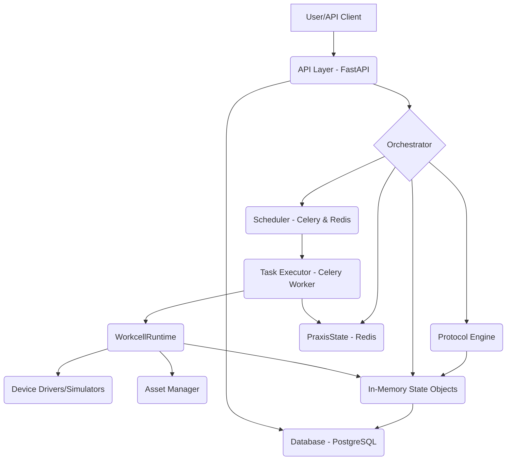

# Praxis

[**Docs**](https://maraxen.github.io/pylabpraxis/) | [**Forum**](https://forums.pylabrobot.org) | [**Installation**](https://maraxen.github.io/pylabpraxis/getting-started/installation/) | [**Getting started**](https://maraxen.github.io/pylabpraxis/getting-started/quickstart/)

## What is Praxis?

Praxis is a comprehensive Python-based platform designed to automate and manage laboratory workflows. It leverages the [PyLabRobot](https://pylabrobot.org/) library to interface with a wide range of lab automation hardware. Praxis provides a robust backend system built with FastAPI, enabling protocol execution, asset management, real-time hardware control, and persistent state management.

Developed for the Ovchinnikov group in MIT Biology.

## Architecture Overview

Praxis employs a modular, service-oriented architecture.

For a detailed breakdown of components, services, and workflows, please refer to the [System Architecture](docs/architecture.md) documentation.

## Key Features

* **FastAPI Backend**: RESTful API for protocol management and execution.
* **PyLabRobot Integration**: Hardware control for liquid handlers, plate readers, and more.
* **Robust State Management**: Distributed state tracking using PostgreSQL, Redis (`PraxisState`), and in-memory objects.
* **Asynchronous Execution**: Celery-based task queue for scheduling and running protocols.
* **Asset Management**: Comprehensive tracking of labware, machines, and their real-time status.

## Documentation

* **[System Architecture](docs/architecture.md)**: Deep dive into components, data flow, and services.
* **[State Management](docs/state_management.md)**: Explanation of how state is persisted and shared across the system.
* **[Testing Strategy](docs/testing.md)**: Guide to testing patterns, tools, and best practices.
* **[Installation](docs/installation.md)**: Setup instructions.

## Asset Model Refactor (2025-06)

The asset-related backend models have been **unified and modernized**. All asset types (machines, resources, decks, workcells) now inherit from a single `Asset` base model.

* **Unified Fields**: `accession_id`, `name`, `fqn`, `asset_type`, `location`, `plr_state`, `plr_definition`, `properties_json`.
* **Legacy Fields Removed**: Code should be updated to use the new standardized fields.

## Development

Praxis uses standard Python development tools managed by `uv`.

* **Test**: `uv run pytest`
* **Lint**: `uv run ruff check .`
* **Typecheck**: `uv run ty check`

See [CONTRIBUTING.md](CONTRIBUTING.md) and [AGENTS.md](AGENTS.md) for more details.

## Demo Mode

Praxis supports a frontend-only demo mode for GitHub Pages deployment. When running in demo mode:

* **No backend required** - All API calls are intercepted and return mock data
* **Pre-seeded protocols** - Sample protocols demonstrate the workflow
* **Mock execution** - Protocol execution is simulated with animations

> [!CAUTION]
> **Demo Mode Security**
>
> Demo mode bypasses authentication. It is **critical** that this is never accidentally enabled in production:
>
> 1. Environment variable check (`NODE_ENV !== 'production'`)
> 2. Build-time configuration replacement (separate `environment.demo.ts`)
> 3. No demo interceptor code included in production bundle

## Known Limitations

| Feature | Limitation | Recommendation |
|---------|------------|----------------|
| **SQLite Backend** | In-memory only; file persistence not supported | Use PostgreSQL for production |
| **Scheduled Runs** | Not available in demo mode | "Coming Soon" indicator shown |
| **Deck Visualizer** | Placeholder only | PLR visualizer integration planned |
| **Real-time Pub/Sub** | Uses polling, not true WebSocket pub/sub | High-priority future work |

---

**Disclaimer:** Praxis is not officially endorsed or supported by any robot manufacturer. Usage of firmware drivers is at your own risk.
