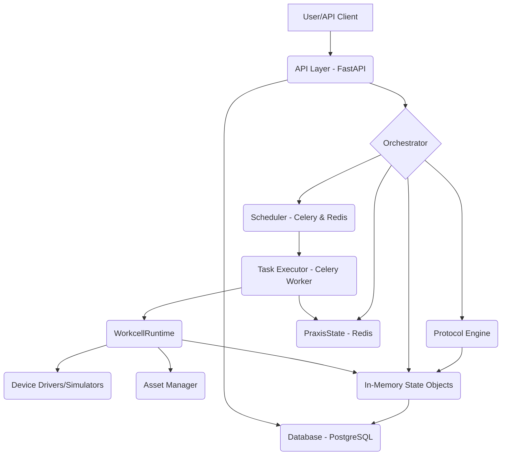

# 

[**Docs**](https://maraxen.github.io/pylabpraxis/) | [**Forum**](https://forums.pylabrobot.org) | [**Installation**](https://maraxen.github.io/pylabpraxis/getting-started/installation/) | [**Getting started**](https://maraxen.github.io/pylabpraxis/getting-started/quickstart/)

## What is Praxis?

Praxis is a comprehensive Python-based platform designed to automate and manage laboratory workflows. It leverages the [PyLabRobot](https://pylabrobot.org/) library to interface with a wide range of lab automation hardware. Praxis provides a robust backend system built with FastAPI, enabling protocol execution, asset management, real-time hardware control, and persistent state management.

Developed for the Ovchinnikov group in MIT Biology.

## Architecture Overview

Praxis employs a modular, service-oriented architecture.

For a detailed breakdown of components, services, and workflows, please refer to the [System Architecture](docs/architecture.md) documentation.

## Key Features

* **Application Modes**:
  * **Production Mode**: Full stack with PostgreSQL, Redis, and FastAPI.
  * **Browser Mode**: Pure client-side execution using Pyodide (WASM) and SQLite-in-browser.
  * **Demo Mode**: Frontend-only with pre-loaded mock data.
* **Hardware Discovery**: Detect connected USB/Serial devices directly from the browser via WebSerial and WebUSB.
* **Real-time Monitoring**: WebSocket-based live updates during protocol execution.
* **Workcell Visualizer**: Modern, dynamic 3D/2D visualization of deck slots, rails, and resources with accurate scaling.
* **Asset Management**: Comprehensive tracking of machines (liquid handlers, plate readers) and resources (plates, tips) with typed capabilities.
* **Interactive REPL**: Browser-based terminal for real-time hardware control and state inspection.

## Documentation

* **[Architecture Overview](docs/architecture/overview.md)**: Deep dive into components, data flow, and services.
* **[Installation Guide](docs/getting-started/installation.md)**: Setup instructions for all modes.
* **[Quick Start](docs/getting-started/quickstart.md)**: Run your first protocol in minutes.

## Asset Management Refactor (2025-12)

The asset management system has been overhauled to include:

* **PLR Inspection**: Automatic discovery of hardware capabilities via LibCST-based static analysis.
* **Typed Capabilities**: Detailed tracking of machine-specific features (e.g., channel counts, iSWAP existence).
* **Unified Asset Model**: Standardized storage for all laboratory entities.

## Development

Praxis uses standard Python development tools managed by `uv`.

* **Test**: `uv run pytest`
* **Lint**: `uv run ruff check .`
* **Typecheck**: `uv run pyright`

See [CONTRIBUTING.md](CONTRIBUTING.md) and [AGENTS.md](AGENTS.md) for more details.

## Known Limitations

| Feature | Limitation | Recommendation |
|---------|------------|----------------|
| **Multi-Workcell** | Scheduling across multiple physical robots is in progress | Use single-robot protocols for now |
| **PWA Support** | Mobile optimization is planned | Use desktop browsers for best experience |
| **Legacy Drivers** | Some older PLR drivers may require backend mode | Use Production Mode for full driver coverage |

---

**Disclaimer:** Praxis is not officially endorsed or supported by any robot manufacturer. Usage of firmware drivers is at your own risk.
