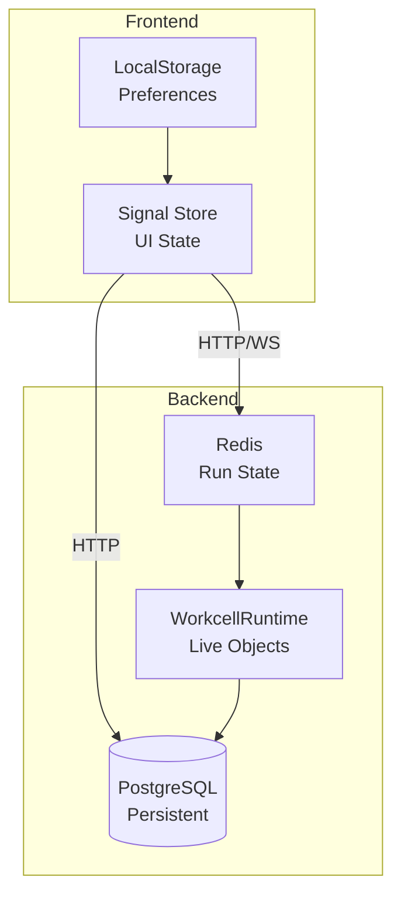

# State Management

Praxis uses a multi-layered state management approach to handle different types of data with appropriate persistence and sharing strategies.

## State Layers Overview



| Layer | Storage | Lifetime | Purpose |
|-------|---------|----------|---------|
| **Signal Store** | Memory | Session | UI state, selections, filters |
| **LocalStorage** | Browser | Persistent | User preferences, theme |
| **PraxisState** | Redis | Per-run | Execution progress, shared data |
| **WorkcellRuntime** | Memory | Per-worker | Live PLR objects |
| **PostgreSQL** | Disk | Forever | Configuration, history, logs |

## Frontend State

### Signal Store Pattern

The frontend uses Angular signals for reactive state management:

```typescript
@Injectable({ providedIn: 'root' })
export class AppStore {
  // Private mutable signals
  private readonly _protocols = signal<Protocol[]>([]);
  private readonly _currentRun = signal<ProtocolRun | null>(null);
  private readonly _notifications = signal<Notification[]>([]);

  // Public read-only signals
  readonly protocols = this._protocols.asReadonly();
  readonly currentRun = this._currentRun.asReadonly();
  readonly notifications = this._notifications.asReadonly();

  // Computed/derived state
  readonly runningProtocols = computed(() =>
    this._protocols().filter(p => p.status === 'RUNNING')
  );

  readonly hasActiveRun = computed(() =>
    this._currentRun() !== null
  );

  // Actions
  setProtocols(protocols: Protocol[]): void {
    this._protocols.set(protocols);
  }

  updateRunStatus(runId: string, status: RunStatus): void {
    this._currentRun.update(run =>
      run?.id === runId ? { ...run, status } : run
    );
  }

  addNotification(notification: Notification): void {
    this._notifications.update(list => [...list, notification]);
  }
}
```

### Effect Pattern

Side effects are handled with `effect()`:

```typescript
@Injectable({ providedIn: 'root' })
export class RunMonitorService {
  private store = inject(AppStore);
  private websocket = inject(WebSocketService);

  constructor() {
    // React to run changes
    effect(() => {
      const run = this.store.currentRun();
      if (run && run.status === 'RUNNING') {
        this.websocket.subscribe(`run:${run.id}`);
      }
    });
  }
}
```

### Local Component State

Components maintain their own UI state separately:

```typescript
@Component({...})
export class ProtocolListComponent {
  // Global state from store
  private store = inject(AppStore);
  readonly protocols = this.store.protocols;

  // Local UI state
  readonly searchQuery = signal('');
  readonly sortBy = signal<'name' | 'date'>('date');
  readonly filterStatus = signal<Status | null>(null);

  // Combined derived state
  readonly displayedProtocols = computed(() => {
    let result = this.protocols();

    // Apply search filter
    const query = this.searchQuery().toLowerCase();
    if (query) {
      result = result.filter(p => p.name.toLowerCase().includes(query));
    }

    // Apply status filter
    const status = this.filterStatus();
    if (status) {
      result = result.filter(p => p.status === status);
    }

    // Apply sorting
    const sort = this.sortBy();
    return result.sort((a, b) =>
      sort === 'name'
        ? a.name.localeCompare(b.name)
        : b.createdAt.getTime() - a.createdAt.getTime()
    );
  });
}
```

## Backend State

### PraxisState (Redis)

Run-specific state stored in Redis for fast access and sharing across workers:

```python
class PraxisState:
    """Redis-backed state for protocol runs."""

    def __init__(self, run_id: str, redis: Redis):
        self.run_id = run_id
        self.redis = redis
        self.key_prefix = f"praxis:run:{run_id}"

    async def set(self, key: str, value: Any) -> None:
        """Store a value in run state."""
        full_key = f"{self.key_prefix}:{key}"
        await self.redis.set(full_key, json.dumps(value))

    async def get(self, key: str) -> Any:
        """Retrieve a value from run state."""
        full_key = f"{self.key_prefix}:{key}"
        data = await self.redis.get(full_key)
        return json.loads(data) if data else None

    async def append_log(self, message: str, level: str = "INFO") -> None:
        """Append to run logs."""
        log_entry = {
            "timestamp": datetime.utcnow().isoformat(),
            "level": level,
            "message": message
        }
        await self.redis.rpush(f"{self.key_prefix}:logs", json.dumps(log_entry))

    async def get_logs(self, start: int = 0, end: int = -1) -> list[dict]:
        """Retrieve run logs."""
        logs = await self.redis.lrange(f"{self.key_prefix}:logs", start, end)
        return [json.loads(log) for log in logs]
```

**Use cases:**

- Current execution step
- Progress percentage
- Runtime variables
- Accumulated logs
- Intermediate results

### WorkcellRuntime State

In-memory state for live PyLabRobot objects:

```python
class WorkcellRuntime:
    """Manages live hardware state."""

    def __init__(self):
        self._machines: dict[str, Machine] = {}
        self._resources: dict[str, Resource] = {}
        self._deck: Deck | None = None
        self._connections: dict[str, ConnectionState] = {}

    @property
    def is_connected(self) -> bool:
        """Check if all required hardware is connected."""
        return all(c.status == "connected" for c in self._connections.values())

    async def serialize_state(self) -> dict:
        """Serialize current state for backup/recovery."""
        return {
            "machines": {
                mid: await m.get_state()
                for mid, m in self._machines.items()
            },
            "resources": {
                rid: r.serialize()
                for rid, r in self._resources.items()
            },
            "deck": self._deck.serialize() if self._deck else None
        }

    async def restore_state(self, state: dict) -> None:
        """Restore state from serialized data."""
        for mid, mstate in state.get("machines", {}).items():
            if mid in self._machines:
                await self._machines[mid].set_state(mstate)
```

### Database State (PostgreSQL)

Persistent configuration and history:

```python
# ORM models for persistent state
class ProtocolRunOrm(Base):
    __tablename__ = "protocol_runs"

    id: Mapped[str] = mapped_column(primary_key=True)
    protocol_id: Mapped[str] = mapped_column(ForeignKey("protocols.id"))
    status: Mapped[RunStatus]
    parameters: Mapped[dict] = mapped_column(JSONB)
    started_at: Mapped[datetime | None]
    completed_at: Mapped[datetime | None]
    result: Mapped[dict | None] = mapped_column(JSONB)
    error: Mapped[str | None]

    # Relationships
    protocol: Mapped["ProtocolOrm"] = relationship(back_populates="runs")
    logs: Mapped[list["LogEntryOrm"]] = relationship(back_populates="run")
    outputs: Mapped[list["DataOutputOrm"]] = relationship(back_populates="run")
```

## State Synchronization

### WebSocket Updates

Real-time state sync from backend to frontend:

```python
# Backend: Broadcast state changes
async def broadcast_run_update(run_id: str, update: dict):
    message = {"type": "run_update", "run_id": run_id, "data": update}
    await websocket_manager.broadcast(f"run:{run_id}", message)

# During execution
async def execute_step(step: ProtocolStep, state: PraxisState):
    await state.set("current_step", step.index)
    await broadcast_run_update(state.run_id, {
        "current_step": step.index,
        "progress": step.index / total_steps * 100
    })
    # ... execute step
```

```typescript
// Frontend: Handle updates
@Injectable({ providedIn: 'root' })
export class WebSocketService {
  private store = inject(AppStore);

  handleMessage(message: WsMessage): void {
    switch (message.type) {
      case 'run_update':
        this.store.updateRunStatus(message.run_id, message.data);
        break;
      case 'log_entry':
        this.store.appendLog(message.run_id, message.data);
        break;
    }
  }
}
```

### Optimistic Updates

For better UX, apply changes optimistically:

```typescript
async deleteProtocol(id: string): Promise<void> {
  // Optimistically remove from UI
  const previous = this._protocols();
  this._protocols.update(list => list.filter(p => p.id !== id));

  try {
    await this.api.deleteProtocol(id);
  } catch (error) {
    // Rollback on failure
    this._protocols.set(previous);
    throw error;
  }
}
```

## State Recovery

### Run Crash Recovery

If a worker crashes during execution:

```python
async def recover_run(run_id: str) -> None:
    """Attempt to recover a crashed run."""
    # Check if run was interrupted
    run = await db.get_run(run_id)
    if run.status != RunStatus.RUNNING:
        return

    # Check if state exists in Redis
    state = PraxisState(run_id, redis)
    last_step = await state.get("current_step")

    if last_step is not None:
        # Resume from last known step
        await orchestrator.resume_from_step(run, last_step + 1)
    else:
        # Mark as failed
        run.status = RunStatus.FAILED
        run.error = "Worker crashed during execution"
        await db.update_run(run)
```

### Session Recovery (Frontend)

Restore UI state after refresh:

```typescript
@Injectable({ providedIn: 'root' })
export class SessionService {
  private store = inject(AppStore);

  restoreSession(): void {
    // Restore from localStorage
    const savedState = localStorage.getItem('praxis_session');
    if (savedState) {
      const { theme, lastRoute, preferences } = JSON.parse(savedState);
      this.applyTheme(theme);
      this.router.navigate([lastRoute]);
    }

    // Check for active runs
    this.checkActiveRuns();
  }

  private async checkActiveRuns(): Promise<void> {
    const activeRuns = await this.api.getActiveRuns();
    if (activeRuns.length > 0) {
      // Reconnect to WebSocket for active runs
      activeRuns.forEach(run => {
        this.websocket.subscribe(`run:${run.id}`);
        this.store.setCurrentRun(run);
      });
    }
  }
}
```

## Best Practices

### 1. Choose the Right Layer

| Need | Use |
|------|-----|
| UI-only state (selections, filters) | Signal Store |
| User preferences | LocalStorage |
| Run-time data sharing | Redis (PraxisState) |
| Live hardware state | WorkcellRuntime |
| Historical data | PostgreSQL |

### 2. Minimize State Duplication

```typescript
// Bad: duplicating data
readonly protocols = signal<Protocol[]>([]);
readonly protocolNames = signal<string[]>([]);  // Redundant!

// Good: derive from source
readonly protocols = signal<Protocol[]>([]);
readonly protocolNames = computed(() => this.protocols().map(p => p.name));
```

### 3. Keep State Close to Usage

```typescript
// Bad: global state for local concern
// In global store
readonly machineListSortOrder = signal<'asc' | 'desc'>('asc');

// Good: local state for local concern
// In MachineListComponent
readonly sortOrder = signal<'asc' | 'desc'>('asc');
```

### 4. Use Immutable Updates

```typescript
// Bad: mutating state
this._protocols()[0].name = 'New Name';

// Good: immutable update
this._protocols.update(list =>
  list.map(p => p.id === id ? { ...p, name: 'New Name' } : p)
);
```
