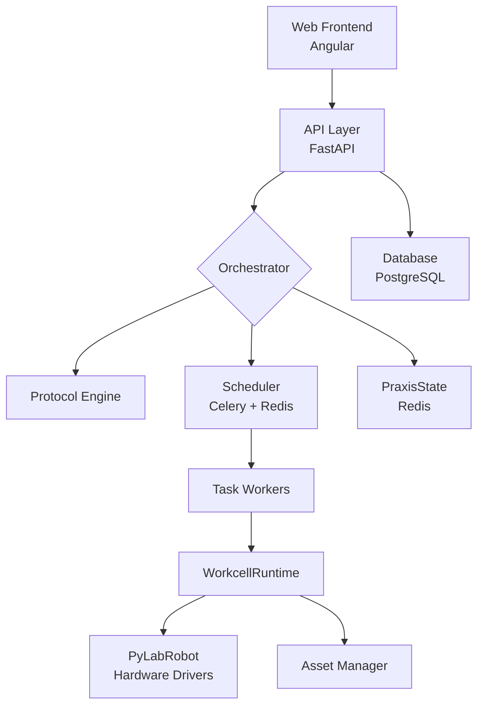

# Praxis

**Lab Automation Platform Built on PyLabRobot**

Praxis is a comprehensive platform for automating laboratory workflows. It provides a modern web interface for managing protocols, assets, and hardware, with a robust FastAPI backend that integrates with [PyLabRobot](https://pylabrobot.org/) for hardware control.

<div class="grid cards" markdown>

-   :material-rocket-launch:{ .lg .middle } **Getting Started**

    ---

    Install Praxis and run your first protocol in minutes.

    [:octicons-arrow-right-24: Installation](getting-started/installation.md)

-   :material-architecture:{ .lg .middle } **Architecture**

    ---

    Understand the system design, components, and data flow.

    [:octicons-arrow-right-24: Overview](architecture/overview.md)

-   :material-book-open-variant:{ .lg .middle } **User Guide**

    ---

    Learn how to use protocols, manage assets, and visualize data.

    [:octicons-arrow-right-24: Protocols](user-guide/protocols.md)

-   :material-api:{ .lg .middle } **API Reference**

    ---

    Explore the REST and WebSocket APIs.

    [:octicons-arrow-right-24: REST API](api/rest-api.md)

</div>

---

## Key Features

| Feature | Description |
|---------|-------------|
| **Protocol Management** | Discover, configure, and execute Python protocols with a visual wizard |
| **Asset Tracking** | Manage machines (liquid handlers, plate readers) and resources (plates, tips) |
| **Hardware Discovery** | Detect connected USB/serial devices via WebSerial/WebUSB |
| **Real-time Monitoring** | WebSocket-based live updates during protocol execution |
| **Data Visualization** | Plotly-powered charts for protocol outputs |
| **Browser Mode** | Frontend-only mode for demonstrations without backend |
| **Simulation Support** | Run protocols in simulation for testing and development |

---

## Architecture at a Glance



The system consists of:

- **Frontend**: Angular 19+ with Material Design, signal-based reactivity
- **Backend**: FastAPI with async SQLAlchemy, Celery task queue
- **State**: PostgreSQL for persistence, Redis for distributed state and task queue
- **Hardware**: PyLabRobot integration for liquid handlers, plate readers, and more

---

## Quick Start

=== "With Backend"

    ```bash
    # Start database
    make db-test

    # Start backend
    PRAXIS_DB_DSN="postgresql+asyncpg://..." uv run uvicorn main:app --reload

    # Start frontend
    cd praxis/web-client && npm start
    ```

=== "Browser Mode"

    ```bash
    cd praxis/web-client
    npm run start:browser
    ```

    Demo mode runs entirely in the browser with mock data - no backend required.

---

## Project Status

Praxis is under active development at the [Ovchinnikov Lab](https://ovchinnikovlab.mit.edu/), MIT Biology.

| Component | Status |
|-----------|--------|
| Protocol Discovery & Execution | :material-check-circle:{ .green } Production |
| Asset Management | :material-check-circle:{ .green } Production |
| Hardware Discovery | :material-check-circle:{ .green } Production |
| Data Visualization | :material-check-circle:{ .green } Production |
| Browser Mode | :material-check-circle:{ .green } Production |
| Multi-workcell Scheduling | :material-progress-clock: In Progress |
| E2E Testing | :material-progress-clock: Planned |

---

## License & Disclaimer

Praxis is developed for research purposes. It is not officially endorsed by any robot manufacturer. Use of firmware drivers is at your own risk.
