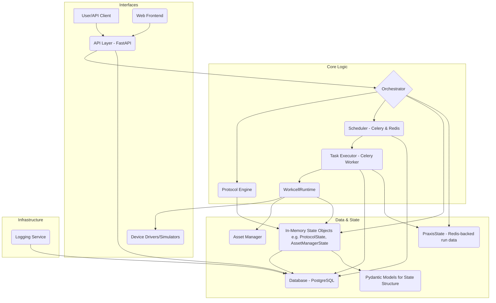

# System Architecture

This document provides a comprehensive overview of the PyLabPraxis architecture, its core components, and how they interact to enable laboratory automation.

## Overview

PyLabPraxis is designed as a modular system to control and manage laboratory automation workflows. The architecture emphasizes separation of concerns, allowing for flexibility, scalability, and maintainability.

## Core Components

The backend is composed of several core components, primarily within `praxis/backend/core/`, each with distinct responsibilities.

### 1. ProtocolExecutionService (`protocol_execution_service.py`)
**Responsibility**: High-level service that acts as the unified entry point for all protocol execution workflows.

**Key Features**:
- Supports both immediate execution and scheduled execution (via Celery).
- Manages status monitoring and run cancellation.
- Integrates `Orchestrator`, `ProtocolScheduler`, and `AssetManager`.

### 2. Orchestrator (`orchestrator.py`)
**Responsibility**: The central brain responsible for the step-by-step execution of a protocol.

**Key Features**:
- Fetches protocol definitions and prepares the execution environment.
- Acquires necessary assets via the `AssetManager`.
- Executes the protocol's Python functions using the `Protocol Engine`.
- Manages in-memory state objects (`ProtocolState`) and logs progress to the database.
- Supports `execute_existing_protocol_run()` for integration with Celery workers.

### 3. ProtocolScheduler (`scheduler.py`)
**Responsibility**: Manages the scheduling of protocol runs and resource reservation.

**Key Features**:
- Analyzes protocol resource requirements.
- Reserves assets using `AssetLockManager` to prevent conflicts.
- Queues execution tasks with Celery (`Celery Tasks`).

### 4. AssetManager (`asset_manager.py`)
**Responsibility**: Handles the lifecycle and allocation of physical laboratory assets (machines and resources).

**Key Features**:
- Interacts with `WorkcellRuntime` to manage live PyLabRobot objects.
- Updates the database with asset status (e.g., `IN_USE`, `AVAILABLE`).
- Manages asset definitions and synchronizes with PyLabRobot's capabilities.

### 5. AssetLockManager (`asset_lock_manager.py`)
**Responsibility**: Provides distributed locking for assets using Redis.

**Key Features**:
- Ensures exclusive access to assets during operations.
- Prevents conflicts when multiple protocols attempt to use the same asset simultaneously.

### 6. WorkcellRuntime (`workcell_runtime.py`)
**Responsibility**: Manages the *live, operational instances* of PyLabRobot objects.

**Key Features**:
- Dynamically instantiates objects (machines, resources) based on database definitions.
- Handles setup and teardown (connecting/disconnecting hardware).
- Supports state serialization and recovery for backup/restore operations.

### 7. ProtocolCodeManager (`protocol_code_manager.py`)
**Responsibility**: Prepares and loads protocol code for execution.

**Key Features**:
- Manages code from Git repositories or local file systems.
- Handles module imports and reloading.
- Validates and loads protocol functions.

### 8. PraxisRunContext (`run_context.py`)
**Responsibility**: A context object passed through the execution flow.

**Key Features**:
- Carries run-specific information (Run ID, `PraxisState` reference, DB session).
- Tracks the call sequence for nested protocol functions.

## Service Layer Architecture

The backend service layer (`praxis/backend/services/`) abstracts database interactions and implements business logic. It follows a repository-style pattern to separate concerns from the API layer.

-   **Standard CRUD Services**: Inherit from `CRUDBase` to provide type-safe Create, Read, Update, and Delete operations for entities like `Workcell`, `Resource`, and `ProtocolRun`.
-   **Discovery Services**: Special services (e.g., `MachineTypeDefinitionService`) that introspect the `pylabrobot` library to discover and synchronize hardware definitions with the database.

## Data Structures

PyLabPraxis utilizes two main types of data structures:

1.  **ORM Models (SQLAlchemy)**: Define the database schema for persistent storage (e.g., `ProtocolRunOrm`, `MachineOrm`).
2.  **Pydantic Models**: Used for API validation, serialization, and defining in-memory state objects (e.g., `ProtocolStartRequest`, `WorkcellDefinition`).

## State Management

State management is multi-layered, involving:

1.  **`PraxisState`**: Redis-backed, run-specific storage for simple shared data.
2.  **`WorkcellRuntime`**: Manages live hardware state.
3.  **Database**: Persistent source of truth for configurations and history.
4.  **In-Memory Objects**: Complex state representations used by the Orchestrator.

For a detailed deep dive, see [State Management](state_management.md).

## Execution Workflow

### 1. Immediate Execution
1.  **Request**: API calls `ProtocolExecutionService.execute_protocol_immediately()`.
2.  **Orchestration**: `Orchestrator` takes control.
3.  **Code Prep**: `ProtocolCodeManager` prepares the protocol code.
4.  **Asset Acquisition**: `AssetManager` acquires live assets from `WorkcellRuntime`.
5.  **Execution**: Protocol functions are executed sequentially.
6.  **Completion**: Assets are released, and results are logged.

### 2. Scheduled Execution
1.  **Request**: API calls `ProtocolExecutionService.schedule_protocol_execution()`.
2.  **Scheduling**: `ProtocolScheduler` analyzes requirements and reserves resources via `AssetLockManager`.
3.  **Queuing**: A task is queued in Celery.
4.  **Worker Pick-up**: A Celery worker picks up the task.
5.  **Async Execution**: The worker calls `Orchestrator.execute_existing_protocol_run()`.
6.  **Orchestration**: Follows the same execution flow as immediate execution.

## API Layer

The FastAPI application (`praxis/backend/api/`) exposes endpoints for:

*   **Protocols**: Discovery, management, and execution control.
*   **Assets/Resources**: Management of physical items and definitions.
*   **Machines**: Control and monitoring of hardware.
*   **Workcells**: Configuration and layout management.
*   **Data Outputs**: Retrieval of structured data generated by protocols.

## Standardized API Filtering

PyLabPraxis uses a standardized filtering mechanism for `GET` list endpoints:

1.  **`SearchFilters`**: A generic Pydantic model for common filters (pagination, date ranges, relationship IDs).
2.  **Entity-Specific Filters**: Defined as separate `Query()` parameters in endpoints.
3.  **Query Builder**: Helper functions in `praxis.backend.services.utils.query_builder` apply these filters to SQLAlchemy queries.
