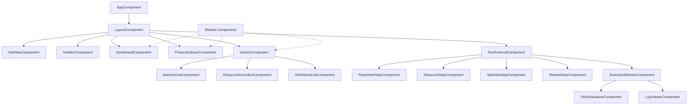
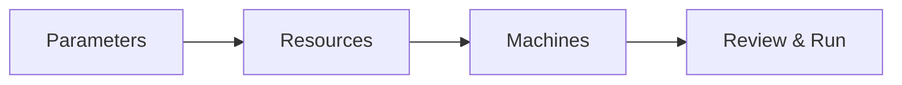

# Frontend Components

The Praxis frontend is built with Angular 19+ using standalone components, signal-based reactivity, and Material Design.

## Architecture Overview

```

## Component Architecture

Below is the high-level component tree representing the Praxis frontend architecture.



## Core Services

### HardwareDiscoveryService

Interfaces with browser WebSerial/WebUSB APIs for device detection.

```typescript
@Injectable({ providedIn: 'root' })
export class HardwareDiscoveryService {
  private devices = signal<DiscoveredDevice[]>([]);

  readonly devices$ = this.devices.asReadonly();
  readonly isSerialSupported = 'serial' in navigator;
  readonly isUsbSupported = 'usb' in navigator;

  async discoverAll(): Promise<void> {
    const [serial, usb] = await Promise.all([
      this.discoverSerial(),
      this.discoverUsb()
    ]);
    this.devices.set([...serial, ...usb]);
  }

  async requestSerialDevice(): Promise<SerialPort | null> {
    if (!this.isSerialSupported) return null;
    return await navigator.serial.requestPort();
  }
}
```

### CommandRegistryService

Manages the command palette actions.

```typescript
@Injectable({ providedIn: 'root' })
export class CommandRegistryService {
  private commands = new Map<string, Command>();

  registerCommand(command: Command): void {
    this.commands.set(command.id, command);
  }

  search(query: string): Command[] {
    const q = query.toLowerCase();
    return Array.from(this.commands.values())
      .filter(cmd =>
        cmd.label.toLowerCase().includes(q) ||
        cmd.keywords?.some(k => k.includes(q))
      );
  }

  executeCommand(id: string): void {
    const cmd = this.commands.get(id);
    if (cmd) cmd.action();
  }
}
```

### KeyboardService

Global keyboard shortcut handling.

```typescript
@Injectable({ providedIn: 'root' })
export class KeyboardService {
  constructor() {
    this.initGlobalListeners();
    this.registerDefaultCommands();
  }

  private initGlobalListeners() {
    window.addEventListener('keydown', (event: KeyboardEvent) => {
      const isCmdOrCtrl = event.metaKey || event.ctrlKey;
      const isAlt = event.altKey;

      // Cmd+K: Command Palette
      if (isCmdOrCtrl && event.key === 'k') {
        event.preventDefault();
        this.openCommandPalette();
      }

      // Alt+shortcuts for navigation
      if (isAlt) {
        switch (event.code) {
          case 'KeyP': this.router.navigate(['/app/protocols']); break;
          case 'KeyM': this.router.navigate(['/app/assets'], { queryParams: { type: 'machine' } }); break;
          case 'KeyD': this.registry.executeCommand('hardware-discovery'); break;
        }
      }
    });
  }
}
```

## Feature Modules

### Assets Feature

Manages machines and resources with chip-based filtering.

**Components:**

| Component | Purpose |
|-----------|---------|
| `AssetsComponent` | Container with tabbed navigation |
| `MachineListComponent` | Machine grid with status indicators |
| `ResourceAccordionComponent` | Grouped resource list |
| `DefinitionsListComponent` | PLR definitions browser |
| `MachineDialogComponent` | Add/edit machine form |
| `ResourceDialogComponent` | Add/edit resource form |
| `HardwareDiscoveryDialogComponent` | USB/serial device scanning |

### Protocols Feature

Protocol library with search, filtering, and execution wizard.

**Components:**

| Component | Purpose |
|-----------|---------|
| `ProtocolLibraryComponent` | Searchable protocol list |
| `ProtocolCardComponent` | Protocol summary card |
| `ProtocolDetailComponent` | Full protocol view |

### Run Protocol Feature

4-step wizard for protocol configuration and execution.



**Components:**

| Component | Purpose |
|-----------|---------|
| `RunProtocolComponent` | Wizard container |
| `ParameterStepComponent` | Parameter form |
| `ResourceStepComponent` | Resource selection |
| `MachineStepComponent` | Machine assignment |
| `ReviewStepComponent` | Final confirmation |
| `ExecutionMonitorComponent` | Live execution view |

### Data Visualization Feature

Plotly-powered charts for protocol outputs.

```typescript
@Component({
  selector: 'app-data-viz',
  template: `
    <div class="chart-container">
      <plotly-chart
        [data]="chartData()"
        [layout]="chartLayout()"
        [config]="chartConfig">
      </plotly-chart>
    </div>
  `
})
export class DataVizComponent {
  chartData = signal<Plotly.Data[]>([]);
  chartLayout = signal<Partial<Plotly.Layout>>({});

  async loadProtocolData(runId: string): Promise<void> {
    const outputs = await this.dataService.getOutputs(runId);
    this.chartData.set(this.transformToPlotly(outputs));
  }
}
```

## State Management

### Signal-Based Store

Praxis uses Angular signals for reactive state:

```typescript
// app.store.ts
@Injectable({ providedIn: 'root' })
export class AppStore {
  // State signals
  private readonly _protocols = signal<Protocol[]>([]);
  private readonly _machines = signal<Machine[]>([]);
  private readonly _loading = signal<boolean>(false);

  // Public read-only accessors
  readonly protocols = this._protocols.asReadonly();
  readonly machines = this._machines.asReadonly();
  readonly loading = this._loading.asReadonly();

  // Computed signals
  readonly availableMachines = computed(() =>
    this._machines().filter(m => m.status === 'IDLE')
  );

  // Actions
  async loadProtocols(): Promise<void> {
    this._loading.set(true);
    try {
      const protocols = await this.api.getProtocols();
      this._protocols.set(protocols);
    } finally {
      this._loading.set(false);
    }
  }
}
```

### Component State Pattern

Components use local signals for UI state:

```typescript
@Component({...})
export class ProtocolListComponent {
  // Injected store
  private store = inject(AppStore);

  // Local UI state
  searchQuery = signal('');
  selectedFilter = signal<string | null>(null);

  // Derived from store + local state
  filteredProtocols = computed(() => {
    const query = this.searchQuery().toLowerCase();
    const filter = this.selectedFilter();

    return this.store.protocols().filter(p =>
      p.name.toLowerCase().includes(query) &&
      (!filter || p.category === filter)
    );
  });
}
```

## Component Patterns

### Standalone Components

All components are standalone (no NgModules):

```typescript
@Component({
  selector: 'app-machine-card',
  standalone: true,
  imports: [
    CommonModule,
    MatCardModule,
    MatIconModule,
    MatChipsModule
  ],
  template: `...`
})
export class MachineCardComponent {
  @Input({ required: true }) machine!: Machine;
  @Output() select = new EventEmitter<Machine>();
}
```

### Dialog Pattern

Dialogs use Material Dialog with typed data:

```typescript
// Opening a dialog
const dialogRef = this.dialog.open(MachineDialogComponent, {
  width: '700px',
  data: { mode: 'create' }
});

dialogRef.afterClosed().pipe(
  filter(result => !!result),
  switchMap(result => this.assetService.createMachine(result))
).subscribe();

// Dialog component
@Component({...})
export class MachineDialogComponent {
  data = inject<{ mode: 'create' | 'edit' }>(MAT_DIALOG_DATA);
  dialogRef = inject(MatDialogRef);

  save(): void {
    if (this.form.valid) {
      this.dialogRef.close(this.form.value);
    }
  }
}
```

## Styling

### Material Theme

Custom Material 3 theme with dark mode support:

```scss
// styles.scss
@use '@angular/material' as mat;

$praxis-theme: mat.define-theme((
  color: (
    theme-type: light,
    primary: mat.$indigo-palette,
    tertiary: mat.$violet-palette
  ),
  typography: (
    brand-family: 'Inter, sans-serif'
  )
));

:root {
  @include mat.all-component-themes($praxis-theme);
}

.dark-theme {
  @include mat.all-component-colors(mat.define-theme((
    color: (theme-type: dark, primary: mat.$indigo-palette)
  )));
}
```

### Component Styles

Scoped styles using SCSS:

```scss
// machine-card.component.scss
:host {
  display: block;
}

.machine-card {
  cursor: pointer;
  transition: transform 0.2s ease;

  &:hover {
    transform: translateY(-2px);
  }

  .status-indicator {
    width: 12px;
    height: 12px;
    border-radius: 50%;

    &.idle { background: var(--status-idle); }
    &.running { background: var(--status-running); }
    &.offline { background: var(--status-offline); }
  }
}
```

## Testing

### Component Testing

```typescript
describe('MachineListComponent', () => {
  let component: MachineListComponent;
  let fixture: ComponentFixture<MachineListComponent>;

  beforeEach(async () => {
    await TestBed.configureTestingModule({
      imports: [MachineListComponent],
      providers: [
        { provide: AssetService, useValue: mockAssetService }
      ]
    }).compileComponents();

    fixture = TestBed.createComponent(MachineListComponent);
    component = fixture.componentInstance;
  });

  it('should display machines', () => {
    component.machines.set(mockMachines);
    fixture.detectChanges();

    const cards = fixture.debugElement.queryAll(By.css('app-machine-card'));
    expect(cards.length).toBe(mockMachines.length);
  });
});
```

### Service Testing

```typescript
describe('HardwareDiscoveryService', () => {
  let service: HardwareDiscoveryService;

  beforeEach(() => {
    TestBed.configureTestingModule({});
    service = TestBed.inject(HardwareDiscoveryService);
  });

  it('should detect WebSerial support', () => {
    expect(service.isSerialSupported).toBe('serial' in navigator);
  });
});
```
