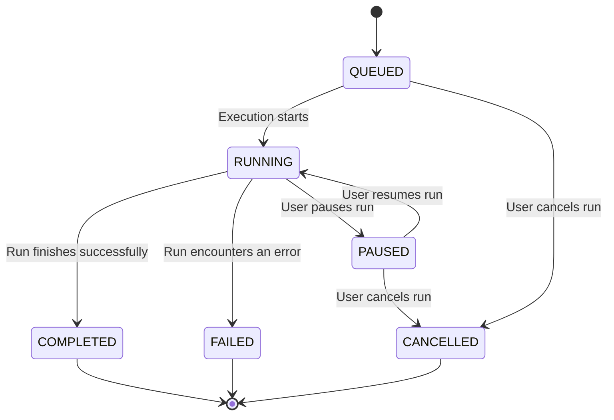

# AUDIT-03: Protocol Library & Execution Monitor

## 1. Component Map

This table maps the audited component files to their primary purpose within the application.

| File Path                                                                                   | Purpose                                                                                             |
| ------------------------------------------------------------------------------------------- | --------------------------------------------------------------------------------------------------- |
| `features/protocols/components/protocol-library/protocol-library.component.ts`              | Main component for browsing, searching, and filtering available protocols. Entry point for starting a run. |
| `features/protocols/components/protocol-detail-dialog/protocol-detail-dialog.component.ts`  | A dialog that displays detailed metadata about a specific protocol.                                  |
| `features/protocols/services/protocol.service.ts`                                           | Angular service for fetching protocol data from and uploading protocols to the backend API.         |
| `features/execution-monitor/execution-monitor.component.ts`                                 | The main dashboard view for monitoring, acting as a container for active runs and run history.       |
| `features/execution-monitor/components/active-runs-panel.component.ts`                      | Displays a summary of runs that are currently active (`RUNNING`, `QUEUED`, etc.). Uses polling for updates. |
| `features/execution-monitor/components/run-history-table.component.ts`                      | Displays a paginated and filterable table of all past protocol runs.                               |
| `features/execution-monitor/components/run-detail.component.ts`                             | The detailed view for a single run, showing its status, logs, and results. Uses a WebSocket for live updates. |
| `features/execution-monitor/services/run-history.service.ts`                                | Angular service responsible for fetching run history and details from the backend API.               |
| `features/run-protocol/services/execution.service.ts`                                       | Handles the WebSocket connection for real-time updates on the `RunDetail` page.                      |

## 2. User Flow Diagram

This diagram illustrates the primary user journey from browsing protocols to monitoring an execution.

```mermaid
graph TD
    A[Start: /protocols] --> B{Protocol Library};
    B --> C{User finds protocol};
    C --> D[Clicks "Run"];
    D --> E[/run?protocolId=...];
    E --> F{Protocol Setup Wizard};
    F --> G[Clicks "Start Execution"];
    G --> H{API call to start run};
    H --> I{Redirect to /monitor/:runId};
    I --> J[Execution Monitor Detail Page];
    J --> K{WebSocket connects for live updates};
    K --> L[User monitors progress];
    L --> M{Run completes or fails};
    M --> N[View final state/logs];
    subgraph Later
        O[User navigates to /monitor] --> P{Execution Monitor Dashboard};
        P --> Q[Views Active Runs];
        P --> R[Views Run History];
        R --> S[Clicks on a past run];
        S --> I;
    end
```

## 3. State Machine Diagram

This diagram shows the possible states of a protocol run and the transitions between them.



## 4. Gap/Limitation List

The following gaps and limitations were identified during the audit.

| Severity | ID  | Gap/Limitation                                                                                                                                                                | File Reference                                                                                    |
| :------: | --- | ----------------------------------------------------------------------------------------------------------------------------------------------------------------------------- | ------------------------------------------------------------------------------------------------- |
|    🔴    | G-01| **Missing Core Execution Controls:** The UI provides no mechanism to `PAUSE`, `RESUME`, or `CANCEL` a running protocol. These are critical features for a robust execution system.        | `features/execution-monitor/components/run-detail.component.ts`                                   |
|    🔴    | G-02| **No User-Facing Error Handling:** API and WebSocket errors are only logged to the console. If fetching a run fails or the WebSocket disconnects, the user receives no feedback.        | `run-detail.component.ts`, `active-runs-panel.component.ts`                                        |
|    🟠    | G-03| **State Synchronization Risk:** The `ActiveRunsPanelComponent` polls for updates every 5s, while the `RunDetailComponent` uses a live WebSocket. This can lead to inconsistent state displays. | `active-runs-panel.component.ts` (polling) vs. `execution.service.ts` (WebSocket)               |
|    🟠    | G-04| **Incomplete UI State Feedback:** The detail page timeline visually treats `FAILED` and `CANCELLED` states as the same ("error"). A `PAUSED` state is not visually represented at all.  | `features/execution-monitor/components/run-detail.component.ts` (`timelineSteps` computed signal) |
|    🟡    | G-05| **No Empty/Error State for Protocol Library:** If the API call to fetch protocols fails, the user sees a permanent loading spinner instead of an error message.                    | `features/protocols/components/protocol-library/protocol-library.component.ts` (`loadProtocols`)  |


## 5. Recommended Test Cases

The existing E2E coverage is limited to the "happy path." The following test cases are recommended to cover the identified gaps.

1.  **Failed Execution:**
    -  Start a protocol that is known to fail.
    -  Assert that the final status on the detail page is `FAILED`.
    -  Assert that the UI timeline visually indicates the failure state.
    -  Assert that the run appears in the main history table with a `FAILED` status.
2.  **Cancelled Execution:**
    -  *Prerequisite: Cancel functionality must be implemented.*
    -  Start a protocol and immediately cancel it.
    -  Assert that the final status is `CANCELLED`.
    -  Assert that the run appears in the history with a `CANCELLED` status.
3.  **Real-time Log Updates:**
    -  Mock the WebSocket connection to send log messages incrementally.
    -  Navigate to a "running" protocol's detail page.
    -  Assert that log entries appear on the screen in real-time without requiring a page refresh.
4.  **API Failure on Detail Page:**
    -  Intercept the `GET /api/v1/runs/:id` request and force a 500 error.
    -  Navigate to `/app/monitor/:id`.
    -  Assert that a user-friendly error message is displayed (e.g., "Run not found" or "Could not load run details").
5.  **State Consistency Check:**
    -  Start a protocol and view it on the `/monitor` dashboard (in the Active Runs panel).
    -  Navigate to the detail page.
    -  Assert that the status displayed on both pages is identical.

## 6. Shipping Blockers

The following issues are considered critical and should be addressed before shipping this feature to users:

-   **G-01 (Missing Core Execution Controls):** The inability for a user to stop a protocol in progress is a major functional gap and potential safety concern. At a minimum, a `CANCEL` function is required.
-   **G-02 (No User-Facing Error Handling):** The system's silence on failure can lead to user confusion and a lack of trust. The application must provide clear feedback when data cannot be loaded or a real-time connection is lost.
