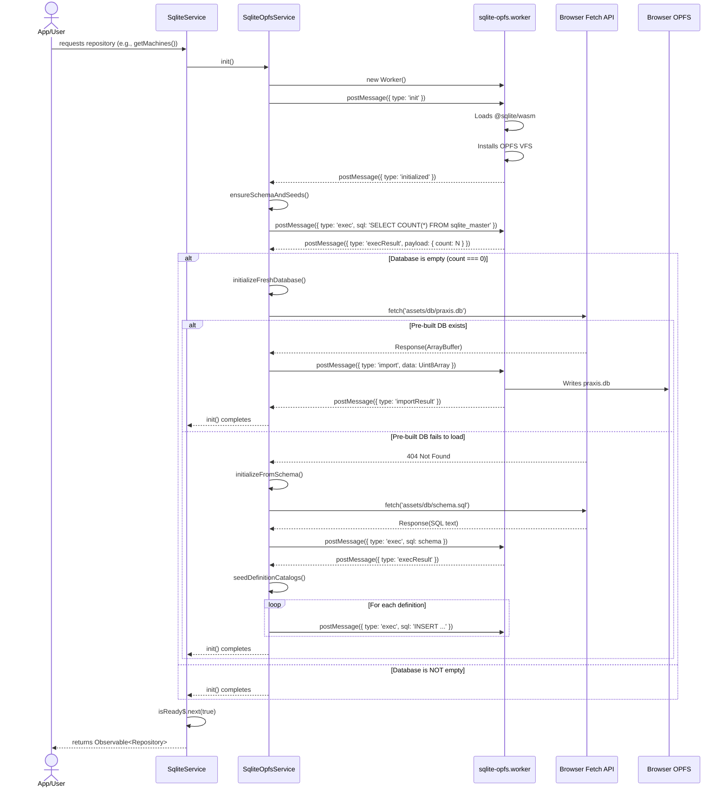
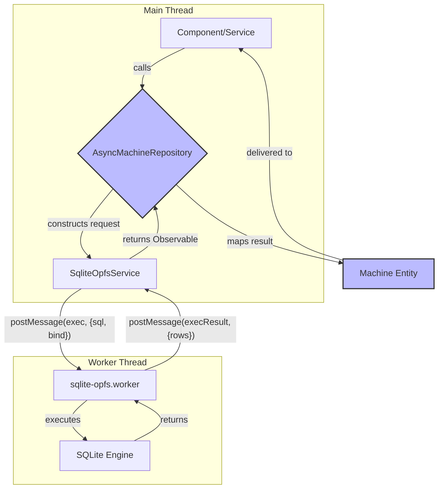

# AUDIT-06: Browser Persistence (OPFS/SQLite)

This audit analyzes the browser-based persistence layer, which leverages SQLite via WebAssembly (WASM) with an Origin Private File System (OPFS) backend.

- **Audited by**: Jules
- **Date**: 2024-07-25
- **Target Files**:
  - `praxis/web-client/src/app/core/workers/sqlite-opfs.worker.ts`
  - `praxis/web-client/src/app/core/services/sqlite/sqlite-opfs.service.ts`
  - `praxis/web-client/src/app/core/services/sqlite/sqlite.service.ts`

---

## 1. Architecture Diagram

The persistence layer is composed of three main components that operate in two different JavaScript contexts (Main Thread and Web Worker).

```mermaid
graph TD
    subgraph Main Thread (Angular)
        A[Application Components] --> B[SqliteService];
        B --> C[SqliteOpfsService];
    end

    subgraph Web Worker
        D[sqlite-opfs.worker.ts];
        E[@sqlite.org/sqlite-wasm];
        F[OPFS SAH Pool VFS];
        D -- uses --> E;
        E -- uses --> F;
    end

    C -- postMessage --> D;
    D -- postMessage --> C;

    F -- interfaces with --> G[(Browser OPFS)];

    style B fill:#f9f,stroke:#333,stroke-width:2px
    style C fill:#f9f,stroke:#333,stroke-width:2px
    style D fill:#ccf,stroke:#333,stroke-width:2px
end
```

**Component Breakdown:**

- **`SqliteService`**: The primary public API for the persistence layer. Application components interact with this service to access data repositories and perform high-level database operations (e.g., import/export). It delegates all actual work to `SqliteOpfsService`.
- **`SqliteOpfsService`**: Manages the Web Worker's lifecycle. It handles lazy initialization of the worker, serializes requests, and deserializes responses. It is the sole component on the main thread that communicates directly with the worker.
- **`sqlite-opfs.worker.ts`**: Runs in a separate thread. It receives messages from the main thread, executes SQLite commands using the `@sqlite.org/sqlite-wasm` library, and posts results back. This isolation prevents the UI from blocking on database operations.
- **`@sqlite.org/sqlite-wasm`**: The core SQLite WASM module that provides the database engine.
- **OPFS SAH Pool VFS**: A virtual file system that allows SQLite to interact with the browser's Origin Private File System using `SyncAccessHandle`s for better performance.

---

## 2. Initialization Sequence

The database is initialized lazily upon the first request for a repository or a direct call to `init()`. The process involves checking for a pre-built database and falling back to a schema + seed process if necessary.



**Key Stages:**

1.  **Lazy Worker Instantiation**: The Web Worker is only created when `SqliteOpfsService.init()` is first called.
2.  **Worker Initialization**: The worker loads the SQLite WASM module and installs the OPFS VFS.
3.  **Schema Check**: `SqliteOpfsService` checks if the database contains any tables to determine if it's a fresh installation.
4.  **Pre-built DB Strategy**: It first attempts to download and import a pre-populated `praxis.db` file from `assets`. This is the primary and most efficient initialization path.
5.  **Fallback Strategy**: If the pre-built database fails to load (e.g., 404 error), it falls back to a manual process:
    *   Fetches and executes `schema.sql`.
    *   Seeds the database by iterating through TypeScript arrays of definitions (`PLR_RESOURCE_DEFINITIONS`, etc.) and sending individual `INSERT` statements.
6.  **Ready Signal**: Once initialization is complete, `SqliteService` emits `true` from its `isReady$` observable, signaling to the rest of the application that the database is available for use.

---

## 3. Data Flow Diagram (CRUD Operations)

This diagram shows the flow of a typical request, such as creating a new `Machine` record.



**Flow Description:**

1.  **Repository Call**: An application component or service calls a method on an async repository (e.g., `machines.create(newMachine)`).
2.  **Request Construction**: The repository, which is a wrapper around `SqliteOpfsService`, constructs the appropriate SQL (`INSERT INTO machines...`) and binding parameters.
3.  **Service Delegation**: The repository calls `SqliteOpfsService.exec()` with the SQL and parameters.
4.  **Worker Communication**: `SqliteOpfsService` assigns the request a unique ID and `postMessage`s it to the `sqlite-opfs.worker`.
5.  **Database Execution**: The worker receives the message, executes the SQL against the SQLite engine, and awaits the result.
6.  **Worker Response**: The worker `postMessage`s the result (or an error) back to the main thread, using the unique ID for correlation.
7.  **Observable Resolution**: `SqliteOpfsService` receives the response, finds the corresponding `Observable`, and emits the result.
8.  **Data Mapping**: The async repository receives the raw data, maps it to the appropriate entity type (e.g., a `Machine` instance), and completes the `Observable` chain.
9.  **Final Delivery**: The application component receives the final, typed data.

This asynchronous, message-passing architecture ensures that all database operations are non-blocking.

---

## 4. Gap / Limitation List

This section identifies potential risks, limitations, and areas for improvement in the current persistence architecture.

| Severity | ID | Gap / Limitation | Description & Impact |
| :---: | :-- | :--- | :--- |
| 🔴 | **MIG-01** | **No Schema Migration Mechanism** | The system initializes a database but lacks a mechanism for evolving the schema over time. If `schema.sql` is updated, existing users will retain the old schema, leading to inevitable errors when the application code expects new tables or columns. **This is the most critical architectural gap.** |
| 🔴 | **REC-01** | **No Recovery from WASM/Worker Failure** | If the `sqlite-opfs.worker.ts` fails to initialize (e.g., WASM module fails to load, browser policy blocks workers), the `isReady$` observable never emits, and the application remains in a permanently broken state with no feedback to the user. |
| 🟠 | **CON-01** | **No Multi-Tab Concurrency Control** | The OPFS `SyncAccessHandle` Pool VFS is designed for single-tab access. If the application is opened in multiple tabs, each tab's worker will have its own connection to the database file. This can lead to race conditions, database corruption, or deadlocks. While OPFS has some built-in file locking, the current implementation does not explicitly handle this scenario. |
| 🟠 | **SEED-01** | **Inefficient Fallback Seeding** | The fallback seeding mechanism in `SqliteOpfsService.seedDefinitionCatalogs()` sends one `INSERT` statement per definition. This is highly inefficient and can block the worker for a significant time on first load if the pre-built DB is unavailable. Batching these inserts into a single transaction with multiple `VALUES` clauses would be far more performant. |
| 🟡 | **ERR-01** | **Limited Error Propagation** | Errors from the worker are wrapped in a generic `Error` object in `SqliteOpfsService`. This loses the original error type and context, making it difficult to implement specific error handling logic on the client-side (e.g., handling a `UNIQUE constraint failed` error differently from a syntax error). |
| 🟡 | **TX-01** | **No Multi-Statement Transaction Support** | The `exec` method handles single SQL statements. There is no clean, repository-level API to wrap multiple operations (e.g., `createMachine` and then `updateResource`) within a single ACID transaction. This must be done manually with `BEGIN TRANSACTION` and `COMMIT` statements, which is error-prone. |
| 🟡 | **TEST-01**| **Outdated E2E Tests** | `04-browser-persistence.spec.ts` attempts to clear an IndexedDB database, which is no longer used. This test provides a false sense of security as it is not testing the OPFS-based persistence layer correctly. |

---

## 5. Recommended Test Cases

The following E2E tests are recommended to improve confidence in the persistence layer.

-   **`should correctly initialize from pre-built database`**
    -   **Scenario**: User opens the application for the first time.
    -   **Steps**:
        1.  Programmatically clear OPFS.
        2.  Intercept the `fetch` call for `praxis.db` to ensure it is requested.
        3.  Navigate to the assets page.
        4.  Verify that a default machine/resource (which is only present in the pre-built DB) is visible.
    -   **Rationale**: Directly verifies the primary, most common initialization path.

-   **`should correctly initialize using schema and seeds if pre-built DB is missing`**
    -   **Scenario**: The pre-built `praxis.db` fails to load.
    -   **Steps**:
        1.  Programmatically clear OPFS.
        2.  Intercept and fail the `fetch` call for `praxis.db` (return a 404).
        3.  Listen for subsequent `fetch` calls to `schema.sql` to ensure the fallback is triggered.
        4.  Navigate to the assets page.
        5.  Verify that a default machine/resource is visible (seeded from TypeScript).
    -   **Rationale**: Ensures the fallback initialization path is functional, preventing a broken state for users who fail to download the primary asset.

-   **`should persist newly created data across a page reload`**
    -   **Scenario**: User creates a new asset.
    -   **Steps**:
        1.  Navigate to the assets page.
        2.  Create a new machine with a unique name.
        3.  Verify the machine is visible in the list.
        4.  Reload the page (`page.reload()`).
        5.  Verify the newly created machine is still visible.
    -   **Rationale**: A fundamental "smoke test" for persistence, replacing the broken `04-browser-persistence.spec.ts`.

-   **`should correctly reset the database to factory defaults`**
    -   **Scenario**: User wants to clear their data and start over.
    -   **Steps**:
        1.  Create a new machine with a unique name.
        2.  Navigate to the settings page.
        3.  Click the "Reset Database" button.
        4.  Navigate back to the assets page.
        5.  Verify the custom machine is no longer present.
        6.  Verify that default assets are present.
    -   **Rationale**: Tests the `resetToDefaults` functionality, ensuring users have a reliable way to recover from a bad state.

-   **`should fail gracefully if the database worker fails to load`**
    -   **Scenario**: The browser fails to load or initialize the SQLite WASM module.
    -   **Steps**:
        1.  Intercept network requests and block the SQLite WASM file (`.wasm`).
        2.  Load the application.
        3.  Verify that a user-friendly error message is displayed (e.g., "Could not initialize database. Please try again or contact support.").
        4.  Verify that the application does not get stuck on a loading spinner indefinitely.
    -   **Rationale**: Addresses the **REC-01** gap by ensuring a recoverable and user-friendly failure mode.

---

## 6. Shipping Blockers

The following issues are considered critical and should be addressed before shipping a version of the application that relies on this persistence layer.

-   **MIG-01: No Schema Migration Mechanism**
    -   **Justification**: This is a **critical data-loss and application stability issue**. Without a migration strategy, any future change to the database schema will either break the application for existing users or require them to manually clear their data. A production application must have a robust, forward-compatible data storage plan. At a minimum, a simple versioning system should be implemented that can detect a schema mismatch and guide the user through a reset.
    -   **Recommendation**: Implement a `user_version` pragma in the SQLite database. On initialization, check this version against a version defined in the application code. If there is a mismatch, either attempt a migration or, more simply, force a `resetToDefaults` and inform the user.

-   **REC-01: No Recovery from WASM/Worker Failure**
    -   **Justification**: This represents a **critical usability issue**. The application should not hang indefinitely without explanation. Users on older browsers, or those with strict security extensions, may encounter a worker initialization failure. The application must handle this gracefully.
    -   **Recommendation**: Add a timeout to the `init()` process in `SqliteService`. If the `isReady$` observable does not emit `true` within a reasonable period (e.g., 10 seconds), display a prominent, user-facing error message.
