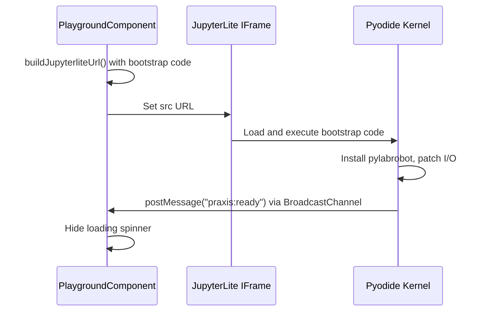

# AUDIT-07: JupyterLite Integration

This report provides a detailed analysis of the JupyterLite integration within the Praxis web client.

## 1. Integration Architecture

The JupyterLite integration is embedded within the `PlaygroundComponent` and managed by the `PlaygroundJupyterliteService`. It uses an `<iframe>` to host the JupyterLite REPL, with communication between the Angular host and the JupyterLite kernel handled via a `BroadcastChannel`.

```mermaid
graph TD
    subgraph Angular Host
        A[PlaygroundComponent]
        B[PlaygroundJupyterliteService]
    end

    subgraph Browser
        C(IFrame)
        D[BroadcastChannel API]
    end

    subgraph JupyterLite Kernel (in IFrame)
        E[Pyodide/Python]
        F[web_bridge.py]
    end

    A -- Manages --> C
    B -- Builds URL & Bootstrap --> C
    A -- Interacts via --> D
    E -- Communicates via --> D
    F -- Handles messages --> D
```

**File References:**
- **IFrame Embedding:** `praxis/web-client/src/app/features/playground/playground.component.ts` (Lines 200-207)
- **URL Construction & Bootstrap:** `praxis/web-client/src/app/features/playground/playground.component.ts` (Lines 605-645)
- **BroadcastChannel Communication:** `praxis/web-client/src/app/features/playground/playground.component.ts` (Lines 422-442) and `praxis/web-client/src/app/features/playground/services/playground-jupyterlite.service.ts` (Lines 148-185)

## 2. Configuration Matrix

The JupyterLite configuration is split between a build-time configuration file and runtime URL parameters. The GH-Pages deployment has a slightly different configuration to handle the subdirectory deployment.

| Config | Dev (Local) | GH-Pages (Production) |
|:-------|:----|:---------|
| **Base URL** | Relative (`./assets/jupyterlite/...`) | Absolute (`/praxis/assets/jupyterlite/`) |
| **Kernel** | Python (default) | Python (default) |
| **OPFS** | Not explicitly configured | Not explicitly configured |
| **Bootstrap Code** | Injected via URL parameter | Injected via URL parameter |

**File References:**
- **Base Build Config:** `praxis/web-client/jupyterlite-config.json`
- **GH-Pages Config Override:** `praxis/web-client/package.json` (Line 23, `build:gh-pages` script)
- **GH-Pages E2E Test Verification:** `praxis/web-client/e2E/specs/ghpages-deployment.spec.ts` (Lines 118-126)

## 3. Initialization Sequence

The initialization process involves the Angular component building a URL with bootstrap code, loading it into the iframe, and then waiting for a "ready" signal from the kernel.



**File References:**
- **Initialization Trigger:** `praxis/web-client/src/app/features/playground/playground.component.ts` (Lines 468-472)
- **Ready Signal Listener:** `praxis/web-client/src/app/features/playground/playground.component.ts` (Lines 422-442)
- **Ready Signal Emitter:** `praxis/web-client/src/app/features/playground/playground.component.ts` (Lines 878-885)

## 4. Gap/Limitation List

Based on the analysis, the following gaps and limitations have been identified:

- 🔴 **URL Length Limitation:** The entire bootstrap code is passed as a URL parameter. This is a significant risk, as browsers have a limit on URL length (typically around 2000 characters). If the bootstrap code grows, it could lead to `431 Request Header Fields Too Large` errors.
- 🟠 **No OPFS Integration:** The current implementation does not appear to use the Origin Private File System (OPFS) for notebook storage. This means that notebooks are not persisted between sessions.
- 🟠 **Limited Error Handling:** The loading sequence relies on a simple timeout to detect failures. There is no mechanism to catch and report specific errors from within the JupyterLite kernel during initialization.
- 🟡 **No Kernel Restart Mechanism:** The "Restart Kernel" button simply reloads the entire iframe. There is no way to restart the kernel without losing the current notebook state.
- 🟡 **Hardcoded Wheel Version:** The bootstrap code hardcodes the `pylabrobot` wheel version, which could become outdated.

## 5. Recommended Test Cases

The existing E2E tests provide good coverage for the bootstrap and path resolution aspects of the integration. However, the following test cases should be added to improve coverage:

- **Test notebook persistence:** Verify that a notebook created in one session is available in a subsequent session (requires OPFS integration).
- **Test kernel error handling:** Simulate a failure in the bootstrap code and verify that the UI displays an appropriate error message.
- **Test asset injection:** Write a test that injects a machine or resource into the notebook and verifies that the corresponding Python variable is created.
- **Test theme switching:** Write a test that toggles the application theme and verifies that the JupyterLite theme updates accordingly.
- **Test large bootstrap code:** Create a test that uses a very large bootstrap string to verify that the application does not crash due to URL length limitations.

**File References:**
- **Existing E2E Tests:** `praxis/web-client/e2e/specs/jupyterlite-bootstrap.spec.ts` and `praxis/web-client/e2e/specs/jupyterlite-paths.spec.ts`

## 6. Shipping Blockers

The following issues are considered critical and should be addressed before shipping:

- **URL Length Limitation:** The risk of hitting the browser's URL length limit is high, especially if more packages or shims are added to the bootstrap code. This should be mitigated by loading the bootstrap code from a separate file or using a different mechanism to pass it to the kernel.
