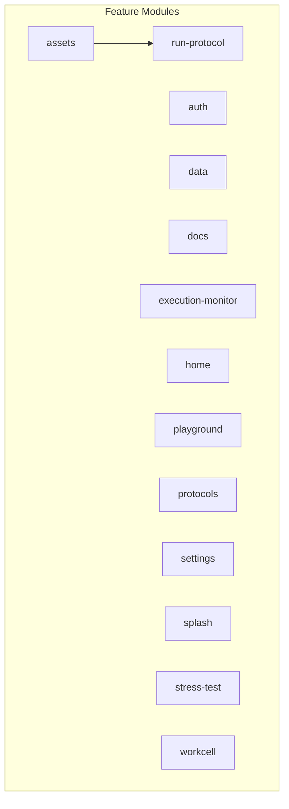

# Feature Module Architecture Audit

## Objective

This document provides a dependency analysis of the 13 feature modules in the `praxis/web-client` application. The goal is to map the relationships between these modules to understand the overall architecture.

## Dependency Graph

The following diagram illustrates the dependencies between the feature modules. An arrow from module A to module B indicates that module A imports code from module B.

## Summary

The audit reveals a largely decoupled architecture. The only dependency found is:
- **assets** depends on **run-protocol**

The following modules have no dependencies on other feature modules:
- auth
- data
- docs
- execution-monitor
- home
- playground
- protocols
- run-protocol
- settings
- splash
- stress-test
- workcell
