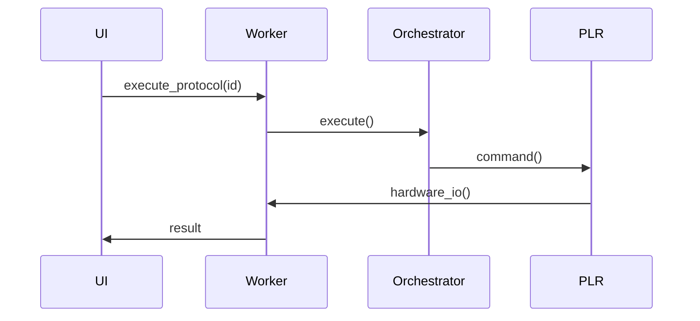

# Backend Components

In **Browser Mode**, Praxis operates without a backend server. The Python logic (Core Engine, Orchestrator, Asset Manager) runs directly in the browser's main thread or a Web Worker using **Pyodide** (CPython compiled to WebAssembly).

## Directory Structure

The structure remains the same as Production, but `praxis/backend/api` is not used. The `Core Engine` is loaded directly by the frontend via the `python-worker.ts`.

## Core Components (Pyodide)

### Orchestrator

The Orchestrator logic is identical to Production, but it runs inside the Web Worker.

**Key responsibilities:**

- Fetch and validate protocol definitions (from IndexedDB)
- Acquire assets (Local State)
- Execute protocol Python functions
- Handle errors

### WorkcellRuntime

Manages live PyLabRobot objects. In Browser Mode, this connects to the IO Shim instead of HTTP drivers.

**Location:** `praxis/backend/core/workcell_runtime.py`

### Asset Manager

Handles the lifecycle and allocation of laboratory assets.

**Key responsibilities:**
- Track asset status in local memory.
- No distributed locking (Redis) is needed as it is single-user.

## Service Layer

The "Service Layer" in Browser Mode is emulated by the `IO Shim Service` in Angular and the Python Bridge.

| Service | Browser Equivalent |
|---------|--------------------|
| `ProtocolService` | Reads from IndexedDB |
| `MachineService` | Reads from IndexedDB |
| `DiscoveryService` | Runs locally in Pyodide |
| `ScheduleService` | Not available (runs are immediate) |

## Key Differences from Production

- **No FastAPI**: There is no HTTP API. The Frontend communicates with the Core Engine directly via a Python Bridge.
- **No Celery**: Background tasks are managed within the browser's event loop or Web Workers.
- **No PostgreSQL/Redis**: Data is persisted using **IndexedDB** (via SQLite Wasm) and **LocalStorage**.
- **Hardware Access**: Hardware is accessed via WebSerial and WebBluetooth APIs, bridged to PyLabRobot.

For a detailed guide on running in Browser Mode, see [Browser Mode](../getting-started/browser-mode.md).
