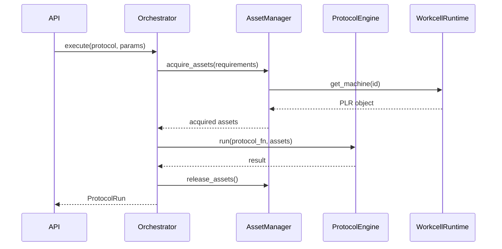

# Backend Components

The Praxis backend is organized into distinct layers, each with clear responsibilities. This document details the core components and their interactions.

## Directory Structure

```
praxis/backend/
├── api/                    # FastAPI routes
│   ├── routes/             # Endpoint definitions
│   └── deps.py             # Dependency injection
├── core/                   # Execution engine
│   ├── orchestrator/       # Protocol execution control
│   ├── workcell_runtime.py # Live hardware management
│   ├── asset_manager.py    # Asset lifecycle
│   └── asset_lock_manager.py # Distributed locking
├── services/               # Business logic
│   ├── protocol_service.py
│   ├── machine_service.py
│   └── ...
├── models/                 # Data models
│   ├── orm/                # SQLAlchemy models
│   └── pydantic/           # API schemas
└── utils/                  # Utilities
```

## Core Components

### Orchestrator

The Orchestrator is the "brain" of protocol execution. It coordinates all aspects of running a protocol.



**Key responsibilities:**

- Fetch and validate protocol definitions
- Acquire assets via AssetManager
- Execute protocol Python functions
- Handle errors and rollback
- Log progress to database

**Location:** `praxis/backend/core/orchestrator/`

```python
class Orchestrator:
    async def execute_protocol(
        self,
        protocol: Protocol,
        params: dict,
        assets: AcquiredAssets
    ) -> ProtocolRun:
        """Execute a protocol with the given parameters and assets."""
        run = await self._create_run(protocol, params)
        try:
            await self._execute_steps(run, assets)
            await self._finalize_success(run)
        except Exception as e:
            await self._handle_error(run, e)
            raise
        finally:
            await self._release_assets(assets)
        return run
```

### WorkcellRuntime

Manages live PyLabRobot objects - the actual hardware connections.

**Key responsibilities:**

- Instantiate PLR objects from database definitions
- Manage connection lifecycle (setup/teardown)
- Provide machine and resource instances to the orchestrator
- Support state serialization for recovery

**Location:** `praxis/backend/core/workcell_runtime.py`

```python
class WorkcellRuntime:
    """Manages live PyLabRobot objects for a workcell."""

    def __init__(self, workcell_id: str):
        self.machines: dict[str, Machine] = {}
        self.resources: dict[str, Resource] = {}
        self.deck: Deck | None = None

    async def setup(self) -> None:
        """Initialize all hardware connections."""
        for machine in self.machines.values():
            await machine.setup()

    async def teardown(self) -> None:
        """Disconnect all hardware."""
        for machine in self.machines.values():
            await machine.teardown()

    def get_machine(self, accession_id: str) -> Machine:
        """Get a live machine by accession ID."""
        return self.machines[accession_id]
```

### Asset Manager

Handles the lifecycle and allocation of laboratory assets.

**Key responsibilities:**

- Track asset status (AVAILABLE, IN_USE, MAINTENANCE)
- Allocate assets to protocol runs
- Coordinate with WorkcellRuntime for live objects
- Sync definitions with PyLabRobot discovery

**Location:** `praxis/backend/core/asset_manager.py`

```python
class AssetManager:
    async def acquire_for_run(
        self,
        run_id: str,
        requirements: AssetRequirements
    ) -> AcquiredAssets:
        """Acquire all required assets for a protocol run."""
        machines = await self._acquire_machines(requirements.machines)
        resources = await self._acquire_resources(requirements.resources)
        return AcquiredAssets(machines=machines, resources=resources)

    async def release_for_run(self, run_id: str) -> None:
        """Release all assets held by a run."""
        # Update status back to AVAILABLE
        # Release distributed locks
```

### Asset Lock Manager

Provides distributed locking using Redis to prevent conflicts.

**Location:** `praxis/backend/core/asset_lock_manager.py`

```python
class AssetLockManager:
    """Redis-based distributed locking for assets."""

    async def acquire_lock(
        self,
        asset_id: str,
        run_id: str,
        timeout: int = 300
    ) -> bool:
        """Attempt to acquire an exclusive lock on an asset."""
        key = f"asset_lock:{asset_id}"
        return await self.redis.set(key, run_id, nx=True, ex=timeout)

    async def release_lock(self, asset_id: str, run_id: str) -> bool:
        """Release a lock, verifying ownership."""
        # Lua script for atomic check-and-delete
```

## Service Layer

Services implement business logic and abstract database operations.

### Service Pattern

All services follow a consistent pattern:

```python
class ProtocolService(CRUDBase[ProtocolOrm, ProtocolCreate, ProtocolUpdate]):
    """Service for protocol operations."""

    async def get_with_runs(
        self,
        session: AsyncSession,
        protocol_id: str
    ) -> Protocol:
        """Get protocol with its execution history."""
        stmt = (
            select(ProtocolOrm)
            .where(ProtocolOrm.id == protocol_id)
            .options(selectinload(ProtocolOrm.runs))
        )
        result = await session.execute(stmt)
        return result.scalar_one()
```

### Available Services

| Service | Responsibility |
|---------|----------------|
| `ProtocolService` | Protocol CRUD and discovery |
| `MachineService` | Machine management |
| `ResourceService` | Resource management |
| `DeckService` | Deck layout management |
| `ProtocolRunService` | Execution history |
| `DiscoveryService` | PLR definition sync |
| `WorkcellService` | Workcell configuration |
| `ScheduleService` | Scheduled run management |

## Model Layer

### ORM Models (SQLAlchemy)

Database schema definitions using SQLAlchemy 2.0:

```python
class AssetOrm(Base):
    """Base class for all asset types."""
    __tablename__ = "assets"

    id: Mapped[str] = mapped_column(primary_key=True)
    accession_id: Mapped[str] = mapped_column(unique=True, index=True)
    name: Mapped[str]
    asset_type: Mapped[AssetType]
    status: Mapped[AssetStatus]
    fqn: Mapped[str | None]  # Fully qualified name in PLR
    plr_state: Mapped[dict] = mapped_column(JSONB, default=dict)
    properties_json: Mapped[dict] = mapped_column(JSONB, default=dict)
```

### Pydantic Models

API validation and serialization:

```python
class ProtocolCreate(BaseModel):
    """Schema for creating a protocol."""
    name: str
    description: str | None = None
    source_path: str
    parameters: dict[str, ParameterDefinition] = {}

class ProtocolResponse(BaseModel):
    """Schema for protocol API responses."""
    id: str
    accession_id: str
    name: str
    description: str | None
    parameters: dict[str, ParameterDefinition]
    created_at: datetime
    updated_at: datetime

    model_config = ConfigDict(from_attributes=True)
```

## API Layer

### Route Organization

Routes are organized by resource:

```
api/routes/
├── auth.py         # Authentication endpoints
├── protocols.py    # Protocol management
├── machines.py     # Machine CRUD
├── resources.py    # Resource CRUD
├── decks.py        # Deck layouts
├── discovery.py    # PLR definition sync
├── hardware.py     # Hardware discovery
├── execution.py    # Protocol execution control
├── outputs.py      # Data outputs
└── websocket.py    # Real-time updates
```

### Dependency Injection

FastAPI dependencies for common patterns:

```python
# deps.py
async def get_db() -> AsyncGenerator[AsyncSession, None]:
    """Database session dependency."""
    async with async_session_maker() as session:
        yield session

async def get_current_user(
    token: str = Depends(oauth2_scheme)
) -> User:
    """Extract and validate current user from JWT."""
    ...

# Usage in routes
@router.get("/protocols/{id}")
async def get_protocol(
    id: str,
    session: AsyncSession = Depends(get_db),
    user: User = Depends(get_current_user)
) -> ProtocolResponse:
    return await protocol_service.get(session, id)
```

## Celery Integration

### Task Definition

```python
# tasks.py
@celery_app.task(bind=True)
def execute_protocol_task(
    self,
    run_id: str,
    protocol_id: str,
    params: dict
) -> dict:
    """Celery task for async protocol execution."""
    # Run in asyncio event loop
    return asyncio.run(
        orchestrator.execute_existing_protocol_run(run_id)
    )
```

### Task Scheduling

```python
# scheduler.py
class ProtocolScheduler:
    async def schedule_run(
        self,
        protocol_id: str,
        params: dict,
        scheduled_time: datetime
    ) -> ScheduledRun:
        """Schedule a protocol for future execution."""
        run = await self._create_pending_run(protocol_id, params)
        task = execute_protocol_task.apply_async(
            args=[run.id, protocol_id, params],
            eta=scheduled_time
        )
        return ScheduledRun(run_id=run.id, task_id=task.id)
```

## Error Handling

### Exception Hierarchy

```python
class PraxisError(Exception):
    """Base exception for all Praxis errors."""

class AssetNotFoundError(PraxisError):
    """Asset does not exist."""

class AssetUnavailableError(PraxisError):
    """Asset exists but is not available."""

class ProtocolExecutionError(PraxisError):
    """Error during protocol execution."""

class HardwareConnectionError(PraxisError):
    """Failed to connect to hardware."""
```

### API Error Responses

```python
@app.exception_handler(PraxisError)
async def praxis_error_handler(request: Request, exc: PraxisError):
    return JSONResponse(
        status_code=400,
        content={"error": exc.__class__.__name__, "message": str(exc)}
    )
```
