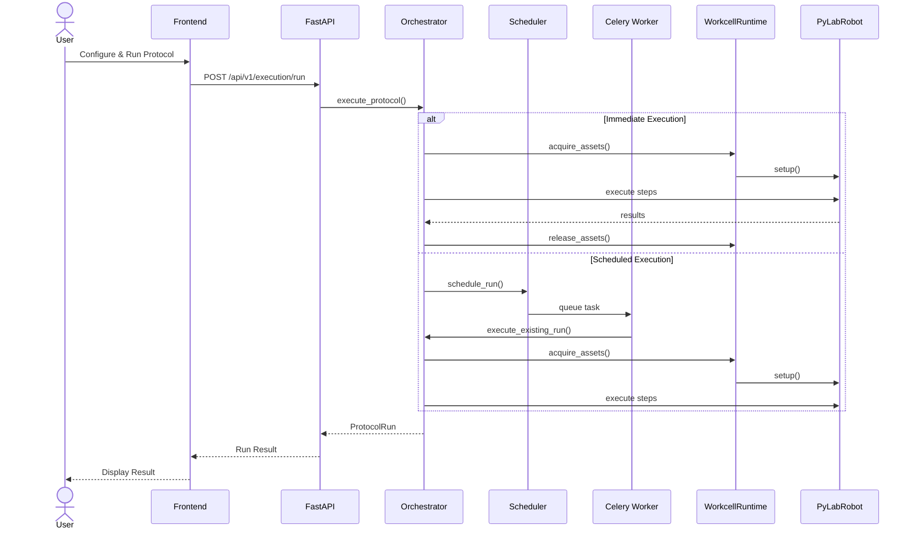

# Execution Flow

This document details how protocols are executed in Praxis, from user request to completion.

## High-Level Flow



## Execution Modes

### Immediate Execution

For interactive runs where the user waits for completion:

```python
async def execute_immediately(
    protocol_id: str,
    params: dict,
    assets: AssetSelection
) -> ProtocolRun:
    """Execute a protocol and wait for completion."""
    # 1. Create run record
    run = await create_pending_run(protocol_id, params)

    # 2. Acquire assets
    acquired = await asset_manager.acquire_for_run(
        run.id,
        assets.to_requirements()
    )

    # 3. Execute protocol
    try:
        result = await orchestrator.execute(
            protocol=await get_protocol(protocol_id),
            params=params,
            assets=acquired,
            run=run
        )
        run.status = RunStatus.COMPLETED
        run.result = result
    except Exception as e:
        run.status = RunStatus.FAILED
        run.error = str(e)
        raise
    finally:
        await asset_manager.release_for_run(run.id)

    return run
```

### Scheduled Execution

For runs that should happen at a future time:

```python
async def schedule_execution(
    protocol_id: str,
    params: dict,
    scheduled_time: datetime
) -> ScheduledRun:
    """Schedule a protocol for future execution."""
    # 1. Create pending run
    run = await create_pending_run(protocol_id, params)
    run.status = RunStatus.SCHEDULED
    run.scheduled_for = scheduled_time

    # 2. Reserve assets (optional)
    await asset_lock_manager.reserve(
        run.id,
        params.get('assets', []),
        scheduled_time
    )

    # 3. Queue Celery task
    task = execute_protocol_task.apply_async(
        args=[run.id],
        eta=scheduled_time
    )

    return ScheduledRun(run=run, task_id=task.id)
```

## Detailed Steps

### 1. Protocol Preparation

```python
async def prepare_protocol(protocol_id: str) -> PreparedProtocol:
    """Load and validate protocol before execution."""
    # Load protocol definition from database
    protocol = await protocol_service.get(protocol_id)

    # Load Python code
    code = await protocol_code_manager.load(protocol.source_path)

    # Validate parameters
    await validate_parameters(protocol.parameters, params)

    # Build execution plan
    plan = await build_execution_plan(code, params)

    return PreparedProtocol(
        definition=protocol,
        code=code,
        plan=plan
    )
```

### 2. Asset Acquisition

```python
async def acquire_assets(
    run_id: str,
    requirements: AssetRequirements
) -> AcquiredAssets:
    """Acquire all required assets for execution."""
    acquired = AcquiredAssets()

    # Acquire machines
    for machine_req in requirements.machines:
        # Get distributed lock
        locked = await asset_lock_manager.acquire_lock(
            machine_req.accession_id,
            run_id
        )
        if not locked:
            raise AssetUnavailableError(f"Machine {machine_req.accession_id} is in use")

        # Get live PLR object
        machine = await workcell_runtime.get_machine(machine_req.accession_id)
        acquired.machines[machine_req.accession_id] = machine

    # Acquire resources
    for resource_req in requirements.resources:
        resource = await workcell_runtime.get_resource(resource_req.accession_id)

        # Check quantity for consumables
        if resource.is_consumable:
            if resource.quantity < resource_req.quantity:
                raise InsufficientResourceError(
                    f"Need {resource_req.quantity} of {resource.name}, "
                    f"only {resource.quantity} available"
                )

        acquired.resources[resource_req.accession_id] = resource

    return acquired
```

### 3. Protocol Execution

```python
async def execute_protocol_steps(
    run: ProtocolRun,
    prepared: PreparedProtocol,
    assets: AcquiredAssets,
    state: PraxisState
) -> dict:
    """Execute the protocol step by step."""
    context = PraxisRunContext(
        run_id=run.id,
        state=state,
        assets=assets
    )

    result = {}

    for step in prepared.plan.steps:
        # Update state
        await state.set("current_step", step.index)
        await state.set("current_step_name", step.name)

        # Log step start
        await state.append_log(f"Starting step: {step.name}")

        try:
            # Execute step function
            step_result = await step.execute(context)

            # Store result
            result[step.name] = step_result

            # Log completion
            await state.append_log(f"Completed step: {step.name}")

        except Exception as e:
            await state.append_log(f"Step failed: {step.name} - {e}", level="ERROR")
            raise StepExecutionError(step=step, cause=e)

        # Broadcast progress
        await broadcast_progress(run.id, step.index, len(prepared.plan.steps))

    return result
```

### 4. Hardware Interaction

Within each step, hardware commands flow through PyLabRobot:

```python
# Example: Transfer liquid
async def transfer_step(context: PraxisRunContext) -> dict:
    lh = context.assets.machines['liquid_handler']
    source = context.assets.resources['source_plate']
    dest = context.assets.resources['dest_plate']

    # Pick up tips
    tip_rack = context.assets.resources['tip_rack']
    await lh.pick_up_tips(tip_rack['A1:H1'])

    # Aspirate
    await lh.aspirate(source['A1:H1'], volume=100)

    # Dispense
    await lh.dispense(dest['A1:H1'], volume=100)

    # Discard tips
    await lh.discard_tips()

    return {"transferred_wells": 8, "volume_per_well": 100}
```

### 5. Result Handling

```python
async def finalize_run(
    run: ProtocolRun,
    result: dict,
    state: PraxisState
) -> None:
    """Finalize a completed run."""
    # Update run record
    run.status = RunStatus.COMPLETED
    run.completed_at = datetime.utcnow()
    run.result = result

    # Persist final logs from Redis to database
    logs = await state.get_logs()
    for log in logs:
        await log_service.create(run.id, log)

    # Update resource quantities for consumables
    for resource_id, usage in result.get('resource_usage', {}).items():
        await resource_service.decrement_quantity(resource_id, usage)

    # Clean up Redis state
    await state.cleanup()

    # Broadcast completion
    await broadcast_run_complete(run.id, result)
```

## Control Commands

### Pause/Resume

```python
async def pause_run(run_id: str) -> None:
    """Pause a running protocol."""
    state = PraxisState(run_id, redis)
    await state.set("control_command", "PAUSE")
    await broadcast_run_update(run_id, {"status": "PAUSED"})

async def resume_run(run_id: str) -> None:
    """Resume a paused protocol."""
    state = PraxisState(run_id, redis)
    await state.set("control_command", "RESUME")
    await broadcast_run_update(run_id, {"status": "RUNNING"})

# In execution loop
async def execute_with_control(step, context):
    # Check for control commands
    cmd = await context.state.get("control_command")

    if cmd == "PAUSE":
        await context.state.append_log("Execution paused")
        while True:
            await asyncio.sleep(1)
            cmd = await context.state.get("control_command")
            if cmd == "RESUME":
                await context.state.append_log("Execution resumed")
                break
            if cmd == "CANCEL":
                raise ProtocolCancelledError()

    # Execute step
    return await step.execute(context)
```

### Cancel

```python
async def cancel_run(run_id: str) -> None:
    """Cancel a running protocol."""
    state = PraxisState(run_id, redis)
    await state.set("control_command", "CANCEL")

    # Wait for graceful shutdown
    for _ in range(30):  # 30 second timeout
        run = await run_service.get(run_id)
        if run.status in (RunStatus.CANCELLED, RunStatus.FAILED):
            break
        await asyncio.sleep(1)
    else:
        # Force kill if needed
        await force_terminate_run(run_id)
```

## Error Handling

### Retry Logic

```python
async def execute_with_retry(
    step: ProtocolStep,
    context: PraxisRunContext,
    max_retries: int = 3
) -> dict:
    """Execute a step with automatic retry on transient errors."""
    last_error = None

    for attempt in range(max_retries):
        try:
            return await step.execute(context)
        except TransientError as e:
            last_error = e
            await context.state.append_log(
                f"Transient error on attempt {attempt + 1}: {e}",
                level="WARNING"
            )
            await asyncio.sleep(2 ** attempt)  # Exponential backoff
        except PermanentError:
            raise  # Don't retry permanent errors

    raise MaxRetriesExceeded(step=step, last_error=last_error)
```

### Cleanup on Failure

```python
async def execute_with_cleanup(
    run: ProtocolRun,
    prepared: PreparedProtocol,
    assets: AcquiredAssets
) -> dict:
    """Execute with guaranteed cleanup."""
    state = PraxisState(run.id, redis)

    try:
        return await execute_protocol_steps(run, prepared, assets, state)
    except Exception as e:
        # Log the error
        await state.append_log(f"Execution failed: {e}", level="ERROR")

        # Attempt safe shutdown
        try:
            await safe_shutdown(assets)
        except Exception as shutdown_error:
            await state.append_log(
                f"Error during shutdown: {shutdown_error}",
                level="ERROR"
            )

        # Update run status
        run.status = RunStatus.FAILED
        run.error = str(e)

        raise
    finally:
        # Always release assets
        await asset_manager.release_for_run(run.id)

        # Always clean up state (after delay for debugging)
        asyncio.create_task(delayed_cleanup(state, delay=300))
```

## Monitoring

### Progress Updates

```python
async def broadcast_progress(
    run_id: str,
    current_step: int,
    total_steps: int
) -> None:
    """Send progress update via WebSocket."""
    progress = {
        "run_id": run_id,
        "current_step": current_step,
        "total_steps": total_steps,
        "percentage": int(current_step / total_steps * 100),
        "timestamp": datetime.utcnow().isoformat()
    }
    await websocket_manager.broadcast(f"run:{run_id}", {
        "type": "progress",
        "data": progress
    })
```

### Telemetry Data

```python
async def emit_telemetry(
    run_id: str,
    metric: str,
    value: float,
    metadata: dict = None
) -> None:
    """Emit a telemetry data point."""
    data_point = {
        "run_id": run_id,
        "metric": metric,
        "value": value,
        "timestamp": datetime.utcnow().isoformat(),
        "metadata": metadata or {}
    }

    # Store in database
    await data_output_service.create(data_point)

    # Broadcast for live charts
    await websocket_manager.broadcast(f"run:{run_id}", {
        "type": "telemetry",
        "data": data_point
    })
```
