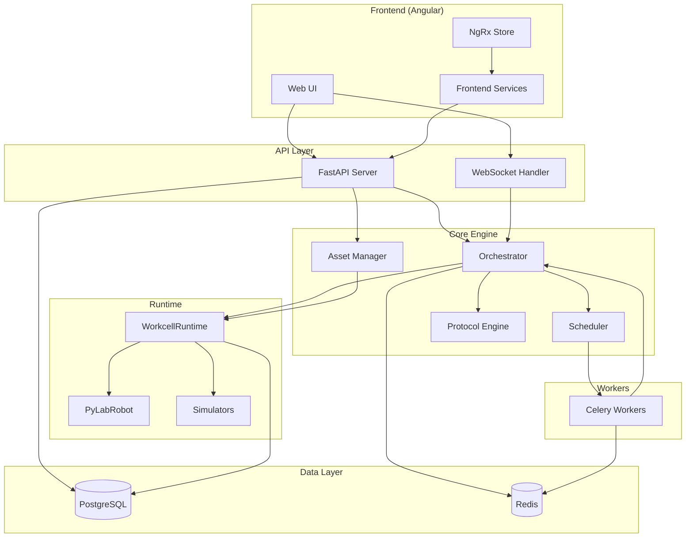

# Architecture Overview

Praxis is designed as a modular, service-oriented system for laboratory automation. This document provides a comprehensive overview of the architecture, components, and data flow.

## System Diagram



## Layer Responsibilities

### Frontend Layer

| Component | Responsibility |
|-----------|----------------|
| **Web UI** | Angular 19+ application with Material Design components |
| **NgRx Store** | Centralized state management with signal-based reactivity |
| **Frontend Services** | HTTP clients, WebSocket handlers, local storage |

### API Layer

| Component | Responsibility |
|-----------|----------------|
| **FastAPI Server** | RESTful endpoints for all resources and operations |
| **WebSocket Handler** | Real-time updates during protocol execution |
| **Middleware** | Authentication, CORS, request logging, error handling |

### Core Engine

| Component | Responsibility |
|-----------|----------------|
| **Orchestrator** | Step-by-step protocol execution control |
| **Scheduler** | Celery-based task queuing and scheduling |
| **Protocol Engine** | Python protocol loading and execution |
| **Asset Manager** | Hardware allocation and lifecycle management |

### Runtime Layer

| Component | Responsibility |
|-----------|----------------|
| **WorkcellRuntime** | Live PyLabRobot object management |
| **PyLabRobot** | Hardware driver abstraction |
| **Simulators** | Mock hardware for testing |

### Data Layer

| Component | Responsibility |
|-----------|----------------|
| **PostgreSQL** | Persistent storage for configurations, history, and logs |
| **Redis** | Distributed state, task queue, and caching |

## Key Design Principles

### 1. Separation of Concerns

Each layer has clear responsibilities:

- **API routes** handle HTTP concerns only
- **Services** implement business logic
- **Core components** manage execution flow
- **Runtime** handles hardware interaction

### 2. Async-First

The entire backend is built on async Python:

```python
async def execute_protocol(protocol_id: str, params: dict) -> ProtocolRun:
    async with get_db_session() as session:
        protocol = await protocol_service.get(session, protocol_id)
        run = await orchestrator.execute(protocol, params)
        return run
```

### 3. Type Safety

Comprehensive type hints throughout:

- **Pydantic models** for API validation
- **SQLAlchemy ORM** with typed models
- **TypeScript** with strict mode in frontend

### 4. State Isolation

Different state layers for different needs:

| State Type | Storage | Lifetime | Use Case |
|------------|---------|----------|----------|
| **Persistent** | PostgreSQL | Forever | Configurations, history |
| **Run State** | Redis | Per-run | Execution progress, shared data |
| **Live State** | Memory | Per-worker | Hardware objects, connections |

## Component Deep Dives

For detailed documentation on each component:

- [Backend Components](backend.md) - Orchestrator, Services, Models
- [Frontend Components](frontend.md) - Angular architecture, Store, Services
- [State Management](state-management.md) - How state flows through the system
- [Execution Flow](execution-flow.md) - Protocol execution lifecycle

## Technology Stack

### Backend

| Technology | Version | Purpose |
|------------|---------|---------|
| Python | 3.11+ | Core language |
| FastAPI | 0.100+ | Web framework |
| SQLAlchemy | 2.0+ | ORM (async) |
| Celery | 5.3+ | Task queue |
| Redis | 7+ | Cache & state |
| PostgreSQL | 15+ | Database |
| PyLabRobot | Latest | Hardware control |

### Frontend

| Technology | Version | Purpose |
|------------|---------|---------|
| Angular | 19+ | Framework |
| Material | 19+ | UI components |
| TypeScript | 5.4+ | Language |
| RxJS | 7+ | Reactive streams |
| Plotly | 2+ | Data visualization |

### Infrastructure

| Technology | Purpose |
|------------|---------|
| Docker | Containerization |
| GitHub Actions | CI/CD |
| MkDocs | Documentation |
