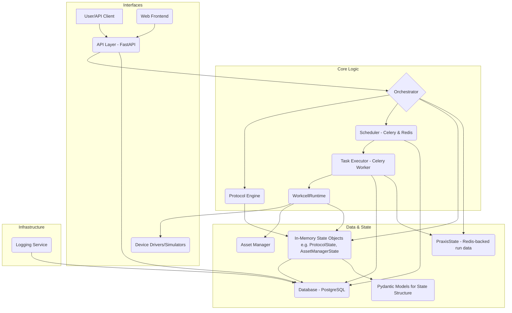

# PyLabPraxis Overview

This document provides a high-level overview of the PyLabPraxis architecture, its core components, data structures, and how they interact, with a special focus on state management.

## Architecture

PyLabPraxis is designed as a modular system to control and manage laboratory automation workflows. The architecture emphasizes separation of concerns, allowing for flexibility and scalability.

### Key Components:

1.  **API Layer (FastAPI)**: Exposes endpoints for user interaction, protocol management, and system control.
2.  **Orchestrator**: The central brain that coordinates protocol execution, managing the flow of operations. It often holds and manipulates in-memory state objects representing the current protocol and assets.
3.  **Protocol Engine**: Parses and interprets protocol definitions, breaking them down into executable steps.
4.  **Scheduler (Celery & Redis)**: Manages asynchronous task execution for device operations and other long-running processes. Redis serves as the message broker and result backend.
5.  **Task Executor (Celery Worker)**: Executes the tasks defined by the Scheduler, interacting with the `WorkcellRuntime` and potentially `PraxisState`.
6.  **WorkcellRuntime**: Provides an abstraction layer for physical or simulated laboratory devices. It manages device connections, command execution, and real-time operational state of PyLabRobot objects.
7.  **Device Drivers/Simulators**: Concrete implementations for controlling specific hardware or simulating their behavior.
8.  **Asset Manager**: Tracks the state and location of labware (plates, tubes), reagents, and samples within the workcell, interacting with the database and `WorkcellRuntime`.
9.  **In-Memory State Objects (e.g., `ProtocolState`, `AssetManagerState`, `WorkcellDefinition` as Pydantic models)**: Rich Python objects, often defined using Pydantic, that hold the complex, live state of the application during operation. These are managed by services like the Orchestrator and AssetManager, initialized from the database, and updated during runtime.
10. **`PraxisState` (Redis-backed run-specific data)**: A dictionary-like object, persisted to Redis per run via `run_accession_id`, used for storing and retrieving simple, JSON-serializable data shared across different steps or function calls within a single protocol run.
11. **Database (PostgreSQL with SQLAlchemy)**: Persistently stores workcell configurations, protocol definitions, execution history, asset details, logs, and serves as the canonical source for initializing in-memory state objects.
12. **Pydantic Models for State Structure**: Define the structure, validation, and serialization for complex in-memory state objects and for data exchanged via the API.
13. **Web Frontend**: (If applicable) Provides a graphical user interface for interacting with the system.
14. **Logging Service**: Manages system-wide logging for diagnostics and audit trails

---

## Data Structures

PyLabPraxis relies on well-defined data structures for managing information:

- **ORM Models (SQLAlchemy)**: Define the schema for persistent data stored in the PostgreSQL database. This includes tables for protocols, workcells, assets, execution logs, etc.
- **Pydantic Models**: Used for:
  - API request/response validation and serialization.
  - Defining the structure of `PraxisState` and its sub-components.
  - Representing protocol definitions and steps.
  - Configuration objects.
- **In-memory Objects**: s of Pydantic models and other Python classes that represent the live state of the system (e.g., `PraxisState`, `WorkcellRuntime` device objects).

---

## Services

Key services that drive the system:

- **Protocol Management Service**: Handles CRUD operations for protocols, validation, and parsing.
- **Execution Service (Orchestrator & Scheduler)**: Manages the lifecycle of protocol execution, from initiation to completion or error handling.
- **Device Control Service (WorkcellRuntime)**: Interfaces with hardware, executes commands, and monitors device status.
- **State Management Service**: A conceptual service encompassing the mechanisms (`PraxisState`, database, Redis) that maintain and update system state.
- **Data Persistence Service**: Manages read/write operations to the database.

---

## API

The FastAPI application exposes a RESTful API for:

- **Protocol Management**: Uploading, retrieving, updating, and deleting protocols.
- **Execution Control**: Starting, pausing, resuming, and stopping protocol runs.
- **State Querying**: Fetching the current state of the workcell, devices, and ongoing protocols.
- **Asset Tracking**: (If exposed) Endpoints for managing and querying asset information.
- **System Configuration**: Endpoints for configuring the workcell and system parameters.

---

## State Management Deep Dive

State management is crucial and multi-layered in PyLabPraxis:

1.  **`PraxisState` (Redis-backed run-specific data)**:
    -   A dictionary-like interface for storing **JSON-serializable data specific to a single protocol run** (keyed by `run_accession_id`).
    -   Persisted to Redis, allowing simple state (flags, IDs, small parameters) to be shared across different functions or asynchronous steps of the same run.
    -   It is **not** for storing complex, live Python objects directly.

2.  **`WorkcellRuntime` (Live Operational State)**:
    -   Manages the real-time status of individual PyLabRobot device objects (e.g., busy, idle, error, current operation).
    -   Handles resource locking and synchronization for device access at the hardware interaction level.

3.  **In-Memory State Objects (Pydantic models, etc.)**:
    -   Services like the `Orchestrator` and `AssetManager` use rich Python objects (often Pydantic models) to represent the live, complex state of the system. Examples include:
        -   `WorkcellDefinition`: The complete layout and capabilities of the lab.
        -   `ProtocolState`: Detailed tracking of the current protocol's progress, parameters, intermediate data.
        -   `AssetManagerState`: Comprehensive view of all assets, their locations, and statuses.
    -   These objects are initialized from the database and updated as operations occur.

4.  **Database (Persistent State - PostgreSQL)**:
    -   The canonical source of truth for:
        -   Workcell configurations and layouts.
        -   Full protocol definitions.
        -   Historical execution records and logs.
        -   Asset catalog and their defined properties.
    -   Serves as the source for initializing the in-memory state objects.
    -   Key changes to in-memory state (e.g., asset status, protocol completion) are persisted back to the database.

5.  **Redis (Transient & Task State - beyond `PraxisState`)**:
    -   Celery broker: queues device commands and other asynchronous tasks.
    -   Celery backend: stores results and status of these tasks.
    -   Distributed locking (e.g., `AssetLockManager`).

**Flow of State**:

-   System starts: `WorkcellDefinition` loaded from DB into an in-memory object (e.g., within `Orchestrator` or `WorkcellRuntime`).
-   Protocol loaded: Protocol definition loaded from DB, parsed into an in-memory representation (e.g., `ProtocolState` object). A `PraxisState` instance is created in Redis for the run.
-   Execution begins: `Orchestrator` uses its in-memory state objects to guide `WorkcellRuntime`. Simple, shareable parameters for the run might be put into `PraxisState`.
-   Device operations: `WorkcellRuntime` updates its internal device states. Outcomes update the Orchestrator's in-memory state objects (e.g., `AssetManagerState`, `ProtocolState`). If needed, `PraxisState` is updated with simple status flags or IDs for other parts of the workflow.
-   Task states (e.g., a robot arm move) are managed by Celery via Redis.
-   Significant events and final states from the in-memory objects are persisted to the PostgreSQL database.

For a more detailed explanation, please refer to `STATE_MANAGEMENT.md`.

---

## Workflow Example (Simplified Protocol Execution)

1. User uploads a protocol via the API.
2. API service validates and stores the protocol in the Database.
3. User initiates protocol execution via the API.
4. The `Orchestrator` loads the `WorkcellDefinition` and the specified protocol into `PraxisState`.
5. The `Orchestrator`, guided by the `Protocol Engine` interpreting the protocol from `PraxisState`, sends the first high-level command (e.g., "aspirate from well A1").
6. This command is broken down and sent to the `Scheduler` (Celery) as one or more tasks.
7. A `Celery Worker` picks up a task (e.g., "move pipette to A1", "aspirate 50ul").
8. The worker, through `WorkcellRuntime`, interacts with the relevant device driver.
9. `WorkcellRuntime` updates the device's operational state.
10. Upon task completion, the result is sent back through Celery.
11. The `Orchestrator` receives the result and updates `PraxisState` (e.g., marks step as complete, updates liquid levels in `AssetManagerState`).
12. Relevant state changes and data are logged to the Database.
13. Steps 5-12 repeat until the protocol is complete or an error occurs.
14. Final protocol status and results are saved to the Database.

This overview should provide a solid understanding of PyLabPraxis. For more specific details, refer to the respective component documentation and the `STATE_MANAGEMENT.md` file.
